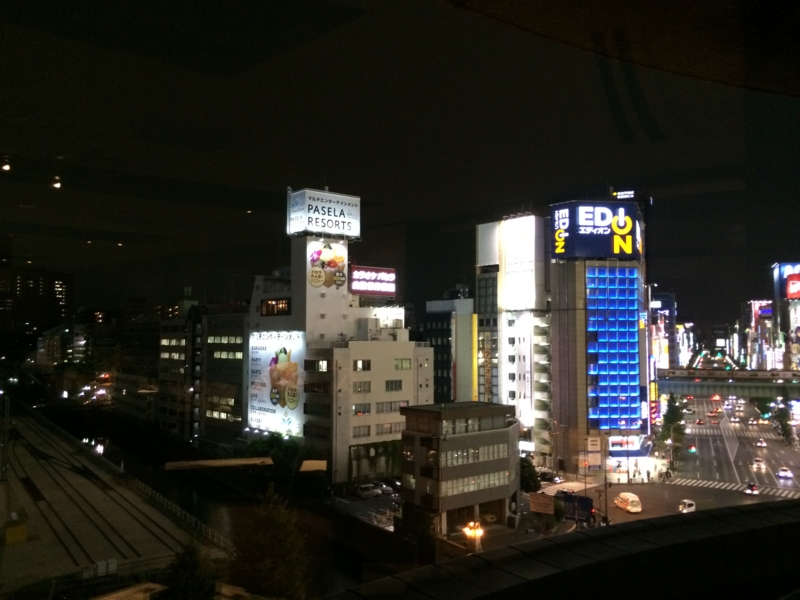
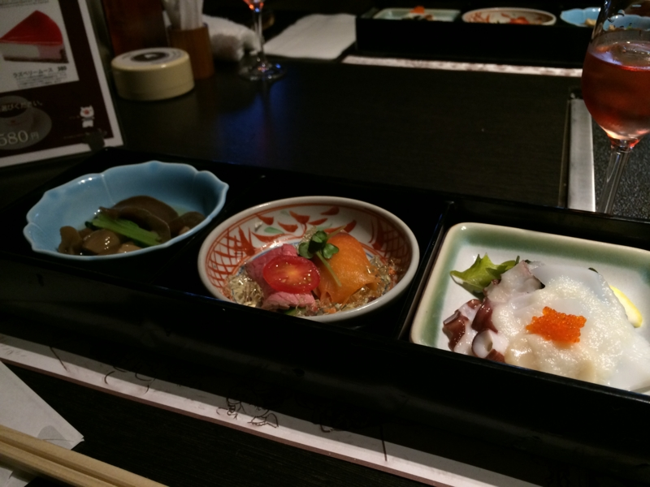
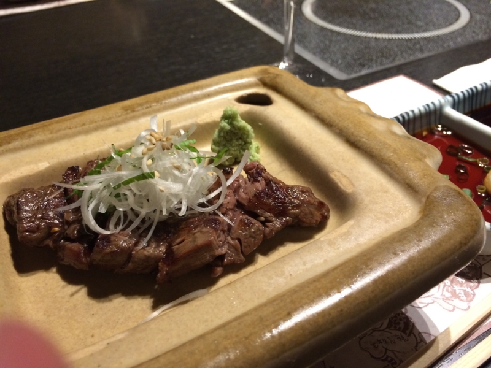
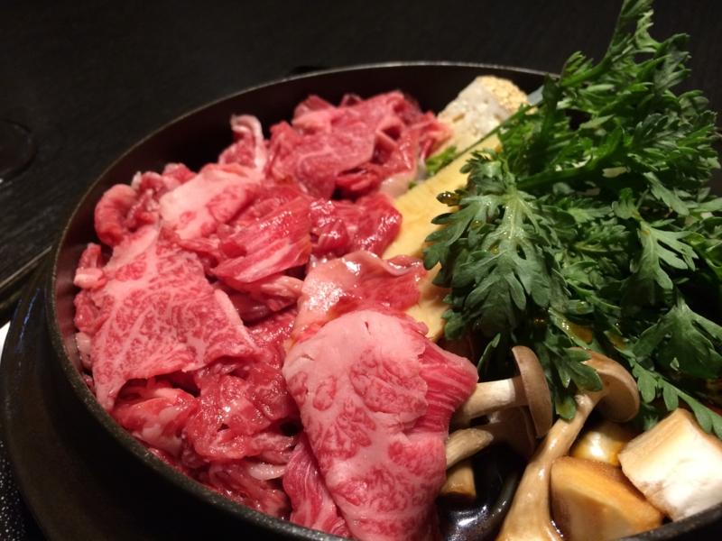
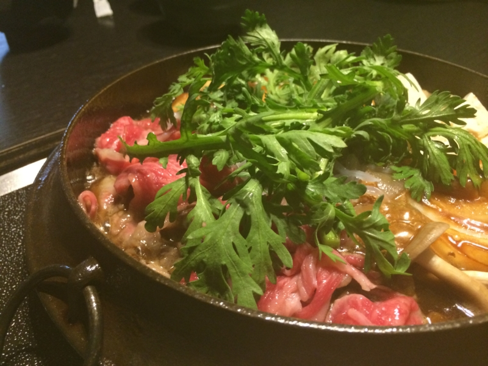

しばやんが<i>「心から敬愛するだるやなぎさんに、日頃の感謝を込めて是非とも高級肉をおごらせたいただきたく伏してお願い申し上げます」</i>と言ってきかない。というわけで、ありがたく万世ですき焼きをごちそうになることにしたった。わーい、すき焼きだ (^q^

      I'm at 肉の万世 7F 七福神 (千代田区, 東京都) <a class="twitter-tweet-url" href="http://t.co/PGZFmy2SQF" target="_top">URL</a>

<a href="http://twitter.com/daruyanagi/status/384631612568530945" class="twitter-detail-info-permalink">2013-09-30 19:51:37</a> via <a href="http://foursquare.com" rel="nofollow">foursquare</a> <a href="http://d.hatena.ne.jp/mapx?points=x:35.69736749,y:139.77098117,t:384631612568530945" class="twitter-detail-info-map">MAP</a>

万世ビルは上の階になればなるほど高級になっていくらしいが、残念ながら九階は満席。渋々七階に降りた。それでもだいぶ景色がいい。「見ろ！　ゴミがヒトのようだ！！」

お手洗いに立つしばやんを放って、自分は先にビールを頼んで一口。カーッ！！　この傍若無人っぷりがたまらんばい！　

      だるさん、俺がお手洗いに行ってるうちに勝手にビール頼んでた。人としてどうかと思う

<a href="http://twitter.com/shibayan/status/384632222839357440" class="twitter-detail-info-permalink">2013-09-30 19:54:02</a> via <a href="http://twitter.com/download/iphone" rel="nofollow">Twitter for iPhone</a>

      さっさと頼んで飲むビールうまい

<a href="http://twitter.com/daruyanagi/status/384632356675395584" class="twitter-detail-info-permalink">2013-09-30 19:54:34</a> via <a href="http://twitter.com/download/iphone" rel="nofollow">Twitter for iPhone</a>

案の定、帰ってきたしばやんに詰られたが、これくらいの茶目は許してほしい。おっさんをいじめるのはよくないと思います！

二品目のお肉もウマい。しばやんのを一切れ奪ったけれど、自分が頼んだミディアムよりも、しばやんのレアのほうが断然おいしかった。

メインもウマウマ。割り下でいただく。家ですき焼きするときは割り下使わない、というか、こういうスタイルのは生まれて初めて食べた気がするけれど、美味しい。いいお肉のときには砂糖とか入れずに、割り下で食べるほうがいいのかもしれないねぇ。よくわかんないけど。

ごちそうさま！　しばやんは神だと思いました。

      他人の金で食う高級すき焼きまじうめえ

<a href="http://twitter.com/daruyanagi/status/384652167065260032" class="twitter-detail-info-permalink">2013-09-30 21:13:17</a> via <a href="http://twitter.com/download/iphone" rel="nofollow">Twitter for iPhone</a>

      7500円か……まだまだ安いな（

<a href="http://twitter.com/daruyanagi/status/384652479645745152" class="twitter-detail-info-permalink">2013-09-30 21:14:32</a> via <a href="http://twitter.com/download/iphone" rel="nofollow">Twitter for iPhone</a>

また食べに行きたいですね！（他人のお給料で

