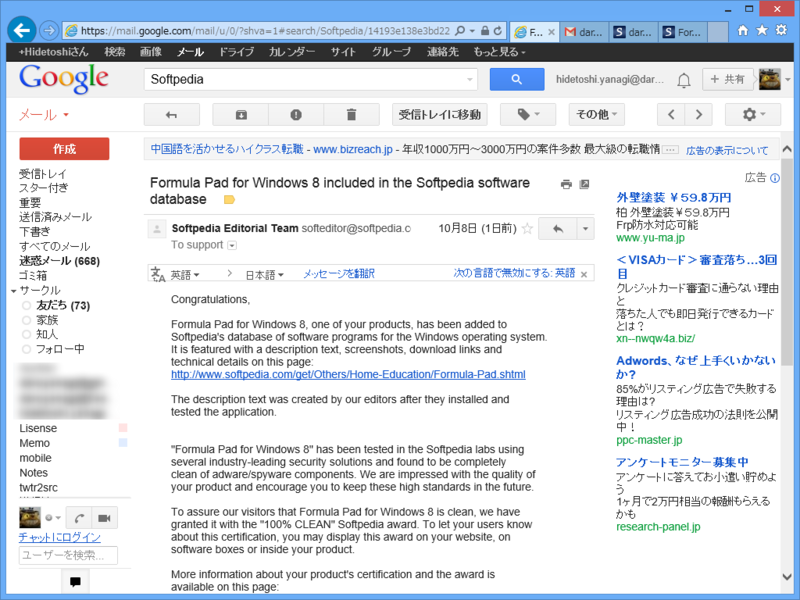
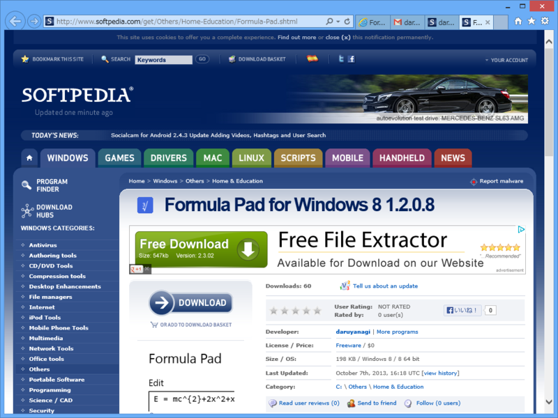

漫然とメール読んでたら……<i>思わずお茶吹いた。</i><a href="http://download.daruyanagi.net/Formula%20Pad%20for%20Windows%208">Formula Pad for Windows 8 - &#x3060;&#x308B;&#x3084;&#x306A;&#x304E;&#xFF08;0x21&#x6B73;&#x2642;&#xFF09;</a> が <a href="http://www.softpedia.com/">Softpedia - Free Downloads Encyclopedia</a> に掲載されたのだそうだ。

Softpedia というのは、まぁ、日本で言えば窓の杜とベクターを足して二で割ったようなサイトだ。ソフトウェア関連のニュースとソフトウェアのライブラリサイトをやっているが、ライブラリは窓の杜のように編集部で選ぶ仕組みになっているんだね。連絡だけよこして割りとフリーダムに載せてしまうけれど、個人的にはあんまり気にはしない。一番面倒なのは独自の広告付きインストーラーでラッピングしてしまうアレとかコレだ<a href="#f1" name="fn1" title="ストアアプリにはその心配はないが">*1</a>。

作品ページ: <a href="http://www.softpedia.com/get/Others/Home-Education/Formula-Pad.shtml">Formula Pad for Windows 8 Free Download</a>

<blockquote>

Formula Pad for Windows 8 allows you to create complex formula and use them in your projects as images. The program allows you to create the formula in LaTeX notations and preview the output in the main window.

The program can export the formula as a text file or by saving it to a PNG file that can be used in documents, web pages and presentations.

</blockquote>

俺の英語よりうまいな（ぉ　Windows ストアでのアプリ概要としてコピペさせていただけないだろうか。

作者プロフィール: <a href="http://www.softpedia.com/developer/daruyanagi-97593.html">daruyanagi developer profile - software title list and all other information available</a>

来年の初めぐらい、身の回りのアレコレがスッキリ片付いたら、もう少しまともなアプリの開発にも挑戦したい。プロフィールページにアプリ一つじゃ寂しいからな！

<a href="#fn1" name="f1" class="footnote-number">*1</a>:ストアアプリにはその心配はないが

