
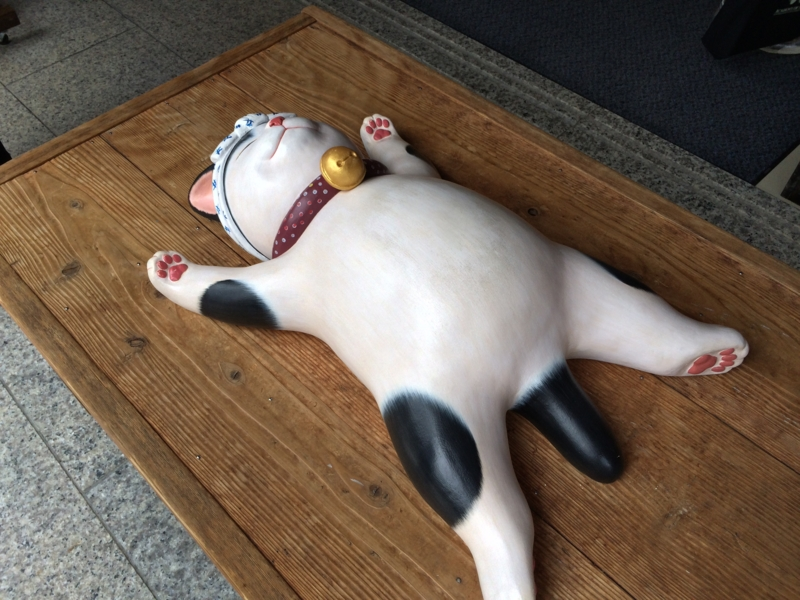

<a href="https://blog.daruyanagi.jp/entry/2013/10/06/082710">&#x304A;&#x5893;&#x53C2;&#x308A;&#x306B;&#x884C;&#x3063;&#x3066;&#x304D;&#x305F;&#x3063;&#x305F;&#x3002; - &#x3060;&#x308B;&#x308D;&#x3050;</a> の帰りに、伊勢神宮に寄ってきた。本当は親父を連れていこうかと思っていたのだけど、痛風の発作で死にかけていたっぽいのであきらめた。まぁ、<i>東京 → 大阪 → 名張（宿泊）→ 伊勢 → 名古屋 → 東京</i>と、なかなかの強行軍だったので、来ない方が身のためだったかもしれない。

<h3>伊勢市駅</h3>

まず、近鉄・伊勢市駅で降りる。――これが間違いだった。久しぶりに行ったので、伊勢市＝外宮・宇治山田＝内宮だと思っていたのだけど、近鉄の伊勢市駅はかなりしょぼく、宇治山田駅にもかなり近い。単に JR 伊勢市駅との乗り換えのためだけにあるような駅で、わざわざここで降りる必要はなかった。しかも、最寄り駅は

<ul>
<li>宇治山田駅＝外宮（結構すぐにつく。徒歩圏内）</li>
<li>五十鈴川駅＝内宮（割りと遠い。徒歩20分ぐらい）</li>
</ul>
だったし。伊勢市駅のコインロッカーにスーツケースを預けたが、かなりの失敗だった。とはいえ、急ぐ旅ではなし、のんびりぶらぶらとお昼ご飯を食べる場所を探しながら散策した。

<h3>伊勢うどん</h3>

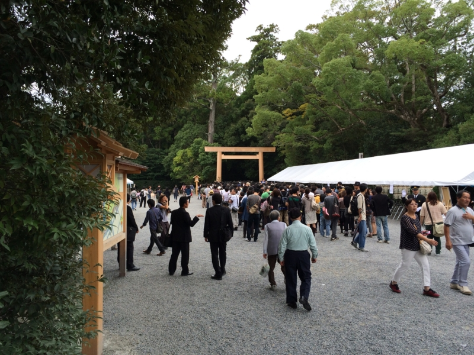

この日はたまたま外宮の遷御の日だったらしく、参拝は1時までだった。12時半ごろに外宮の入り口に着いたが、黒服のひとと報道陣ばかりだなぁというのを確認しただけで、すぐに退散した。それにしても腹がすいた。朝飯も食ってない。

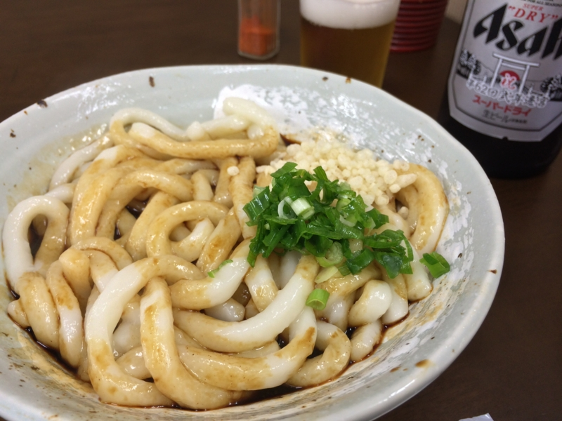

というわけで、外宮近所の飯屋で伊勢うどんを食べた。ビール瓶のラベルが遷宮記念の特別仕様なんやで！

うどんを食い始めてから気づいたが、この食堂は昔、家族で伊勢参りしたときに来たことがある。親父が伊勢うどんのまずさにブチ切れていたのを思い出す。

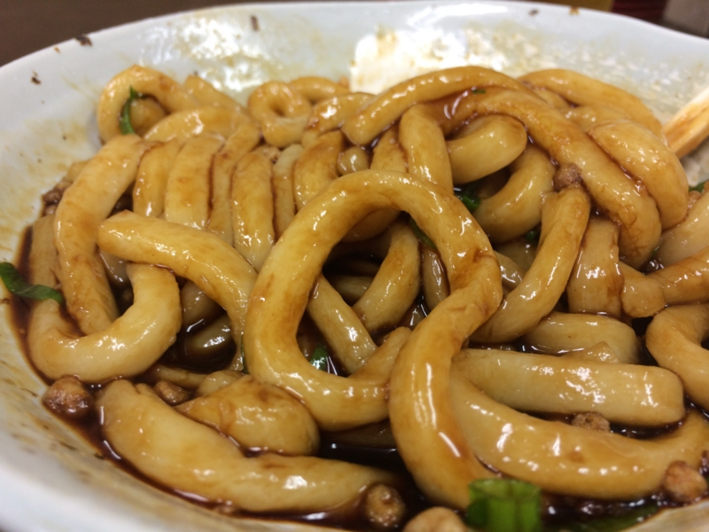

けれど、自分は割とこの味が好き。ちゃんとよくかき混ぜて食べるんやで。タレは色から想像するほど辛くはない。むしろ、飲める。そういえば、以前に東京・市ヶ谷のセブンイレブンでなぜか伊勢うどんが売ってたので、家で食ったことがある。

<ul>
<li><a href="https://blog.daruyanagi.jp/entry/2012/09/08/082851">&#x30BB;&#x30D6;&#x30F3;&#x30A4;&#x30EC;&#x30D6;&#x30F3;&#x3067;&#x300C;&#x4F0A;&#x52E2;&#x3046;&#x3069;&#x3093;&#x300D;&#x3092;&#x30B2;&#x30C3;&#x30C8;&#x3057;&#x305F; - &#x3060;&#x308B;&#x308D;&#x3050;</a></li>
</ul>
伊勢うどんはブヨブヨになるまで煮た麺のフワフワとしただらしない柔らかさが魅力だと思うので、ガッツリ煮込むのがよさそう。

<h3>散歩</h3>

そのあとは、内宮まで歩いた。伊勢参りは外宮から内宮へと行くのが正しいのだそうだ。何回も行ったことがあるが、今回初めて知った。

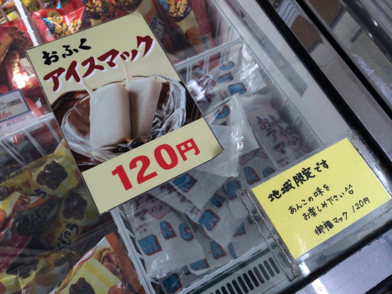

一時間半ぐらい歩いて疲れたので、途中のコンビニで地元限定だというアイスを購入。

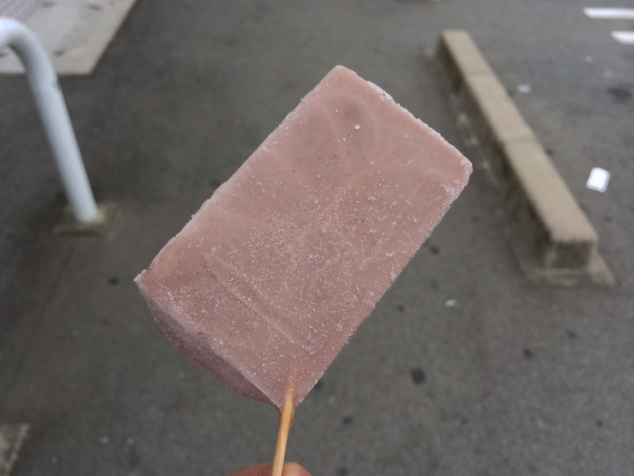

棒の刺さり方が割りとアクロバティックだった。正直食いにくかったが、味はあっさりとした小豆バーでなかなかよろしい。

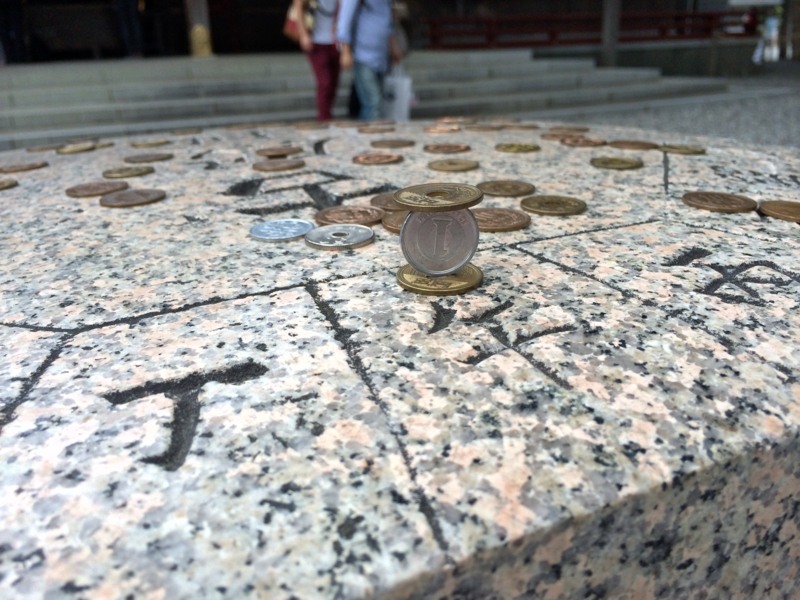

ようやく、内宮の手前にある猿田彦神社に到着。ここで神の御業を目の当たりにする。一円玉が逆立ちしてた。

<h3>「水雷戦隊の指揮はお任せ。提督を全力で勝利へと導くわ」</h3>

おかげ横丁に着いた時には、割りとへとへとだった。休憩がてら、神話のお話を聞くことにする。

割りと子供向けだったが、自分は古事記も日本書紀もろくに読んだことのない非国民だったので楽しめた。断片的なエピソードは知ってたけれど、そういう繋がりだったのか―みたいな感じ。カグツチがイザナミのおま○こを焼いて殺したみたいな表現は、もちろんジェントルに伏せられていた。

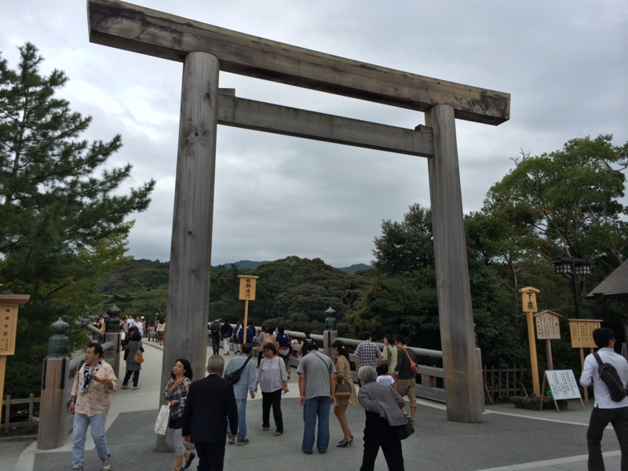

少し休憩して元気が出たので、内宮へと進撃。途中、ギャルっぽい二人組に写真を頼まれたので、割りとがんばって可愛く撮ってあげた。

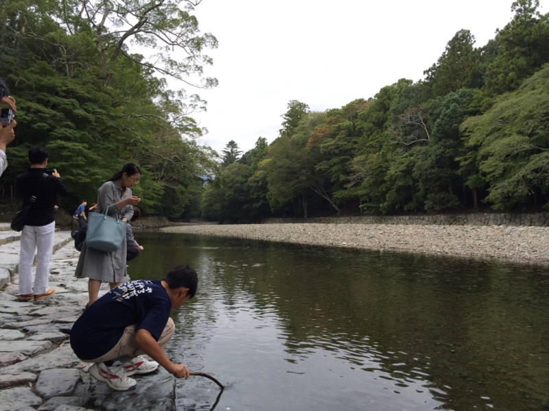

五十鈴川の流れも、神話を習った後に見ると少し神々しいというか、違うように見える。軽巡洋艦・五十鈴の名前はこの川からとられている。

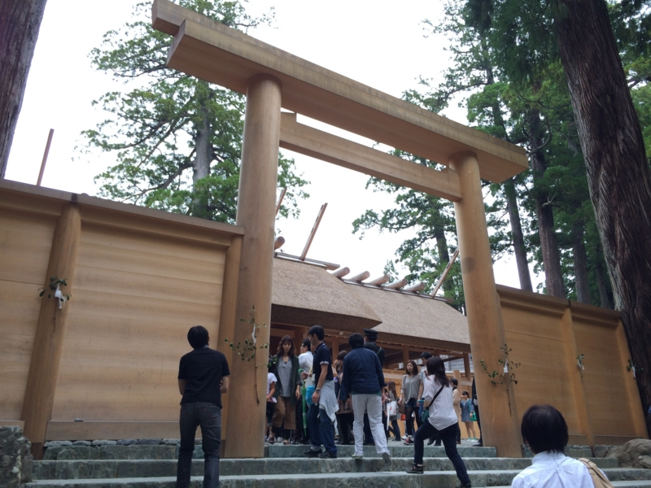

できあがったばかりの社はまっさらで、木の香りがしそう。とりあえずなでなでして手垢をつけておいた。

<h3>疲れを癒す</h3>

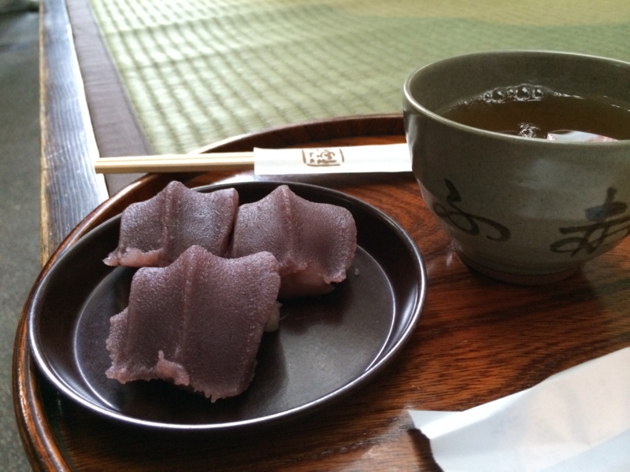

参拝を終えた後は、いつも赤福を食べるようにしている。いつぞや赤福賞味期限問題が起こったときは、これができずにとても悲しかった。熱いお茶とともにいただく。

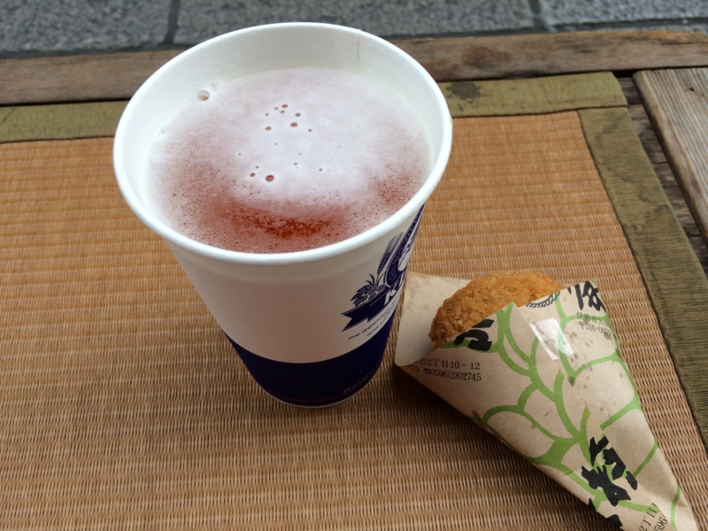

しかし、それでも俺の魂の渇きは癒せない。仕方なく「豚捨」のミンチカツをアテに、金色の泡立つ麦茶をのどに流し込む。この「豚捨」というのは割と有名な店らしい。ミンチカツはコロモがしっかりしていて、中は肉の旨みがしっかり。なかなか美味であった。

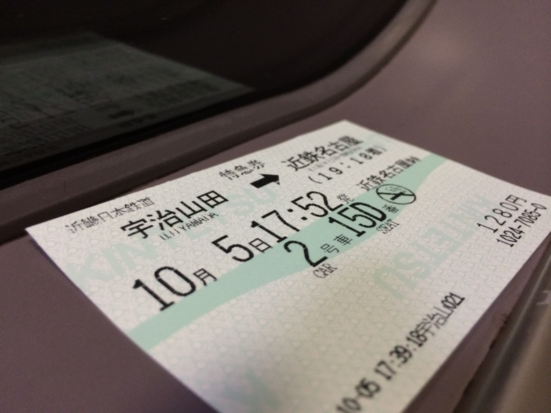

あとは五十鈴川の駅まで歩く。伊勢市駅までスーツケースをとりに行き、宇治山田駅へ舞い戻って特急で名古屋へ。あわよくば新型特急「しまかぜ」に乗りたかったが、一日1本しかないらしい。今度行くときはぜひ乗ってみたいものだと思う。

<h3>おまけ</h3>

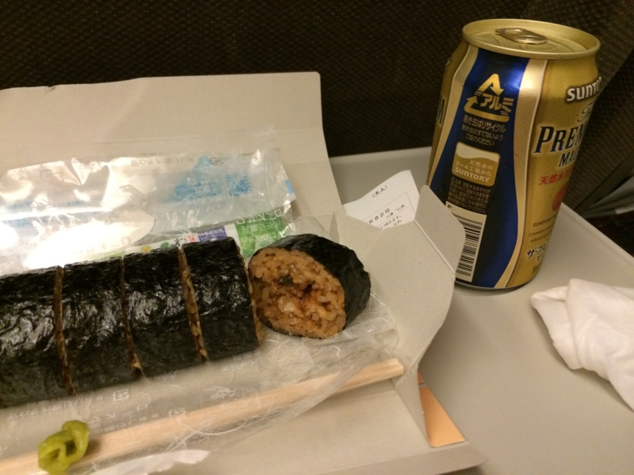

名古屋からの新幹線で食べた「ひつまぶし巻」はなかなか侮れない感じだった。うまうま。

