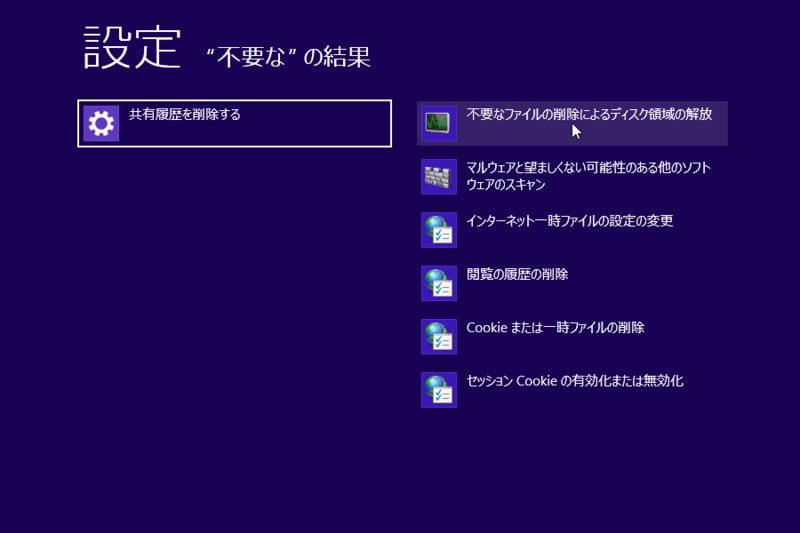
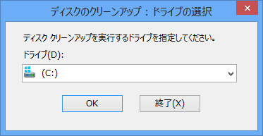
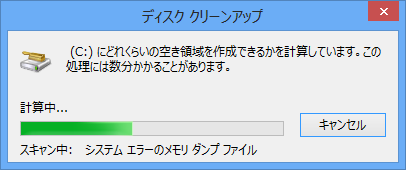
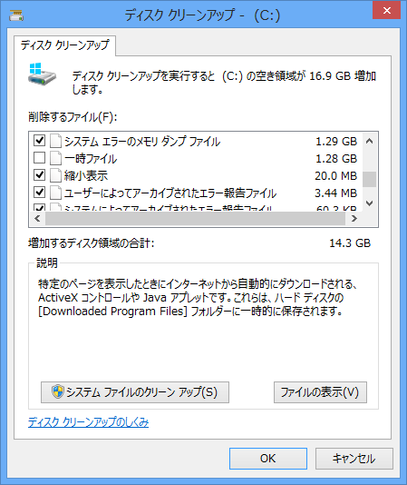
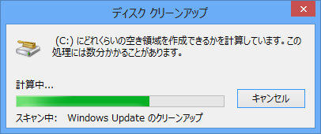
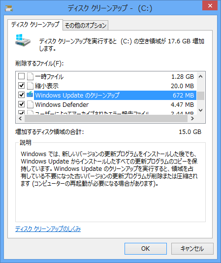

<blockquote cite="http://www.forest.impress.co.jp/docs/news/20131011_619172.html">

Microsoft Corporationは7日、Windows 7に標準搭載されているドライブ内の不要ファイル削除ツール「ディスク クリーンアップ」に“Windows Update のクリーンアップ”機能を追加する更新プログラム「Windows 7 用更新プログラム (KB2852386)」をService Pack 1を適用したWindows 7および同64bit版向けに公開した。現在、“Windows Update”経由でインストールするほか、同社のダウンロードセンターからダウンロードできる。

<cite><a href="http://www.forest.impress.co.jp/docs/news/20131011_619172.html">MS&#x3001;Windows 7&#x306B;&ldquo;Windows Update &#x306E;&#x30AF;&#x30EA;&#x30FC;&#x30F3;&#x30A2;&#x30C3;&#x30D7;&rdquo;&#x6A5F;&#x80FD;&#x3092;&#x8FFD;&#x52A0;&#x3059;&#x308B;&#x66F4;&#x65B0;&#x30D7;&#x30ED;&#x30B0;&#x30E9;&#x30E0; - &#x7A93;&#x306E;&#x675C;</a></cite>
</blockquote>

Windows 8 では確か昔からできたはず（<a href="http://windows.microsoft.com/ja-jp/windows/delete-files-using-disk-cleanup#delete-files-using-disk-cleanup=windows-8">&#x30C7;&#x30A3;&#x30B9;&#x30AF; &#x30AF;&#x30EA;&#x30FC;&#x30F3;&#x30A2;&#x30C3;&#x30D7;&#x3092;&#x4F7F;&#x7528;&#x3057;&#x3066;&#x30D5;&#x30A1;&#x30A4;&#x30EB;&#x3092;&#x524A;&#x9664;&#x3059;&#x308B; - Microsoft Windows &#x30D8;&#x30EB;&#x30D7;</a>）なので、これは要するに Windows 7 の「ディスク クリーンアップ」を Windows 8 相当にするパッチなわけだが（あんまりちゃんと調べてない）、なんでそう書かなかったのかは知らない。

念のため、一応 Windows 8 での動作を確認しておく。

<h3>「ディスク クリーンアップ」の起動</h3>

「不要なファイルの削除によるディスク領域の解放」を選択。“不要”とか“ディスク”で設定を検索するとサクッとでてくる。

<h3>システム ファイルの削除</h3>

ディスクの選択。

削除項目の検索。

削除項目の列挙。ここでは Windows Update のクリーンアップは出てこないが、これは管理者権限で起動していないため。［システム ファイルのクリーン アップ］ボタンを押すと、管理者権限でツールが再起動される。

もう一度ディスクの選択。

削除項目の検索。今回は前回よりも多少時間がかかるはず。

Windows Update のクリーン アップが項目に出てきた！

