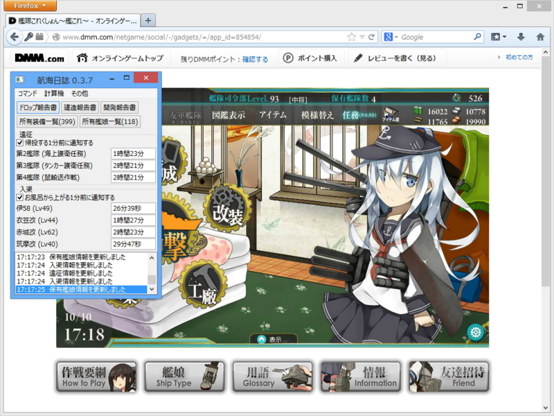
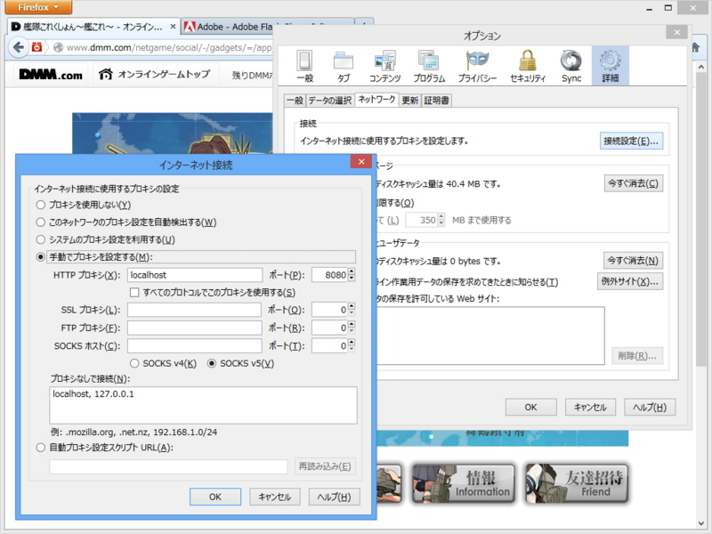
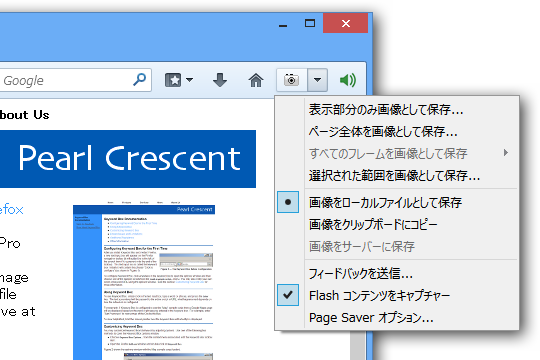
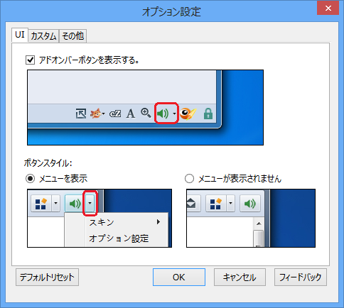
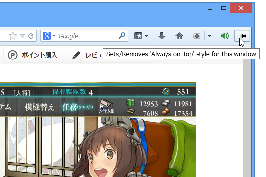

<blockquote cite="http://www.forest.impress.co.jp/docs/news/20131011_619026.html">

「航海日誌」は、オンラインゲーム“艦隊これくしょん -艦これ-”向けの支援ソフト。Windows/Mac OS X/Linuxに対応する寄付歓迎のフリーソフトで、本ソフトの公式サイトからダウンロードできる。なお、動作にはJavaランタイム（JRE）が必要。

<cite><a href="http://www.forest.impress.co.jp/docs/news/20131011_619026.html">&#x3010;&#x30EC;&#x30D3;&#x30E5;&#x30FC;&#x3011;&ldquo;&#x8266;&#x3053;&#x308C;&rdquo;&#x3092;&ldquo;&#x7D71;&#x8A08;&#x5B66;&#x7684;&#x306B;&rdquo;&#x3084;&#x308A;&#x8FBC;&#x3093;&#x3067;&#x3044;&#x308B;&#x63D0;&#x7763;&#x306B;&#x304A;&#x52E7;&#x3081;&#x306E;&#x652F;&#x63F4;&#x30C4;&#x30FC;&#x30EB;&#x300C;&#x822A;&#x6D77;&#x65E5;&#x8A8C;&#x300D; - &#x7A93;&#x306E;&#x675C;</a></cite>
</blockquote>

かれこれ三週間ぐらい使ってるけど、なかなかいい感じ。

<ul>
<li><a href="http://kancolle.sanaechan.net/">&#x822A;&#x6D77;&#x65E5;&#x8A8C; (&#x8266;&#x3053;&#x308C;&#x5C02;&#x7528;&#x30BD;&#x30D5;&#x30C8;&#x30A6;&#x30A7;&#x30A2;)</a></li>
</ul>
「Google Chrome」はシステムのプロキシ設定を使うみたいなので、独自にプロキシを設定できる「Mozilla Firefox」を艦これ専用ブラウザーにしている。

でも、これだけだとスクリーンショット機能とミュート機能がないんだよね。そこで拡張機能で補ってみる。

<h3><a href="http://pearlcrescent.com/products/pagesaver/pro/">Pearl Crescent Page Saver Pro</a></h3>

Flash もバッチリ撮れるスクリーンショットツール。Free と Pro （15米ドル）があって、試しに Pro を買ってみたけれど、まぁ、Free で十分だと思った（Pro だとコマンドラインで使えたりする）。ショートカットキーを指定できるのもグッド。

<ul>
<li><a href="https://addons.mozilla.jp/firefox/details/10367">Pearl Crescent Page Saver Basic | Firefox &#x30A2;&#x30C9;&#x30AA;&#x30F3; | Mozilla Japan &#x306E;&#x516C;&#x5F0F;&#x30A2;&#x30C9;&#x30AA;&#x30F3;&#x7D39;&#x4ECB;&#x30B5;&#x30A4;&#x30C8;</a></li>
</ul>
欲を言えばあらかじめ指定した矩形のみをキャプチャーなんて言う機能があればゲーム画面だけを切り抜けていいと思うのだけど（フィードバックはしておいた）、あとでバッチ処理してもいいと思う。

<h3><a href="http://yxl.github.io/Firefox-Muter/">yxl/Firefox-Muter @ GitHub</a></h3>

ずばり「<a href="https://addons.mozilla.org/ja/firefox/addon/muter/">&#x6D88;&#x97F3; :: Add-ons for Firefox</a>」という名のこの拡張機能を使えば、「Mozilla Firefox」だけをミュートにすることができる（意外なことに、「Google Chrome」では拡張機能からこれができないらしい（<a href="http://www.forest.impress.co.jp/docs/review/20131002_617670.html">&#x3010;&#x30EC;&#x30D3;&#x30E5;&#x30FC;&#x3011;&#x300C;Google Chrome&#x300D;&#x3067;&#x6D41;&#x308C;&#x3066;&#x3044;&#x308B;&#x97F3;&#x58F0;&#x3092;&#x30BF;&#x30D6;&#x3054;&#x3068;&#x306B;&#x505C;&#x6B62;&#x30FB;&#x518D;&#x958B;&#x3067;&#x304D;&#x308B;&#x62E1;&#x5F35;&#x6A5F;&#x80FD;&#x300C;MuteTab&#x300D; - &#x7A93;&#x306E;&#x675C;</a>）。このことも「Mozilla Firefox」を選んだ理由の一つ）。

かつてはアドオンバーというクソバーにボタンが表示されるので気に入らなかったのだけど、最近のバージョンではツールバーも選べるらしい。入れておいて損のない拡張機能だと思った。

<h3><a href="https://addons.mozilla.org/ja/firefox/addon/always-on-top/">Always on Top :: Add-ons for Firefox</a></h3>

（2013/10/15 追記）

「Twitter 専用のサブディスプレイに最前面表示させておきたいなぁ」と思ったので、この拡張機能も導入しておいた。しょうもない（？）拡張機能だけど、これは割とイケる。ピリリと辛いとでもいいますかね。

<h3>おまけ</h3>

「航海日誌」を入れていれば不要なのだけど、<a href="http://miku39.jp/blog/wp/?p=1652">mainami.com blog &#x51FA;&#x5F35;&#x7248;&raquo; &#x30D6;&#x30ED;&#x30B0;&#x30A2;&#x30FC;&#x30AB;&#x30A4;&#x30D6; &raquo; &#x8266;&#x3053;&#x308C;&#x30BF;&#x30A4;&#x30DE;&#x30FC; for Firefox version 0.3</a> というのもある。建造の時間が見れるのが利点になるのかな。とはいえ、高速建造してしまえば建造のタイマーはあまり要らない気がする。

