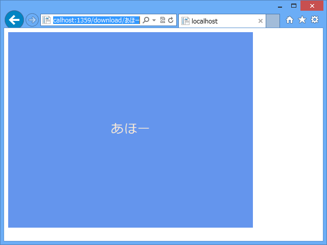
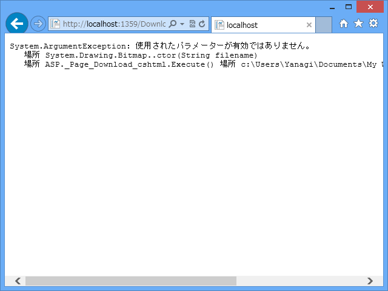

動的に画像を出力したい、という場合はこんな感じでいいのかな。以下は「~/Download/あほー」にアクセスると、「あほー」と描かれた画像を出力する例。

<pre class="code lang-cs" data-lang="cs" data-unlink>@using System.Drawing

@{
var text = UrlData[0] == string.Empty ? &quot;Sample&quot; : UrlData[0];

try
{
var bitmap = new Bitmap(600, 480);

using (var g = Graphics.FromImage(bitmap)) {
using (var font = newFont(&quot;Meiryo&quot;, 24))
{
var rect = new RectangleF(0, 0, 600, 480);
var format = StringFormat.GenericDefault;
format.Alignment = StringAlignment.Center;
format.LineAlignment = StringAlignment.Center;

g.FillRectangle(
Brushes.CornflowerBlue,
rect
);

g.DrawString(
text, font,
Brushes.AntiqueWhite,
rect, format
);
} }

bitmap.Save(
Response.OutputStream,
Imaging.ImageFormat.Png
);

Response.ContentType = &quot;image/png&quot;;
Response.Flush();
Response.End();
}
catch (Exception e)
{
Response.ContentType = &quot;text/plain&quot;;
Response.Write(e);
Response.End();
}
}
</pre>

関係ないけれど、Razor だと using 句の {} が省略できない（if などのほかの制御文でも同じ）なので、using 句を連続して使う場合はネストが深くなる。仕方ないけれど、気持ち悪い。

静的な画像を出力する場合。

<pre class="code lang-cs" data-lang="cs" data-unlink>@{
try
{
var path = Server.MapPath(@&quot;~/Images/image.jpg&quot;);
var bitmap = new System.Drawing.Bitmap(path);

bitmap.Save(
Response.OutputStream,
System.Drawing.Imaging.ImageFormat.Png
);

Response.ContentType = &quot;image/png&quot;;
Response.Flush();
Response.End();
}
catch (Exception e)
{
Response.ContentType = &quot;text/plain&quot;;
Response.Write(e);
Response.End();
}
}
</pre>

エラーを起こしてみた。

<blockquote cite="http://wiz.came.ac/blog/2010/02/aspnet.html">

実際に、Visual Studio でデバッグしてみてもちゃんと動作するので、安心してIIS 5.0に持って行ってみると、「GDI+で一般的なエラーが発生しました」というエラーを吐き出す。

いろいろと試してみたところ、MemoryStream に一度書き出してからOutputStreamへ送り込めば大丈夫。おそらく、原因は OutputStream がシークと読み取りを禁止している点。Image クラスの Save メソッド内で読み返しが行われているのか、CanSeek / CanReadをチェックしているのかは不明ですが、直接書き出すのは無理っぽい。

<cite><a href="http://wiz.came.ac/blog/2010/02/aspnet.html">&#x300C;ASP.NET&#x3067;&#x52D5;&#x7684;&#x306B;&#x753B;&#x50CF;&#x3092;&#x4F5C;&#x308B;&#x300D;&#x3067;&#x30CF;&#x30DE;&#x3063;&#x305F; - &#x3046;&#x3043;&#x305A;&#x306E;&#x3072;&#x3068;&#x308A;&#x3054;&#x3068;</a></cite>
</blockquote>

試してはないけど、こういうハマりどころもあるみたい。「気をつけねば」<a href="#f1" name="fn1" title="そもそも ASP.NET で GDI+ 使うのはあんまりよくないって聞いたこともある気がする">*1</a>

<a href="#fn1" name="f1" class="footnote-number">*1</a>:そもそも ASP.NET で GDI+ 使うのはあんまりよくないって聞いたこともある気がする

