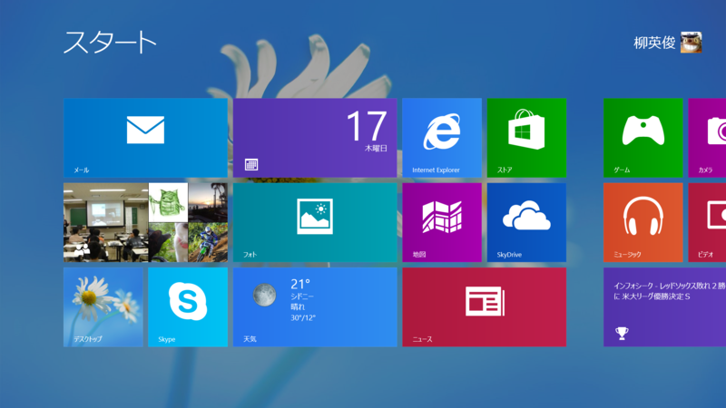
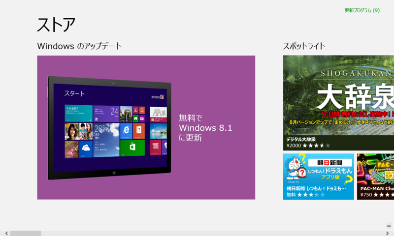
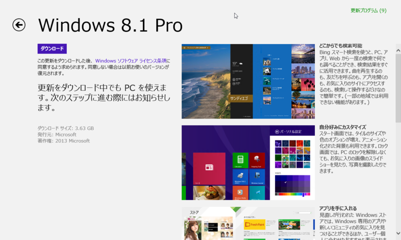
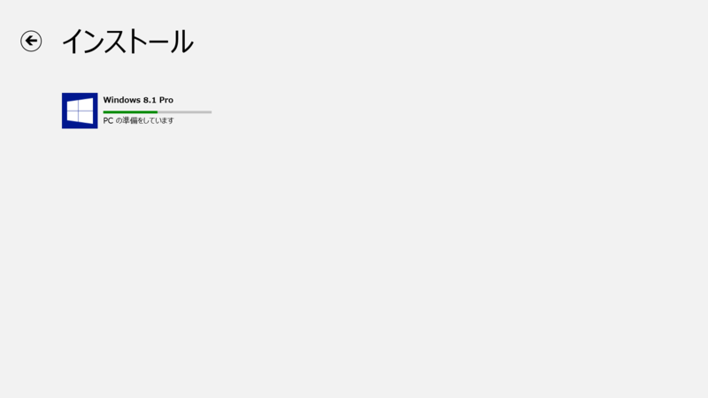
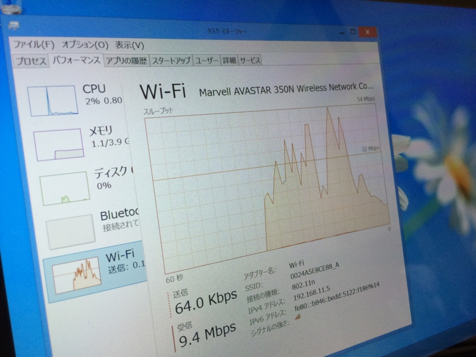
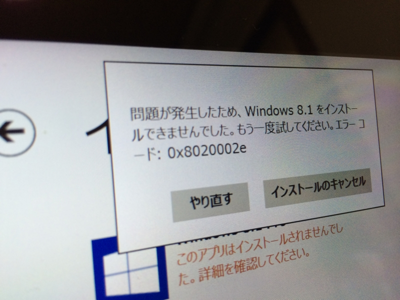
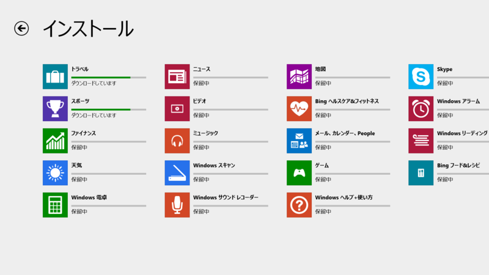
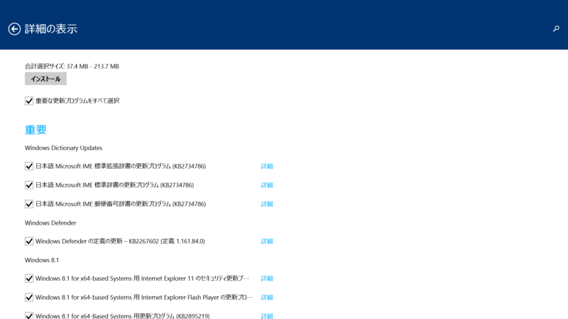

<blockquote cite="http://internet.watch.impress.co.jp/docs/news/20131017_619874.html">

日本マイクロソフト株式会社は17日、最新OS「Windows 8.1」の一般提供を開始した。17日午後8時には、Windows 8ユーザー向けにWindows 8.1への無償アップデートをオンラインのWindowsストアで公開。18日にはWindows 8.1のパッケージ製品や搭載PCの店頭販売が始まり、秋葉原では17日深夜から販売イベントが開催される。

<cite><a href="http://internet.watch.impress.co.jp/docs/news/20131017_619874.html">&#x300C;Windows 8.1&#x300D;&#x7121;&#x511F;&#x30A2;&#x30C3;&#x30D7;&#x30C7;&#x30FC;&#x30C8;&#x63D0;&#x4F9B;&#x958B;&#x59CB;&#x3001;&#x30D1;&#x30C3;&#x30B1;&#x30FC;&#x30B8;&#x88FD;&#x54C1;&#x306F;18&#x65E5;&#x767A;&#x58F2; -INTERNET Watch</a></cite>
</blockquote>

もちろん、さっそく入れるわけですよ。

<h3>下準備</h3>

今回実験台となるのは、以下の2台。

<ul>
<li>Surface Pro（Windows 8.1 Pro RTM → Windows 8 Pro）</li>
<li>Surface RT（Windows 8.1 RT Preview）</li>
</ul>
プレーンな Windows 8 からのアップデートシーケンスを体験したかったというのと、余計なトラブルは御免だという理由で、Surface Pro は Windows 8 Pro へ初期化してある（ユーザーデータはクラウドに退避済み！）。Windows 8.1 RT を Windows RT へ戻すのは断念。リカバリディスクを作成していない場合、ロールバックは困難なようだ。

      @<a class="twitter-user-screen-name" href="http://twitter.com/daruyanagi" target="_top">daruyanagi</a> 僕の理解ではx86のデバイスはリカバリー領域まで書き換えないから8に戻れる、ARMのRTはリカバリー領域を書き換えるからRT8には戻れない、です

<a href="http://twitter.com/KazukiKasahara/status/390765164619780097" class="twitter-detail-info-permalink">2013-10-17 18:04:09</a> via <a href="http://www.tweetdeck.com" rel="nofollow">TweetDeck</a> to @<a href="http://twitter.com/daruyanagi/status/390764772783702016"  class="twitter-user-screen-name">daruyanagi</a>

もちろん、自分はリカバリディスクなんか作ってないわけで（ぉ

Windows を最新の状態にして「ストア」を起動すると、Windows 8.1 のインストールが案内されるはず。うちの環境では Surface Pro にはすぐ来たのだけど、Surface RT にはなかなか来ない。個体差があるのか、Preview 版なのが問題なのか……。

<h4>追記（2013/10/18 1:07）</h4>

<blockquote cite="http://blogs.wankuma.com/hatsune/archive/2013/10/18/328166.aspx">

PreviewからRTMへのアップグレードはISOイメージが必要なようでSurface RTをはじめとするWindows RT機はどうするの？というと実は直リンクがあったりします。

<cite><a href="http://blogs.wankuma.com/hatsune/archive/2013/10/18/328166.aspx">[Windows8]Windows RT 8.1 Preview&#x3067;RT 8.1 RTM&#x304C;&#x30B9;&#x30C8;&#x30A2;&#x306B;&#x8868;&#x793A;&#x3055;&#x308C;&#x305A;&#x306B;&#x56F0;&#x3063;&#x305F;&#x6642;&#x306E;&#x5BFE;&#x51E6;&#x6CD5;</a></cite>
</blockquote>

      @<a class="twitter-user-screen-name" href="http://twitter.com/daruyanagi" target="_top">daruyanagi</a> むちゃくちゃ確実ですｗ

<a href="http://twitter.com/hatsune_/status/390871612091678720" class="twitter-detail-info-permalink">2013-10-18 01:07:09</a> via web to @<a href="http://twitter.com/daruyanagi/status/390871466620633090"  class="twitter-user-screen-name">daruyanagi</a>

アザッす！！

<ul>
<li><a href="http://windows.microsoft.com/en-us/windows-8/update-from-preview">Update from Windows 8.1 Preview to Windows 8.1 - Microsoft Windows Help</a></li>
</ul>
ストアで Windows 8.1 へのアップデートを選択するとこんな画面になり、ダウンロードとインストールが可能となる。

Media Center Edition を使ってる人は、ココの表記が少し違うようだ。どちらにしろ、このままインストールを進めればいい。

<h3>祈る</h3>

ここから先は Surface Pro を前提に。

うちの環境ではダウンロードで 10Mbps 程度出て快適だった（午後8時頃）。

途中“0x8020002e”というエラーがでて一度インストールが止まったが、これは接続エラーらしく、再試行すれば問題なくインストール処理は完了した。

<h3>アップデート</h3>

インストール直後だったけれど、「ストア」のアップデートをチェックしてみた……ら、わんさかあった。

Windows Update もなかなか溜まってる。これ以外にも RTM → GA でいろいろ変更点があるみたいだけど（だったら RTM ってなんなんだよ！）、それはおいおい検証していこうかな、と思う。今日のところはここまで。

