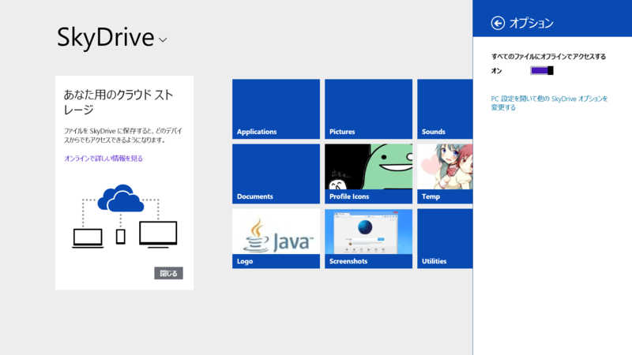
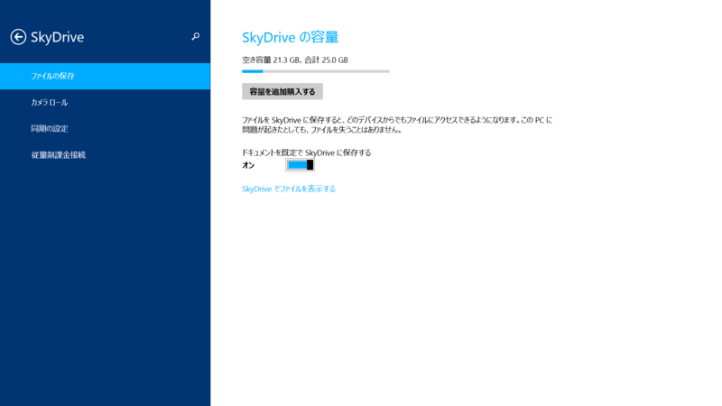
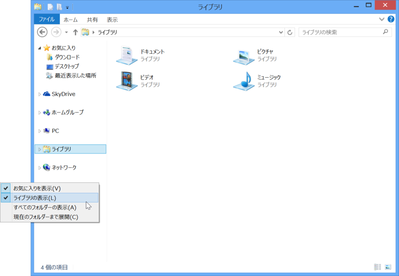

<h3>1. Pictures/Screenshots を削除して SkyDrive へシンボリックリンクを張る</h3>

Windows 8.x では<i>［Windows］＋［PrintScreen］キー</i>でデスクトップのスクリーンショットを撮影し、Pictures/Screenshots へ PNG 画像として保存できる。Surface Pro/RT の場合は、<i>本体の Windows ボタン＋［Volume Down］キー</i>でも可能。また、最新のドライバーがインストール済みであれば、<i>［Windows］＋［Fn］＋［Space］キー</i>でもスクリーンショットが撮れる。

<ul>
<li><a href="https://blog.daruyanagi.jp/entry/2012/03/05/220912">Windows 8 &#x306F;&#xFF3B;Windows&#xFF3D;&#xFF0B;&#xFF3B;PrintScreen&#xFF3D;&#x30AD;&#x30FC;&#x3067;&#x30C7;&#x30B9;&#x30AF;&#x30C8;&#x30C3;&#x30D7;&#x306E;&#x30B9;&#x30AF;&#x30EA;&#x30FC;&#x30F3;&#x30B7;&#x30E7;&#x30C3;&#x30C8;&#x3092;&ldquo;&#x30D4;&#x30AF;&#x30C1;&#x30E3;&#x30FC;&rdquo;&#x30D5;&#x30A9;&#x30EB;&#x30C0;&#x306B;&#x4FDD;&#x5B58;&#x3067;&#x304D;&#x308B; - &#x3060;&#x308B;&#x308D;&#x3050;</a></li>
<li><a href="https://blog.daruyanagi.jp/entry/2013/05/09/032910">Surface RT&#xFF1A;&#xFF08;&#x672C;&#x4F53;&#x5074;&#x306E;&#xFF09;&#xFF3B;Windows&#xFF3D;&#x30AD;&#x30FC;&#x306E;&#x6A5F;&#x80FD; - &#x3060;&#x308B;&#x308D;&#x3050;</a></li>
</ul>
これを複数 PC で同期するために SkyDrive へシンボリックを張っておくのが自分の流儀。

<pre class="code lang-sh" data-lang="sh" data-unlink>mklink /d C:\Users\Hidetoshi\Pictures\Screenshots C:\Users\Hidetoshi\SkyDrive\Screenshots
</pre>
管理者権限のコマンドプロンプトでこんな感じに。保存場所が固定されているファイルを SkyDrive で同期させたい場合なんかに応用してネ。

<a href="http://www.forest.impress.co.jp/docs/review/20130904_613844.html">&#x3010;&#x30EC;&#x30D3;&#x30E5;&#x30FC;&#x3011;&#x53F3;&#x30AF;&#x30EA;&#x30C3;&#x30AF;&#x30E1;&#x30CB;&#x30E5;&#x30FC;&#x304B;&#x3089;&#x4EFB;&#x610F;&#x306E;&#x30D5;&#x30A9;&#x30EB;&#x30C0;&#x3092;&#x300C;SkyDrive&#x300D;&#x306E;&#x540C;&#x671F;&#x5BFE;&#x8C61;&#x306B;&#x52A0;&#x3048;&#x308B;&#x300C;SkyShellEx&#x300D; - &#x7A93;&#x306E;&#x675C;</a> こういうツールがあれば楽なんだけど、残念ながら Windows 8.1 では使えない。

<h3>2. SkyDrive のオフライン利用を有効にする。</h3>

ディスク容量に余裕のある環境だったら、オフライン利用を有効化しておくとよい。Windows 8.1 の SkyDrive はローカルとクラウドを賢く使い分けてくれるけれど、ストレージに余裕があるのならば全部ローカルに持っておくのがシンプルでわかりやすい。

<ul>
<li><a href="http://www.forest.impress.co.jp/docs/special/20130801_610004.html">&#x3010;&#x7279;&#x5225;&#x4F01;&#x753B;&#x3011;Windows 8.1 &#x5FB9;&#x5E95;&#x89E3;&#x5256; &#x7B2C;1&#x56DE; OS&#x306B;&#x7D71;&#x5408;&#x3055;&#x308C;&#x305F;&ldquo;SkyDrive&rdquo; - &#x7A93;&#x306E;&#x675C;</a></li>
</ul>
［設定］チャームで［オプション］を開くと［すべてのファイルにオフラインでアクセスする］というオプションにアクセスできるので、これを有効化しておく。

この際だから［ドキュメントを既定で SkyDrive に保存する］も有効化しておくといいよ。とくにオフィス文書は SkyDrive で集中管理すると失くさずに済むし、リモートからもアクセス可能でいい。仮に SkyDrive が 7GB しかなくても、オフィス文書程度では使い切らない……はず。

<h3>3. とくにない。</h3>

3つと言ったな……あれはウソだ。あとはアプリをインストールしたりだけど、これもできるだけクラウドに放り込んでおけば移行は楽ちん。ぶっちゃけ、待つだけ。

楽な世の中になったと思う。

<h3>追記（2013/10/18 16:57）</h3>

<i>ソレだ！</i>

せっかく定着しかけた便利機能なのに、なんでここで無効化しちゃうかな！　きっと統計をとったら利用率が低かったのだろうけれど、ユーザーインターフェイスはユーザーの期待に応えるだけでなく、よりよい使い方を導く・提案する“先生”であってもよいと思うので（まぁ、かなり反発は受けるのだが）、もうちょっと粘ってもらってもよかったと思う。

