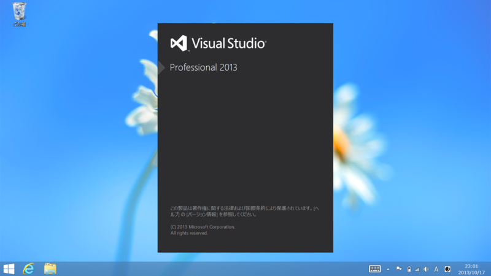
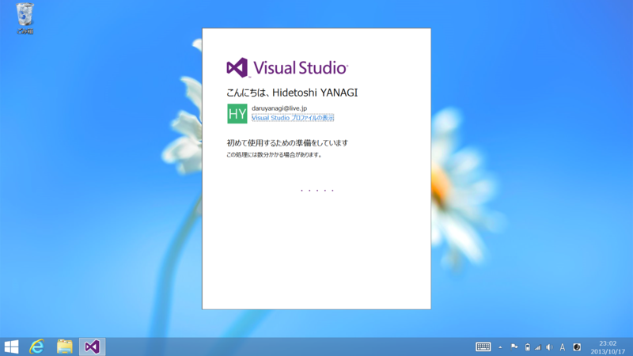

<a href="https://blog.daruyanagi.jp/entry/2013/10/18/000952">Windows 8.1 &#x3092;&#x3055;&#x3063;&#x305D;&#x304F;&#x5165;&#x308C;&#x3066;&#x307F;&#x305F;&#x3002; - &#x3060;&#x308B;&#x308D;&#x3050;</a> ので、Windows 8.1 と同じく RTM だか GA だかした Visual Studio 2013 もインストールしてみた。VS 2013 の詳細については、すっかりお馴染みとなったソマセガー氏のブログでも読んでけれ。

<blockquote cite="http://blogs.msdn.com/b/somasegar/archive/2013/10/17/visual-studio-2013-available-for-download.aspx">

I’m excited to announce that the final releases of Visual Studio 2013, .NET 4.5.1, and Team Foundation Server 2013 are now available for download!  MSDN subscribers can download from the MSDN Subscriber Downloads page.

Visual Studio 2013 is the best tool for developers and teams to build and deliver modern, connected applications on all of Microsoft’s platforms.  From Windows Azure and SQL Server to Windows 8.1 and Windows Phone 8, Visual Studio 2013 supports the breadth of Microsoft’s developer platforms.

<cite><a href="http://blogs.msdn.com/b/somasegar/archive/2013/10/17/visual-studio-2013-available-for-download.aspx">Visual Studio 2013 available for download &ndash; Somasegar&#39;s blog</a></cite>
</blockquote>

ふと気づいたけど、OS と開発環境が同時リリースって今まであったっけ？　なかったっけ。

<ul>
<li><a href="http://www.microsoft.com/visualstudio/jpn/downloads">http://www.microsoft.com/visualstudio/jpn/downloads</a></li>
</ul>
ダウンロードはこちらから。僕は貧乏なので Professional をインストールした。そう遠くないうちに Visual Studio 2012 のユーザーには優待アップグレードパッケージが提供される予定なので、それまでは試用版で過ごすつもり。

<h3>インストール。</h3>

初期状態では Windows Phone 8.0 SDK だけチェックが外れている。

一度再起動。

インストールの再開。

完了。

 

<h3>起動</h3>

初回起動時に Microsoft アカウントでログインすると……

設定が同期されるのだそうだ。

Visual Studio を入れるとまずフォントを Consolas にするのが慣例になっていたが、それもこのバージョンで終わり。楽になってケド、ちょっと寂しい気もする（？

やっぱり Visual Studio はこの青のテーマだね。黒とかいったい何だったんだ……まぁ、好きな人もいるんだろうけれど。

Blend もついている。高橋忍さんが Blen道 という連載を始めたので、それでも読みながら少しずつマスターしたいなぁ。

<ul>
<li><a href="http://microsoft-evangelist.hatenablog.jp/entry/blend">&#x3061;&#x3087;&#x3063;&#x3068;&#x65B0;&#x9023;&#x8F09; Blen&#x9053; - &#x30DE;&#x30A4;&#x30AF;&#x30ED;&#x30BD;&#x30D5;&#x30C8; &#x30A8;&#x30D0;&#x30F3;&#x30B8;&#x30A7;&#x30EA;&#x30B9;&#x30C8;&#x306E;&#x30D6;&#x30ED;&#x30B0;</a></li>
</ul>
一応レイアウトやバインディングまではできるつもりだけど、アニメーションなんかは苦手。3D はまったくわからない！

<h3>おまけ</h3>

アイコンを見分けるのが大変だと、Twitter で話題になってた。

