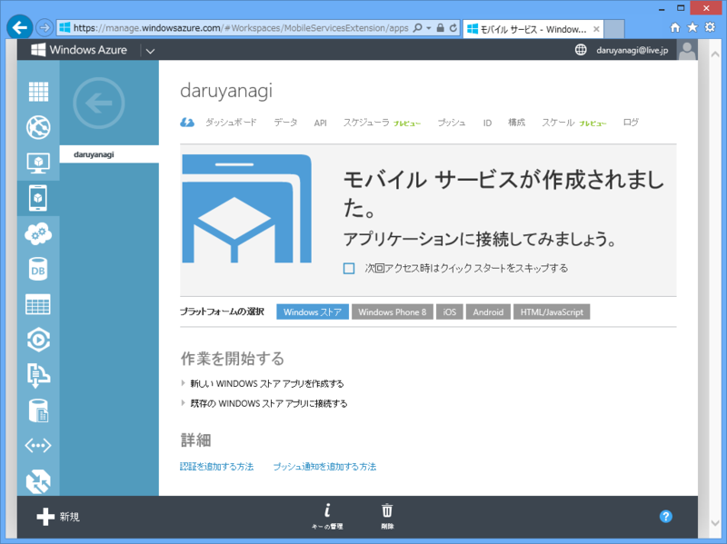

<a href="https://blog.daruyanagi.jp/entry/2013/10/14/141550">WebMatrix 3: Twitter Bot &#xFF08;&#xFF0B;&#x30EA;&#x30A2;&#x30EB;&#x30BF;&#x30A4;&#x30E0;&#x30ED;&#x30B0;&#x8868;&#x793A;&#x4ED8;&#x304D;&#xFF09;&#x3067;&#x3082;&#x4F5C;&#x3063;&#x3066;&#x307F;&#x308B;&#x3002; - &#x3060;&#x308B;&#x308D;&#x3050;</a> を Windows Azure Websites に置いてみた――のだけど、なんかすぐに止まってしまう。最初は SignalR 使ってるからかなぁと思い、リアルタイムログ表示の機能をとっぱらってみたのだけれど、やはり止まる。

<blockquote cite="http://sqlazure.jp/b/windows-azure/1435/">

Windows Azure Webサイトの無料や共有インスタンスの場合、５～20分ほどアクセスが無かった場合はシャットダウンされてリソースが解放されます。そーすると、初回アクセス時に、レスポンスが遅く感じる事象が発生します。

Windows Azureモバイルサービスのジョブスケジューラーで15分起きにリクエストを送信することで、常時ウォームアップし続けることが可能になります。  
素敵だけど、怒られそうな話ですね！

<cite><a href="http://sqlazure.jp/b/windows-azure/1435/">Windows Azure&#x3067;&#x5B9A;&#x671F;&#x30B8;&#x30E7;&#x30D6;&#x3092;&#x5B9F;&#x884C;&#x3059;&#x308B;&#x65B9;&#x6CD5; - &#x84BC;&#x306E;&#x738B;&#x5EA7;</a></cite>
</blockquote>

怒られたらイヤだけど、とりあえずこの方法を試してみた。結論的には、上手くいった。Twitter のメインアカウント（<a href="https://twitter.com/YanagiHidetoshi">&#x3084;&#x306A;&#x304E; &#x3072;&#x3067;&#x3068;&#x3057;&#xFF08;&#x67F3; &#x82F1;&#x4FCA;&#xFF09; (@YanagiHidetoshi) | Twitter</a>）に新着情報を配信できるようになった。

スケジューリングは毎分・毎時・毎日・毎月と要求時が設定できるみたい。正時にキッカリ実行したいなんて言う場合には使えないので、10分おきにサイトをキックするだけにして、定期実行の仕組みは自分で実装した（ついでにコードも前よりカッコよく、シンプルにしたった！）。

 

<pre class="code lang-javascript" data-lang="javascript" data-unlink>function warmup() {
warmUpSite(&quot;http://darufeed.azurewebsites.net/&quot;);
}
function warmUpSite(url) {
console.info(&quot;warming up: &quot; + url);
var req = require('request');
req.get({ url: url }, function(error, response, body) {
if (!error) {
console.info(&quot;hot hot hot! &quot; + url);
} else {
console.error('error warming up ' + url + ': ' + error);
}
});
}
</pre>
スクリプトは JavaScript で記述。コピペで拝借したけれど、ウォームアップに使うならこれで十分みたい。

<h3>追記</h3>

<ul>
<li><a href="http://www.buildinsider.net/web/webapibatch/01">&#x30B9;&#x30B1;&#x30B8;&#x30E5;&#x30FC;&#x30EB;&#x3055;&#x308C;&#x305F;&#x30B8;&#x30E7;&#x30D6;&#x6A5F;&#x80FD;&#x3068;Azure Web&#x30B5;&#x30A4;&#x30C8;&#x3092;&#x7D44;&#x307F;&#x5408;&#x308F;&#x305B;&#x305F;&#x5B9A;&#x671F;&#x51E6;&#x7406;&#x306E;&#x5B9F;&#x88C5; - Build Insider</a></li>
</ul>
これがわかりやすいっポイポイ。

