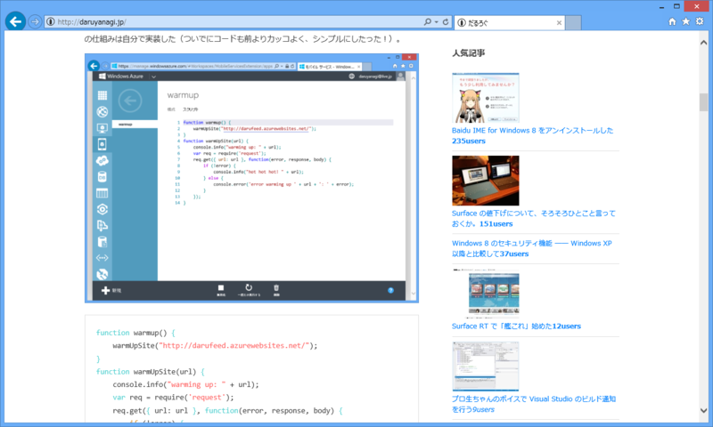
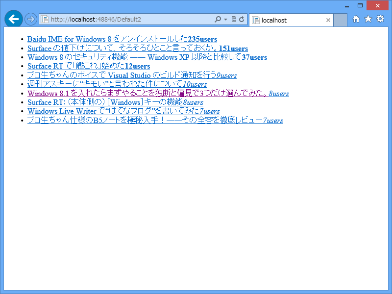
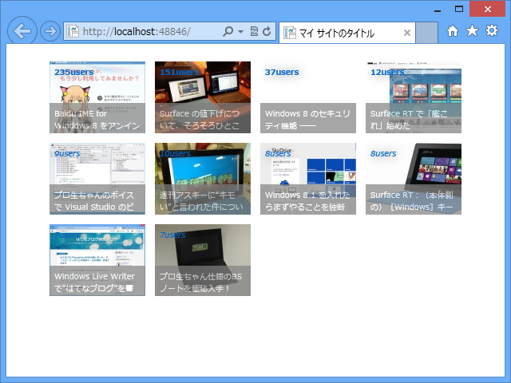

このブログのサイドバーにある「人気記事」のリストは、しばやんが作ったはてなブログ用の人気エントリー API を利用している。

<ul>
<li><a href="http://shiba-yan.hatenablog.jp/entry/20130511/1368281675">Nancy &#x3067;&#x306F;&#x3066;&#x306A;&#x30D6;&#x30ED;&#x30B0;&#x7528;&#x306E;&#x4EBA;&#x6C17;&#x30A8;&#x30F3;&#x30C8;&#x30EA;&#x30FC; API &#x3092;&#x4F5C;&#x3063;&#x3066;&#x307F;&#x305F; - &#x3057;&#x3070;&#x3084;&#x3093;&#x96D1;&#x8A18;</a></li>
<li><a href="http://shiba-yan.hatenablog.jp/entry/20130523/1369239060">&#x306F;&#x3066;&#x306A;&#x30D6;&#x30ED;&#x30B0;&#x7528;&#x306E;&#x4EBA;&#x6C17;&#x30A8;&#x30F3;&#x30C8;&#x30EA;&#x30FC;&#x8868;&#x793A;&#x30D1;&#x30FC;&#x30C4;&#x3092;&#x771F;&#x9762;&#x76EE;&#x306B;&#x4F5C;&#x3063;&#x305F; - &#x3057;&#x3070;&#x3084;&#x3093;&#x96D1;&#x8A18;</a></li>
</ul>
最近ちょっと動かないことがあったのだけど、

とのこと。最近、はてながスクリプトの読み込み順序をイジったのが原因らしい。というわけで、この対処法を組み込んで実行してみる。
 
 

<h3>シンプルな例</h3>
<pre class="code lang-html" data-lang="html" data-unlink>&lt;!DOCTYPE html&gt;

&lt;html lang=&quot;en&quot;&gt;
&lt;head&gt;
        &lt;meta charset=&quot;utf-8&quot; /&gt;
        &lt;title&gt;&lt;/title&gt;
        
        &lt;script src=&quot;http://ajax.aspnetcdn.com/ajax/jQuery/jquery-2.0.3.js&quot;&gt;&lt;/script&gt;
        &lt;script&gt;
            (function (url) {
                $(function () {
                    var ul = $(&quot;#hatena-bookmark&quot;);
                    ul.parent().prev().wrapInner(&quot;&lt;a href=\&quot;http://b.hatena.ne.jp/entrylist?url=&quot; + url + &quot;&amp;sort=count\&quot;&gt;&lt;/a&gt;&quot;);
 
                    $.ajax({
                        url: &quot;http://rss2json.azurewebsites.net/hatena/bookmark&quot;,
                        data: { url: url },
                        dataType: &quot;jsonp&quot;
                    }).done(function (entries) {
                        var list = [];
                        $.each(entries, function () {
                            var link = $(&quot;&lt;a/&gt;&quot;, { href: this.link }).append($(&quot;&lt;span/&gt;&quot;, { text: this.title }));
                            var count = $(&quot;&lt;a/&gt;&quot;, { href: &quot;http://b.hatena.ne.jp/entry/&quot; + this.link, text: this.count + &quot;users&quot; });
                            var container = $(&quot;&lt;span/&gt;&quot;).addClass(&quot;bookmark-count&quot;).append(this.count &gt; 10 ? $(&quot;&lt;strong/&gt;&quot;).append(count) : this.count &gt;= 5 ? $(&quot;&lt;em/&gt;&quot;).append(count) : count);
 
                            list.push($(&quot;&lt;li/&gt;&quot;).append(link, container));
                        });
                        ul.append(list);
                    });
                });
                document.write(&quot;&lt;ul id=\&quot;hatena-bookmark\&quot; class=\&quot;hatena-urllist\&quot;&gt;&lt;/ul&gt;&quot;);
            })(&quot;https://blog.daruyanagi.jp/&quot;);
        &lt;/script&gt;
    &lt;/head&gt;
&lt;body&gt;
&lt;ul id=&quot;hatena-bookmark&quot;&gt;&lt;/ul&gt;
&lt;/body&gt;
&lt;/html&gt;
</pre>
このコードをコピペして実行するとこんな感じに表示されるはず。

 

<h3>ちょっとリッチにしてみた</h3>

<blockquote>

あとは API から返却している JSON に image というキーを追加しました。このキーには、はてなブックマークが保持しているエントリ画像への URL が格納されるので、こんな一覧表示もできます。

</blockquote>

これを利用すると、少しだけリッチになる（CSS は割と適当なので注意）。

<pre class="code lang-html" data-lang="html" data-unlink>&lt;!DOCTYPE html&gt;

&lt;html lang=&quot;ja&quot;&gt;
&lt;head&gt;
        &lt;meta charset=&quot;utf-8&quot; /&gt;
        &lt;title&gt;マイ サイトのタイトル&lt;/title&gt;
        &lt;link href=&quot;~/favicon.ico&quot; rel=&quot;shortcut icon&quot; type=&quot;image/x-icon&quot; /&gt;

        &lt;script src=&quot;http://ajax.aspnetcdn.com/ajax/jQuery/jquery-2.0.3.js&quot;&gt;&lt;/script&gt;
        &lt;script&gt;
            (function (url) {
                $(function () {
                    var ul = $(&quot;#hatena-bookmark&quot;);
                    ul.parent().prev().wrapInner(&quot;&lt;a href=\&quot;http://b.hatena.ne.jp/entrylist?url=&quot; + url + &quot;&amp;sort=count\&quot;&gt;&lt;/a&gt;&quot;);
 
                    $.ajax({
                        url: &quot;http://rss2json.azurewebsites.net/hatena/bookmark&quot;,
                        data: { url: url },
                        dataType: &quot;jsonp&quot;
                    }).done(function (entries) {
                        var list = [];
                        $.each(entries, function () {
                            var image = $(&quot;&lt;img/&gt;&quot;, { src: this.image === &quot;&quot; ? &quot;/Images/404.jpg&quot; : this.image, alt: this.title, text: this.title });
                            var link = $(&quot;&lt;a/&gt;&quot;, { href: this.link }).addClass(&quot;bookmark-title&quot;).append($(&quot;&lt;span/&gt;&quot;, { text: this.title }));
                            var count = $(&quot;&lt;a/&gt;&quot;, { href: &quot;http://b.hatena.ne.jp/entry/&quot; + this.link, text: this.count + &quot;users&quot; });
                            var container = $(&quot;&lt;span/&gt;&quot;).addClass(&quot;bookmark-count&quot;).append(this.count &gt; 10 ? $(&quot;&lt;strong/&gt;&quot;).append(count) : this.count &gt;= 5 ? $(&quot;&lt;em/&gt;&quot;).append(count) : count);
 
                            list.push($(&quot;&lt;li/&gt;&quot;).append(image, link, container));
                        });
                        ul.append(list);
                    });
                });
                document.write(&quot;&lt;ul id=\&quot;hatena-bookmark\&quot; class=\&quot;hatena-urllist\&quot;&gt;&lt;/ul&gt;&quot;);
            })(&quot;https://blog.daruyanagi.jp/&quot;);
        &lt;/script&gt;

        &lt;style&gt;
#hatena-bookmark {
font-family: Meiryo, sans-serif;
}

#hatena-bookmark li {
display: block;
position: relative;
width: 120px;
height: 90px;
margin: 6px;
float: left;
}

#hatena-bookmark li image {
position: absolute;
bottom: 0;
left: 0;
}

#hatena-bookmark li a.bookmark-title {
position: absolute;
bottom:0;
left: 0;
padding: 6px;
font-size: 10px;
height: 26px;
overflow: hidden;
text-decoration: none;
color: white;
opacity: 0.7;
background: gray;
}

#hatena-bookmark li .bookmark-count a {
position: absolute;
top: 6px;
left: 6px;
font-size: 10px;
text-decoration: none;
text-shadow: 1px 1px 12px gray;
color: red;
}
&lt;/style&gt;
    &lt;/head&gt;
&lt;body&gt;
&lt;ul id=&quot;hatena-bookmark&quot;&gt;&lt;/ul&gt;
&lt;/body&gt;
&lt;/html&gt;
</pre>

サムネイルがない場合に表示する画像を ~/Images/404.jpg に用意してほしい。

<pre class="code lang-javascript" data-lang="javascript" data-unlink>var image = $(&quot;&lt;img/&gt;&quot;, { src: this.image === &quot;&quot; ? &quot;/Images/404.jpg&quot; : this.image, alt: this.title, text: this.title });
</pre>
と

<pre class="code lang-javascript" data-lang="javascript" data-unlink>list.push($(&quot;&lt;li/&gt;&quot;).append(image, link, container));
</pre>
の行以外はあんまり触っていない。できれば、もう少し大きいサムネイルもあればいいのにな。 <a href="http://daruyanagi.net/">http://daruyanagi.net/</a> にでも使うのに（チラッ

