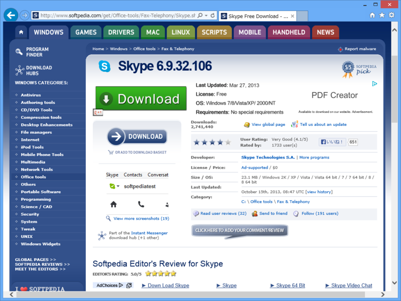
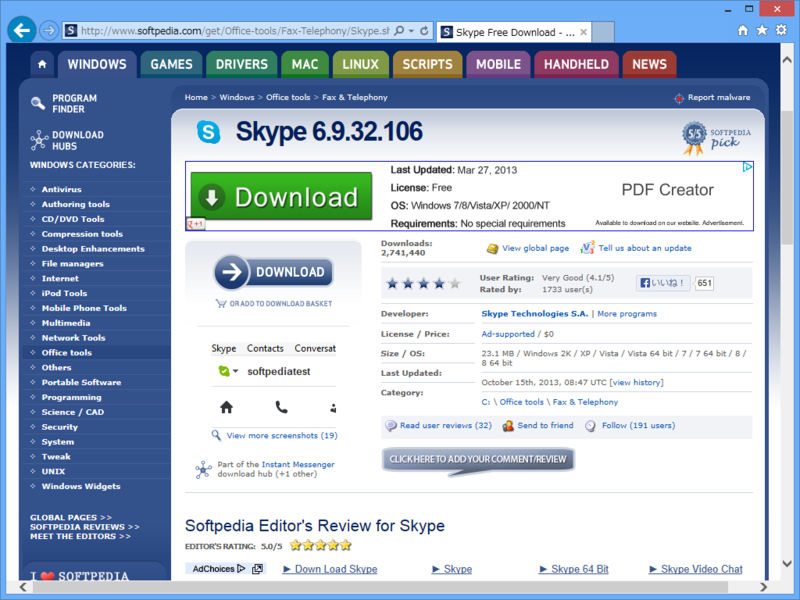

ちょいとこれを見てくれ。あなたは今、このページに掲載されているソフトウェアをダウンロードしたいものとする。どこをクリックするのが正解でしょうか。

答えは青い方のダウンロードボタンで、緑色のボタンは広告だ。というか、青線で囲われた部分が Google AdSense になる。対応 OS や公開日まで書いてあるので、ついついこっちをクリックしそうになる（実際に何回か騙されたことはある）。

最近、こういう広告が増えて困る。

まぁ、でも、クリックする方もする方だと思う。なかには「英語だからクリックしたら変なアプリをインストールされた。責任とれ」とかいう人までいるんだけど、「英語だからクリックする」ってどんな脳みその構造になっているのか。どんだけ英語が好きなんだ。パブロフの犬なのか、パブロンの猫なのか。

悪い奴というのは、ありとあらゆる手段でこちらを騙しにかかってくる。なるべくそれに対抗する処置はとるつもりだけれど、最低限は自営してもらわないと困る。

クリックするときはよくよく注意するべきだし、ましてや意味が分からないものには触っちゃいけない。たいていのブラウザーはマウスオーバーでリンク先を表示してくれるはずなので、それをチェックする癖をつけたい。アドレスバーでドメインを確認するのも大事だ。

――けど、タッチオペレーションのモバイル端末ブラウザーだとなかなか難しいよね。だいぶ困る。

あと、愚痴ついでに言わせてもらうけれど「英語表記だからソフトの使い方がわからない」と言われるのも困る。それが“Supercalifragilisticexpialidocious”みたいな単語ばかりだったらまだわかる。でも、たかだか“File”とか“Edit”とか“Exit”ぐらいしか書いてないじゃないか。

お前は義務教育で何を学んできたのかと問いたい。

