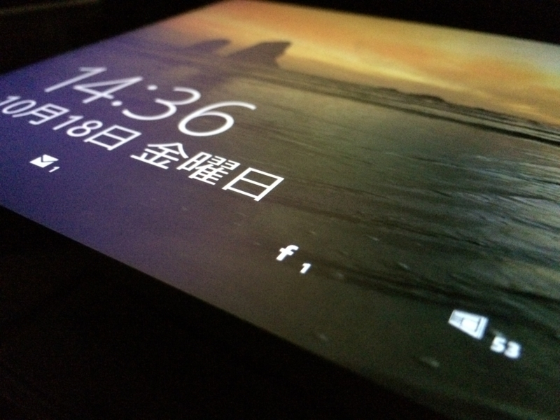
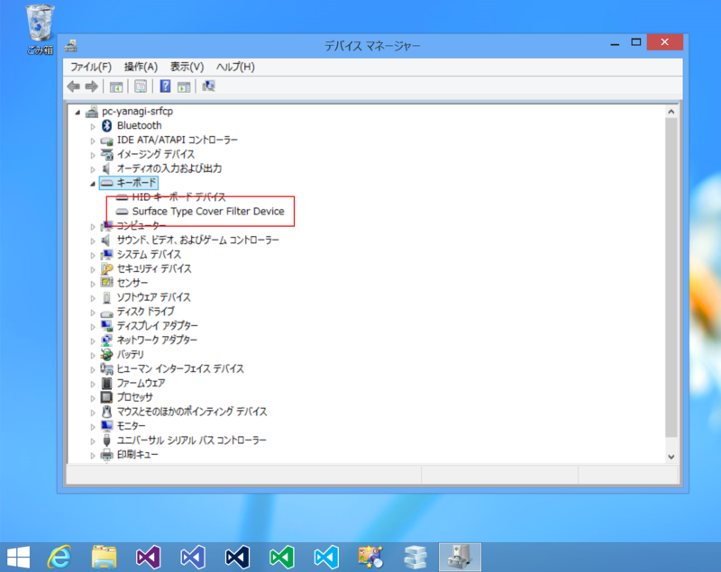
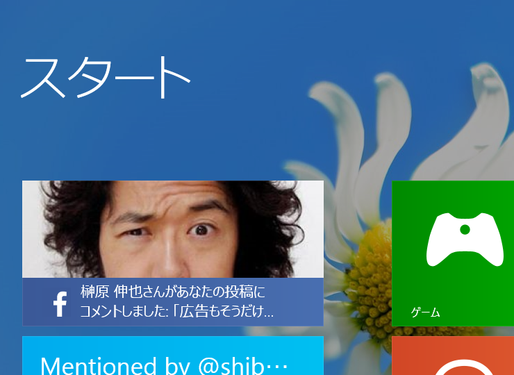
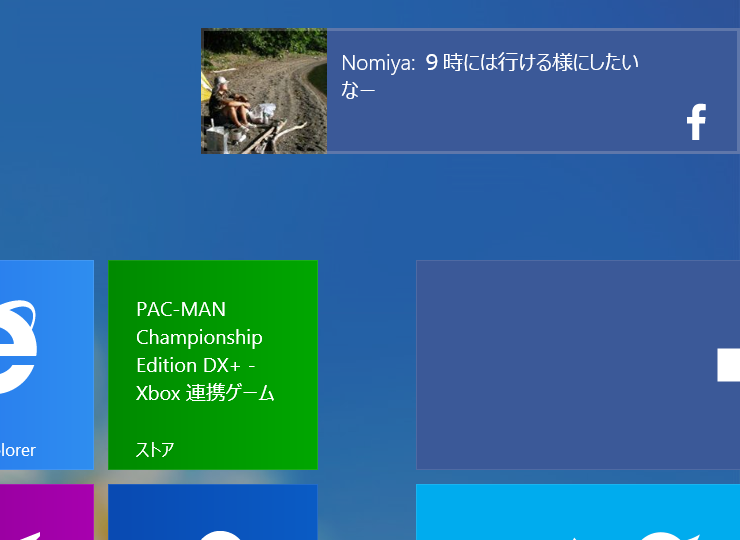

最近、Surface Pro ＋ Type Cover の調子が悪い。症状はこんな感じ。

<ul>
<li>勝手に再起動する。</li>
<li>Type Cover が反応しなくなる。</li>
</ul>
心当たりのあることと言えば、Surface RT 用の AC アダプターで駆動していることぐらいだろうか。けれど、バッテリー駆動時でも再起動がかかることがある気がする（記憶があやふや）。Windows 8.0 でも Windows 8.1 でも発生したので、OS はとくに関係がないようだ。

デバイス マネージャーをみてみると、Type Cover が反応しないときは“Surface Type Cover Filter Device”というのがない。

Type Cover を外した状態で再起動をかけて再装着するとたいてい復活するのだけど、毎回それをやるのは面倒すぎる。

とりあえず、今日は Surface RT につけていた Touch Cover（青）と交換して使ってみた。Surface RT ＋ Type Cover、Surface Pro ＋ Touch Cover ともに一度もトラブルなく一日を終えることができたので、少しこの運用を続けてみようと思う（追記: 残念ながら 2013/10/24 1:50 に落ちた）。

<ul>
<li><a href="http://www.microsoft.com/surface/ja-jp/support/hardware-and-drivers/troubleshoot-surface-keyboards">Microsoft Surface &#x30BF;&#x30C3;&#x30C1; &#x30AB;&#x30D0;&#x30FC;&#x304A;&#x3088;&#x3073;&#x30BF;&#x30A4;&#x30D7; &#x30AB;&#x30D0;&#x30FC;&#x306E;&#x30D8;&#x30EB;&#x30D7; | &#x30BF;&#x30C3;&#x30C1;&#x30D1;&#x30C3;&#x30C9;&#x306E;&#x30D8;&#x30EB;&#x30D7;</a></li>
</ul>
掃除とかもしたほうがいいんらしいけど、ちょっと拭いただけでは改善されなかった。

 

話は変わるけど、Facefook For Windows 8.1 はフツーに使える。これで Surface の使い勝手が上がった。あとは将棋連盟の中継アプリと Kinoppy が Windows ストア アプリになってくれれば完璧なんだが。

