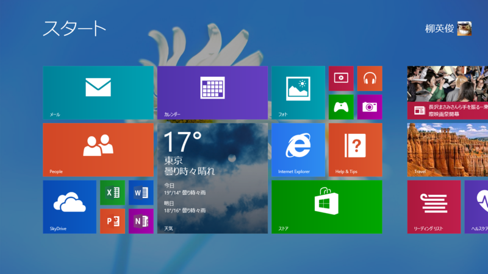
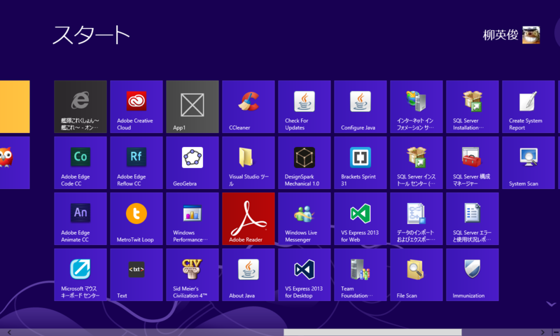
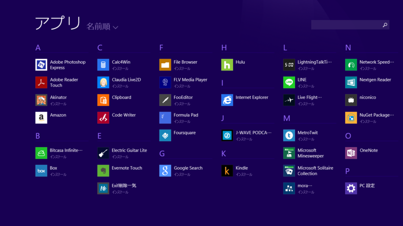
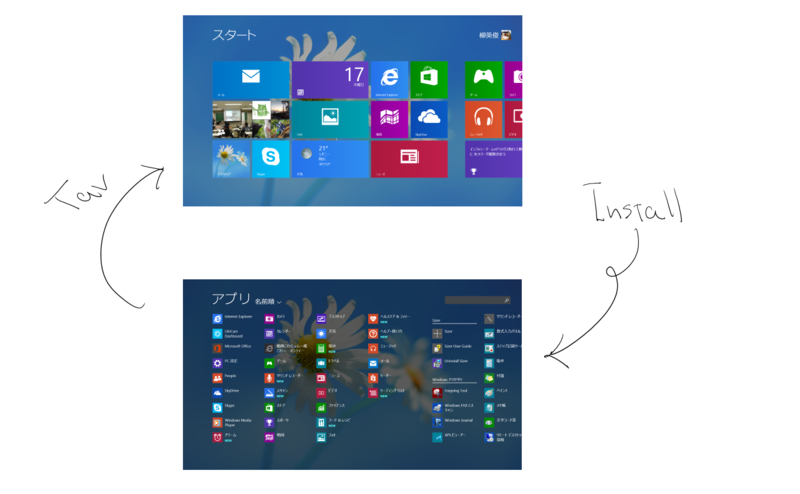
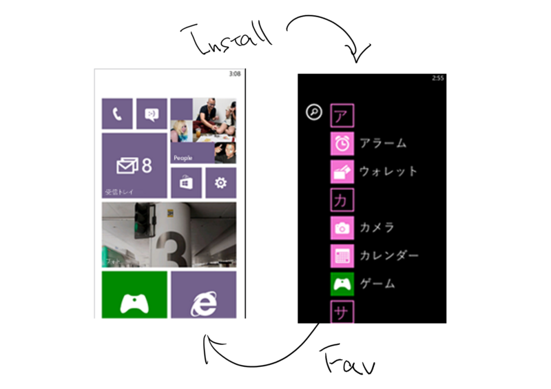
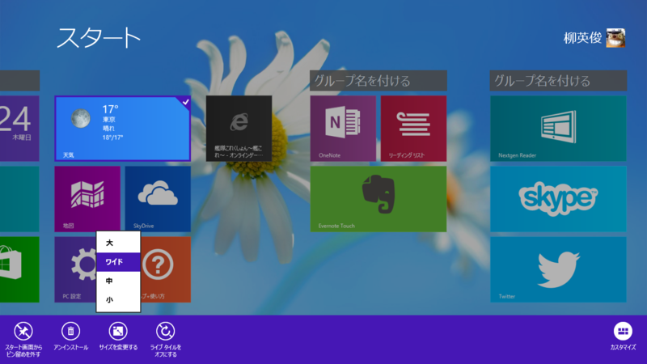
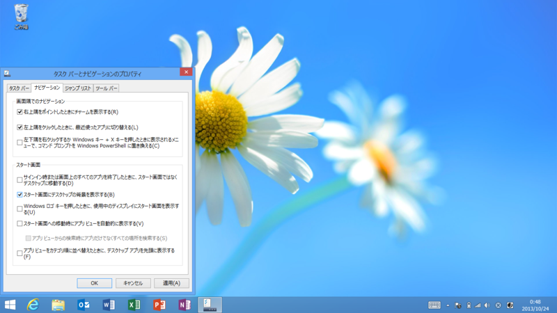
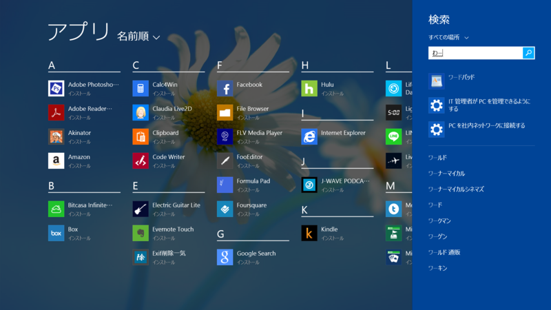

Windows 8.1 で一番いいなと思ったのは、実はスタート画面の改善。一言で表現すると“よりコントローラブルになった”。

というのも、Windows 8.0 のスタート画面はわりかしコントローラブルではなかった。次から次へとスタート画面にタイルが追加され、日を追うにつれてぐちゃぐちゃになっていく（Windows ストア アプリを開発したりする人なんかはよくわかると思う。新しいアプリをビルドするたびに、スタート画面の右端はカオスになっていく）。始めはちゃんと自分好みに整理整頓してカスタマイズするのだけど、だんだんそのやる気も削がれていき、最終的にはこんな感じになる。

<i>なんてアグリーなんだ！</i>現実に為すすべなく敗れた理想の悲しい姿がそこにある。

けれど、Windows 8.1 ではあまりこうならないはず。というのも、インストールされたアプリはいきなりタイルにはならず、“アプリ ビュー”に突っ込まれるからだ。スタート画面を上へめくると現れるのがそれで、カオスはここに封じ込められる。

スタート画面に並べておきたいアプリだけココから取り出すようにすれば、スタート画面が乱雑になることはない。“SkyDrive”を利用すれば、スタート画面のレイアウトを複数環境で同期することも可能<a href="#f-61ab5e42" name="fn-61ab5e42" title="Windows 8.0 時代はローミングのストレージとして“SkyDrive”があまり前面に押し出されてなかったと思うが、Windows 8.1 ではずばり“SkyDrive”の設定欄で同期オプションが指定できる">*1</a>。これだったらカスタマイズのしがいもあるというものだ。

Install したら“アプリ ビュー”へ。気に入ったら“タイル ビュー”<a href="#f-ed8ad1be" name="fn-ed8ad1be" title="勝手に名前つけてみた">*2</a>へ。

でもこれって実は Windows Phone でお馴染みのスタイルなんだよね。<i>なんで最初からこうじゃなかったんだ！！ </i>タイルの大きさを自由に変えられるようになったのも、ある意味 Windows Phone 7.8/8.0 に追いついたと言えるよね。

正直、今出てる Windows タブレットで“小”タイルがいるかと言われれば微妙な気はするけど、7インチタブレットなんかがラインナップされたら重要性が増すのかもしれない。

一方、ちょっと戸惑ったのがタイルのカスタマイズ。

従来はタイルを下にはじく操作（マウスなら右クリック、つまりタイルの選択操作）でカスタマイズモードに遷ったと思うのだけど、Windows 8.1 ではタイルの長押しでカスタマイズモードに遷るように挙動が変わっている（マウスによる操作の場合は依然と変わらず）。ちょっと戸惑ったし、今でもたまに間違うのだけれど、まぁ、これは慣れるしかないか。タイルを下へはじいて選択、というユーザーインターフェイスはあまり受け入れられなかったのかな？

ほかにもデスクトップユーザーを意識したオプションが結構追加されている。

<ol>
<li>サインイン時にスタート画面ではなくデスクトップを表示する（いわゆる Boot2Desktop というやつ）</li>
<li>スタート画面にデスクトップの背景を表示する</li>
<li>スタート画面を表示した際にタイル ビューではなくアプリ ビューを表示する</li>
<li>アプリ ビューから検索時に、アプリだけでなくすべての場所を検索する</li>
<li>アプリ ビューをカテゴリ順に並べたとき、デスクトップ アプリを先頭に表示する</li>
</ol>
2 は文句なくすべてのユーザーにお勧め（<a href="https://blog.daruyanagi.jp/entry/2013/10/18/003351">Windows 8.1 &#x3092;&#x5165;&#x308C;&#x305F;&#x3089;&#x307E;&#x305A;&#x3084;&#x308B;&#x3053;&#x3068;&#x3092;&#x72EC;&#x65AD;&#x3068;&#x504F;&#x898B;&#x3067;3&#x3064;&#x3060;&#x3051;&#x9078;&#x3093;&#x3067;&#x307F;&#x305F;&#x3002; - &#x3060;&#x308B;&#x308D;&#x3050;</a> に足しとこうかしら？）。スタート画面がとデスクトップの距離がぐっと縮まる。

デスクトップメインのユーザーは 1 のほか、3・4 を有効化しておくとよいと思う。キーボードオペレーションで利用したときに、ほとんど Windows 7 と同じ動作をする。腐るほどアプリをインストールしている“パワーユーザー”なら、スタートメニューの検索ぐらい使いこなしてるよな？　アレと同じ感じになるってことだ。

ただ、この検索ユーザーインターフェイスだけは Windows 8.0 のほうがよかった。なぜ狭いところに検索結果を押し込めるのだろう。Windows 8.0 なら「わーど」で「Microsoft Word」まで引っかかったけれど、Windows 8.1 では「ワードパッド」しか引っかからないのも少し退化であるように思える。

<ul>
<li><a href="https://blog.daruyanagi.jp/entry/2012/06/06/204210">Metro &#x30C7;&#x30B9;&#x30AF;&#x30C8;&#x30C3;&#x30D7;&#x306F;&#x3067;&#x3063;&#x304B;&#x3044;&#x30B9;&#x30BF;&#x30FC;&#x30C8;&#x30E1;&#x30CB;&#x30E5;&#x30FC;&#x3002;&#x6B7B;&#x3093;&#x3060;&#x306E;&#x306F;&#x30B9;&#x30BF;&#x30FC;&#x30C8;&#x30E1;&#x30CB;&#x30E5;&#x30FC;&#x3067;&#x306F;&#x306A;&#x304F;&#x30DE;&#x30A6;&#x30B9;&#x3002; - &#x3060;&#x308B;&#x308D;&#x3050;</a></li>
</ul>

<a href="#fn-61ab5e42" name="f-61ab5e42" class="footnote-number">*1</a>:Windows 8.0 時代はローミングのストレージとして“SkyDrive”があまり前面に押し出されてなかったと思うが、Windows 8.1 ではずばり“SkyDrive”の設定欄で同期オプションが指定できる

<a href="#fn-ed8ad1be" name="f-ed8ad1be" class="footnote-number">*2</a>:勝手に名前つけてみた

