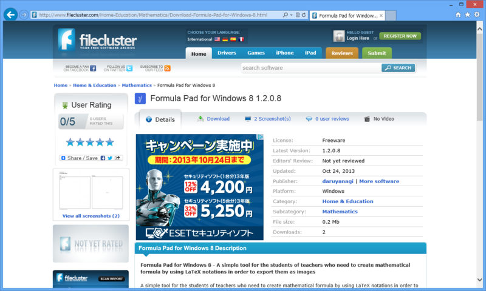

<a href="https://blog.daruyanagi.jp/entry/2013/10/09/123725">Softpedia &#x306B;&#x63B2;&#x8F09;&#x3055;&#x308C;&#x305F;&#x3063;&#x305F;&#x3002; - &#x3060;&#x308B;&#x308D;&#x3050;</a> に引き続き、<a href="http://www.filecluster.com/">FileCluster - Free Software Downloads, Reviews and Guides</a> というところからも紹介したとの旨のメールをいただいた。

<blockquote cite="http://www.filecluster.com/Home-Education/Mathematics/Download-Formula-Pad-for-Windows-8.html">

<a href="http://download.daruyanagi.net/Formula%20Pad%20for%20Windows%208">Formula Pad for Windows 8</a> - A simple tool for the students of teachers who need to create mathematical formula by using LaTeX notations in order to export them as images

<cite><a href="http://www.filecluster.com/Home-Education/Mathematics/Download-Formula-Pad-for-Windows-8.html">http://www.filecluster.com/Home-Education/Mathematics/Download-Formula-Pad-for-Windows-8.html</a></cite>
</blockquote>

こういう商売しているにも拘らず、寡聞にしてここは知らなかったのだけど。恥ずかしす。海外のネタも積極的に拾っているつもりだけれど、まだまだ漏れがあるらしい。インターネッツは広大ですね。

この業界も海の分け隔て関係なく案外狭くて、毎日ウォッチしていると「あぁ、このネタはあそこから引っ張ってきたんだな」「ん、ウチを読んでるのかな」などと、緩いつながりが見えてきてなかなか面白い。時間があればこうした情報をまとめるネタ管理サービスなんかも、WebMatrix で作りたいところだ。純粋に自分のために作ったものであっても、公開すればだれかしらの役に立つかもしれんしな。そう思えるのが、この業界の心地よいところだ。

それはそうと、この前とあるコンテストに応募してしまったので、新しいアプリを開発せねばならないのだが……どうしよう。どうせなら Windows 8 ではできなくてあきらめたことに挑戦してみたいものだ。

