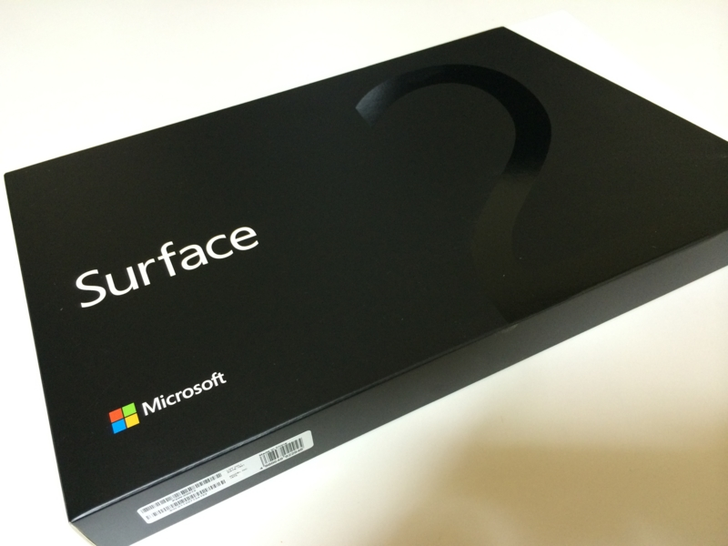
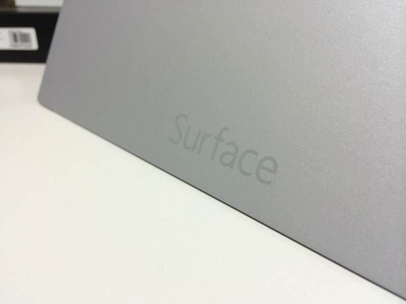
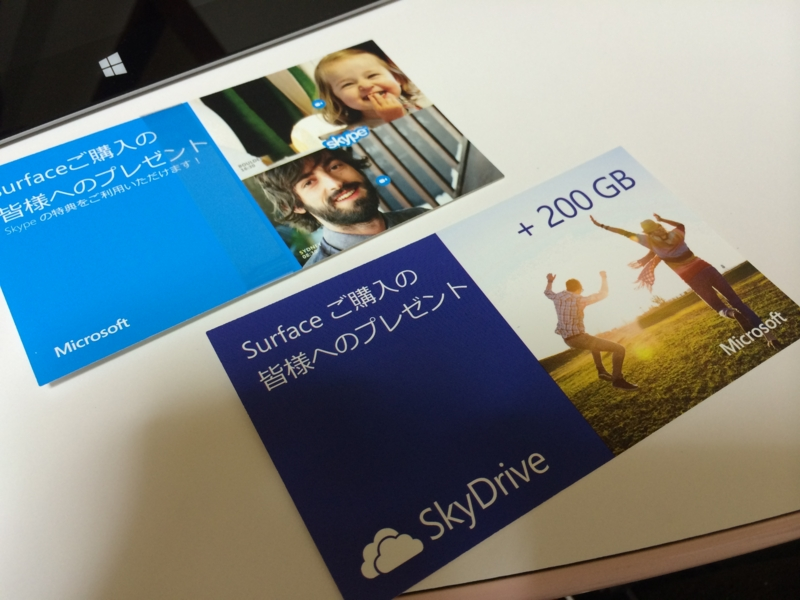
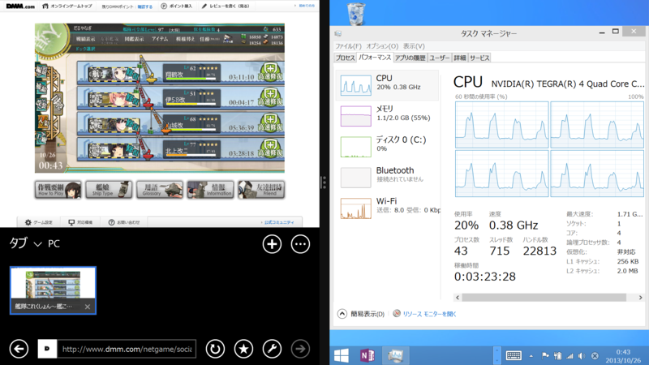
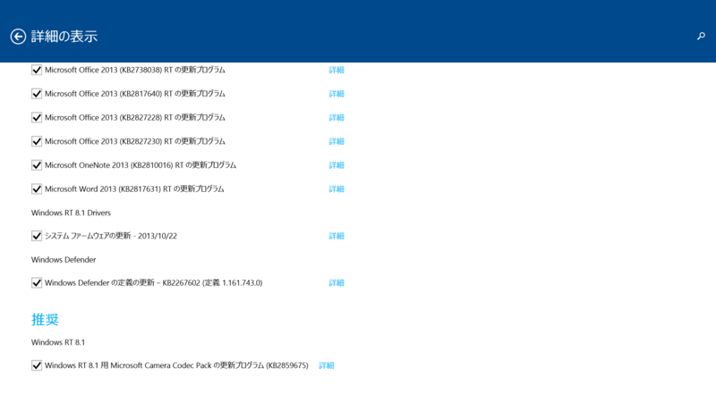
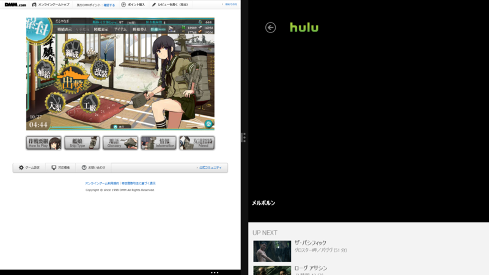

金曜日、朝起きたらなんか調子悪かったので、お仕事サボった。まぁ、サボるといってもリソースの足りない昨今、純粋にサボるわけにもいかず<a href="#f-1c49198c" name="fn-1c49198c" title="いや、まぁ、サボっても何とかしてくれるとは思うがｗ">*1</a>、少し頑張って記事を二本書いて送った。

――そこまでは自分を褒めてあげたいのだが<a href="#f-0640e5e3" name="fn-0640e5e3" title="そもそもちゃんと体調管理しろよというツッコミはなしな">*2</a>、そのあと、ぼーっとした頭で Surface 2 のページをいろいろ見ていたのがあかんかった。

午後8時、ヨドバシから Surface 2 が到着。<i>当日配達するとかいうから買っちまったじゃねーか、クソが！（褒　</i>こうして、来月のカードの請求残高には確実に4万円が追加されたのであった<a href="#f-dc7216ff" name="fn-dc7216ff" title="ヨドバシポイント使ったので5,000円の割引">*3</a>。

<h3>第一印象</h3>

<i>ちょっと軽いかな？　</i>と感じた。先代の Surface RT の重量は約 680 g、今回の Surface 2 の重量は 676 g 未満とのこと。カタログスペックではほとんど違いはないはずなのに、軽さを感じた。外装が重そうな黒から、軽快さを感じさせるシルバーになったからか。ちなみに、Surface 2 の外装がシルバーだっていうことは到着してから知った（死

Skype と SkyDrive のクーポンがついていた。とくに Skype はいろいろ試してみたいことがあったのでうれしい。SkyDrive 200GB は、ちょっともてあましそうだ。

あとは――SD カードスロットの位置がわかりやすくなったな。Surface RT は最初スロットがついていることに気づかず、ついていることを知った後もどこにあるのか謎だった。

2段階のキックスタンドは、今のところメリットが感じられない。そのうち役に立つんだろう。あと液晶がキレイになって解像度が上がったらしいのだけど、あまりよくわからなかった。初期状態の DPI 設定は Surface Pro と同じで、すでにこちらで慣れていたというのもあるのかもしれない。

<h3>艦これ</h3>

Surface 2 を開封して、10分ほどでか。かつての Surface RT の環境が SkyDrive 経由で同期された。スタート画面にできた艦これショートカットをタップすると、Internet Explorer 11 で ID・パスワードがセット済みのログイン画面が表示され、そのまま艦これの世界へ。ほんま Cool やで。Twitter や Facebook クライアントのパスワードも再入力しなくていい。この点は iOS よりも勝っている。

さて、期待のパフォーマンスだが、確かに Surface RT よりは早い。けれど、アニメーションにラグはあるし、画面の切り替えは遅い。

どうも CPU がフル活用されている気配がない。OS のせいか、Flash のせいか、ゲームの実装に問題があるのか。

そこで思い出したのだけど、Windows RT 8.1 では RTM から GA でかなり変更が加えられていて、Windows Update が溜まっている。このなかには Adobe Flash Player 11.9 のアップデートも含まれているので、もしかしたらこれをあてればマシになるかもしれない。とりあえず、適用して再起動。

これが功を奏したのかはわからないが、再起動後はちゃんと CPU がめいいっぱい使われるようになって、パフォーマンスが向上した。バックグラウンドでタスクが走ると重くなる場合があるようだけれど、かなり実用的な速度だと思う。とくに画面を 50:50 で使った場合はコマ落ちもなく、デスクトップでの動作と遜色がない。逆にいえば、<i>もう一世代分だけ CPU パワーがあれば！　</i>と思わないでもないけれど。それだけあれば、Windows RT 端末でパフォーマンス不足を感じることはもはやないのではないだろうか。

Hulu を見ながらの艦これも、ほぼ問題がなかった。ビデオ再生にハードウェア支援が効いているのか、艦これの画面が小さくなって負荷が減ったのか。ときおり Hulu の再生が止まるけれど（1時間の映画で1・2回あるかないかの頻度）、アプリの画面サイズをちょろっと調整してやれば再生が再開される。

スクリーンショットとって気付いたけれど、ビデオのレンダリングがキャプチャーできなくなってる？　システム上の都合か、著作権がらみの大人の事情かは知らないが……。

<ul>
<li><a href="https://blog.daruyanagi.jp/entry/2012/11/11/002224">Hulu &#x306E; Windows &#x30B9;&#x30C8;&#x30A2; &#x30A2;&#x30D7;&#x30EA; &#x2015;&#x2015; IE 10 &#x3067;&#x306E;&#x8868;&#x793A;&#x3068;&#x6BD4;&#x3079;&#x3066;&#x307F;&#x305F; - &#x3060;&#x308B;&#x308D;&#x3050;</a></li>
</ul>
前はキャプチャーできたのだけどね。まぁ、まったく問題はないけれど。

ともあれ、そんなこんなで布団でも退屈せず、ゆっくり養生することができた。

<h3>さよなら、Surface RT</h3>

というわけで、Surface RT はお役御免。<a href="https://blog.daruyanagi.jp/entry/2013/04/01/173814">&#x30D7;&#x30EC;&#x30BC;&#x30F3;&#x30C8;&#x306E;&#x304A;&#x77E5;&#x3089;&#x305B; - &#x3060;&#x308B;&#x308D;&#x3050;</a> の商品をいまだに発送していなかったので、お詫びの意味も込めてプロ生ちゃんグッズ（これも送るの忘れてた）とともに @nakaji に送りました。可愛がってもらえますように。

<a href="#fn-1c49198c" name="f-1c49198c" class="footnote-number">*1</a>:いや、まぁ、サボっても何とかしてくれるとは思うがｗ

<a href="#fn-0640e5e3" name="f-0640e5e3" class="footnote-number">*2</a>:そもそもちゃんと体調管理しろよというツッコミはなしな

<a href="#fn-dc7216ff" name="f-dc7216ff" class="footnote-number">*3</a>:ヨドバシポイント使ったので5,000円の割引

