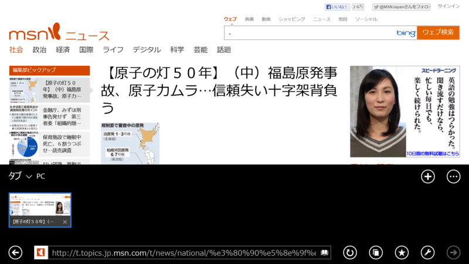

Internet Explorer 11 の Preview → RTM（11.0.9600.16384）で追加された機能に<b>“読み取りビュー”</b>がある。まぁ、<a href="http://www.readability.com/">Readability</a> みたいな機能と思っていい。要は広告やサイドバーなんかをとっぱらって Web ページを読みやすく成形する機能だ。

この機能は一部ニュースサイトでのみ利用できるようで、利用できる場合のみアドレスバーにアイコンが表示される。たとえば僕のブログのような弱小サイトでは、この機能は有効化されない。

Internet Explorer 11 の既定ではアドレスバーが非表示になっているので、説明なしでこれに気づく人がいたらかなりのエスパーだと思う。常にアドレスバーを表示しているユーザーならば気付くかもしれないが。

押すとこんな感じになる。確かに読みやすいけれど、記事にあった資料画像が飛んでしまうので功罪相半ばと言ったところか。

この読み取りビューには4つのスタイルが用意されており、［設定］チャームで切り替えられる。

フォントは Internet Explorer 11 の“Web ページ フォント”の設定が適用されるようだ。この機能には直接関係ないが、Windows 8.1 には游ゴシック・游明朝が追加されているので、それを利用することも可能。

まぁ、悪くはない機能だけど、きっと使われないと思う。僕はたまに思い出して使っている。

