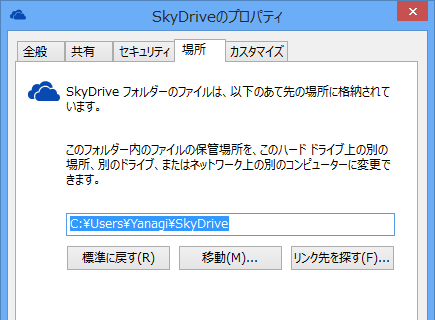
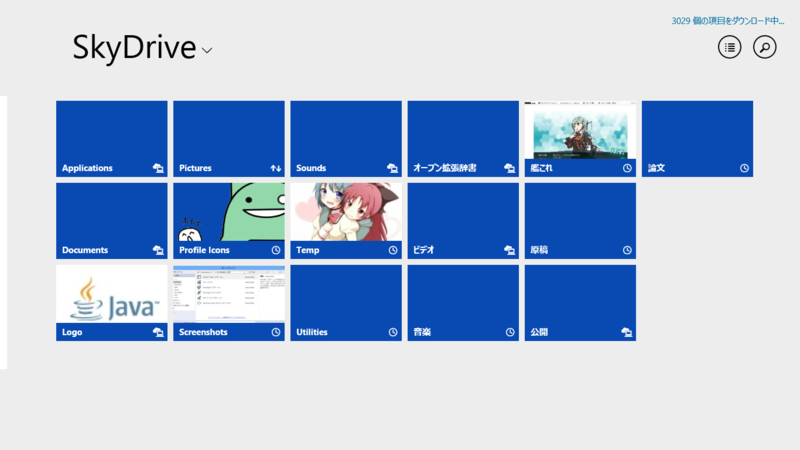

SkyDrive の同期フォルダがカスタマイズできる。うちの Surface 2（32GB）では、SkyDrive の同期フォルダを SD カードドライブへ逃がしてある。

同期済みのフォルダ（雲とコンピューターのアイコン）と同期待ちのフォルダ（時計アイコン）が分かりやすくなったのも、Preview → RTM/GA での変更点になるのかな？　ここら辺は自信がないけれど。

<a href="http://www.forest.impress.co.jp/docs/special/20130801_610004.html">&#x3010;&#x7279;&#x5225;&#x4F01;&#x753B;&#x3011;Windows 8.1 &#x5FB9;&#x5E95;&#x89E3;&#x5256; &#x7B2C;1&#x56DE; OS&#x306B;&#x7D71;&#x5408;&#x3055;&#x308C;&#x305F;&ldquo;SkyDrive&rdquo; - &#x7A93;&#x306E;&#x675C;</a> の内容はだいぶ古くなってしまったな。

