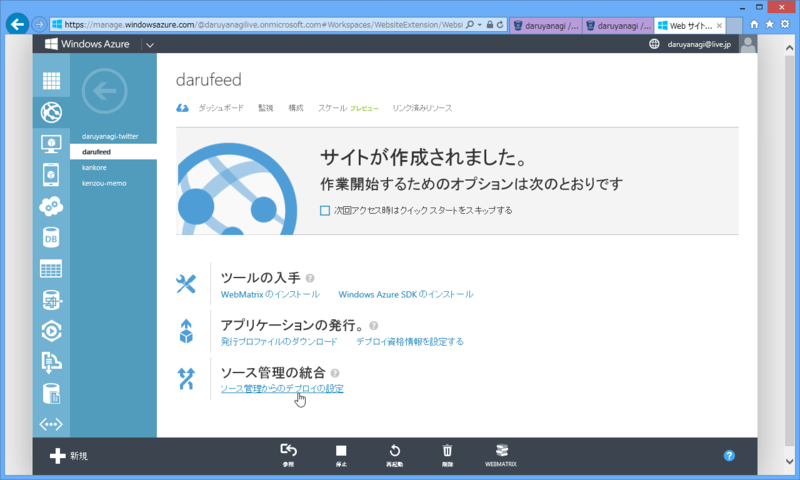
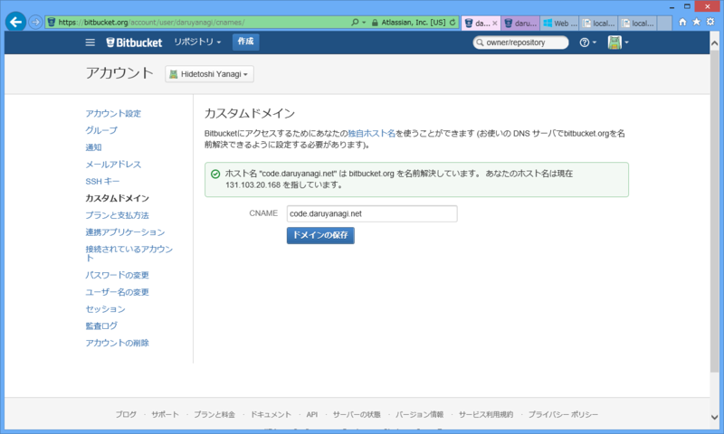
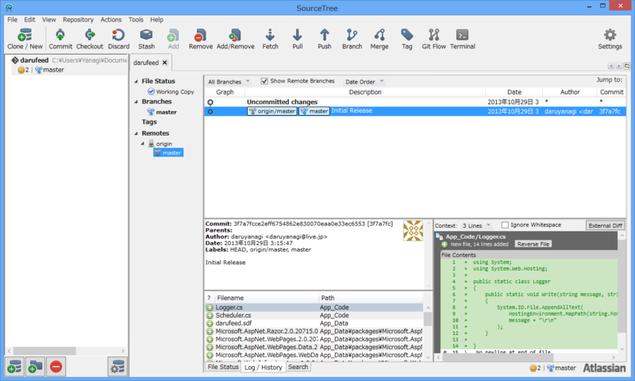
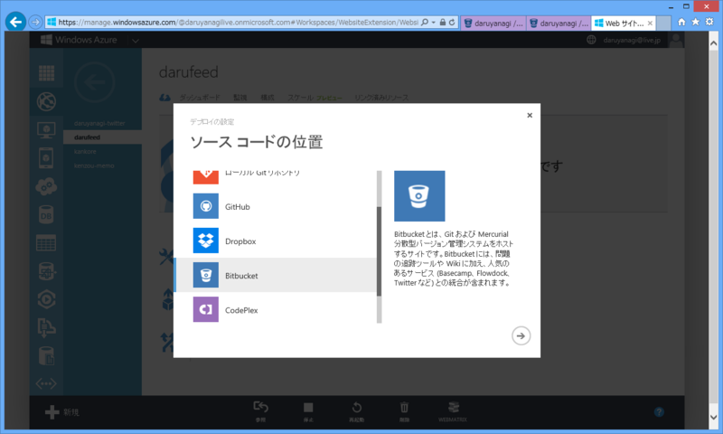
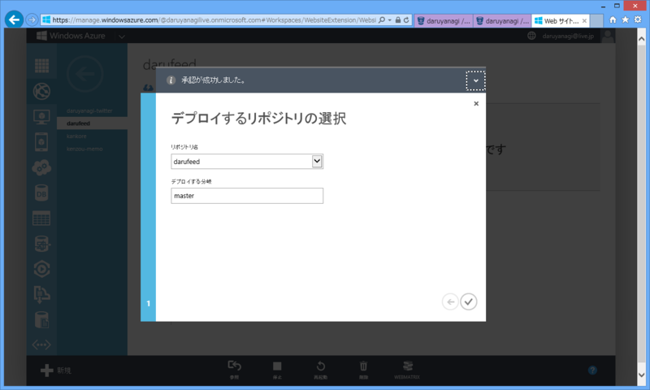
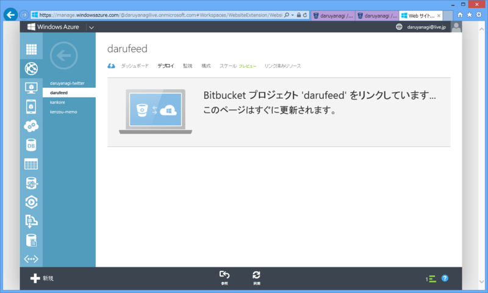
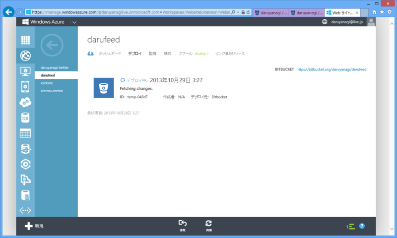
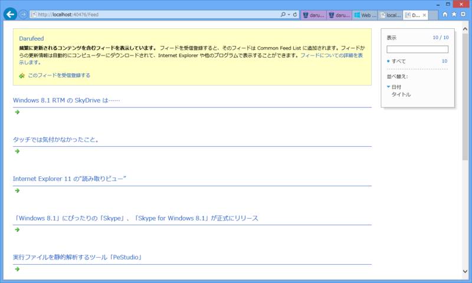

Windows Azure Web Sites はソース管理（GitHub とか CodePlex とか）からのデプロイが可能。前々から使ってみたかったがついつい後回しにしていたのだけど、これが超便利だった。

<h3>Bitbucket</h3>

今回はソース管理に <a href="https://bitbucket.org/">Bitbucket | The Git solution for professional teams</a> を使った。

Bitbucket のいいところは、なんといっても<b>無料でプライベートリポジトリが作れる</b>ところやな。Web アプリのソースコントロールでありがちなシチュエーションのなかに、シークレットキーを公開リポジトリにプッシュしちゃって消し方がわからんというのがあるけれど、プライベートリポジトリならそこらへんのことはあまり気にしなくてもいいのかもしれない（知らんけど）。

あと、今回初めて知ったのだけど、ドメインの割り当て（CNAME）もできるのね。さっそくやってみたった。

<ul>
<li><a href="http://code.daruyanagi.net/">http://code.daruyanagi.net/</a></li>
</ul>
機能的には GitHub のほうが先進的なのかもしれないけれど、Bitbucket もだいぶアリだなと思った。

唯一の弱点は WebMatrix 3 によるサポートがないところ（まぁ、使おうと思えば使えると思うけれど）。公式の GUI ツール「SourceTree」も、「GitHub for Windows」に比べるとメンドくさい（その分多機能ではある）。

<ul>
<li><a href="http://www.forest.impress.co.jp/docs/news/20130917_615684.html">Atlassian&#x3001;&#x7121;&#x511F;&#x306E;Git/Mercurial&#x30AF;&#x30E9;&#x30A4;&#x30A2;&#x30F3;&#x30C8;&#x300C;SourceTree for Windows&#x300D;v1.2&#x3092;&#x516C;&#x958B; - &#x7A93;&#x306E;&#x675C;</a></li>
<li><a href="http://www.forest.impress.co.jp/docs/news/20130627_605293.html">&#x300C;SourceTree for Windows&#x300D;&#x304C;v1.0&#x306B;&#x3001;&ldquo;Mercurial&rdquo;&#x3092;&#x65B0;&#x305F;&#x306B;&#x30B5;&#x30DD;&#x30FC;&#x30C8; - &#x7A93;&#x306E;&#x675C;</a></li>
</ul>
私の記憶が正しければ（←歳ばれ）、「SourceTree」の最新版は v1.3 ぐらいだったような気がする。

ちなみに、WebMatrix 3 は全部入りでスゴく便利だけど、決して万能ではない。だからソースコントロールにしろテキストエディターにしろ、自分に好みのツールがほかにあるならば、それと組み合わせてもいいんだよ？　なにも縛られることはないんだ。実際、自分はコードの半分か 1/3 ぐらいは Visual Studio で書いている。

<h3>Windows Azure＋ソースコントロール＝デプロイ</h3>

Windows Azure 側の設定はめっちゃ簡単。プロジェクトでデプロイの設定とやらをしてあるだけでいい。

Azure から Bitbucket で認証すれば、Bitbucket にホストしているプロジェクトがリストアップされるので、そこで目当てのプロジェクトを選ぶだけでいい。ブランチも選べるんだな。今回はメンドくさいので master にしたけど、release みたいなブランチを切って置くほうがいいのかもしれない。

設定が終わったら、しばし待たれよー……。

完成！

試しに darufeed.azurewebsites.net へフィード出力機能をちゃちゃっとつけて（<a href="http://darufeed.azurewebsites.net/Feed">http://darufeed.azurewebsites.net/Feed</a>）、Bitbucket にプッシュしてみたら、Azure にも勝手にデプロイされた。

<h3>おまけ</h3>

<a href="https://blog.daruyanagi.jp/entry/2013/04/17/065153">WebMatrix 3: RSS &#x30D5;&#x30A3;&#x30FC;&#x30C9;&#x3092;&#x51FA;&#x529B;&#x3059;&#x308B; - &#x3060;&#x308B;&#x308D;&#x3050;</a> の内容には問題があるな。Writer を Close していないから、空のフィードが出力された。

<pre class="code lang-cs" data-lang="cs" data-unlink>@using System.IO
@using System.Xml
@using System.ServiceModel.Syndication

@{
using (var db = Database.Open(&quot;darufeed&quot;))
{
var items = db.Query(&quot;SELECT * FROM Feeds ORDER BY FeedId DESC&quot;).Take(10);

var feed = new SyndicationFeed(App.Title, App.Description, Request.Url)
{
Copyright = new TextSyndicationContent(App.Copyright.ToString()),
Items = items.Select(
item =&gt; new SyndicationItem(item.Title, &quot;&quot;, new Uri(item.Url))
),
};

Response.Clear();
Response.ContentType = &quot;application/xml&quot;;

using (var writer = XmlWriter.Create(Response.Output))
{
feed.SaveAsRss20(writer);
}
}
}
</pre>
Writer を Using しておけば問題ない。Response.Close() や Response.Flush() はなくても動いたのだけど、つけといたほうがいいんだろうか。まだまだシロートなので、こういうところはよくわかんない。

