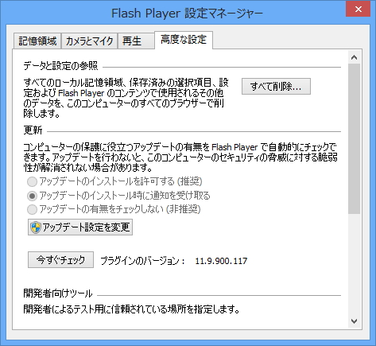
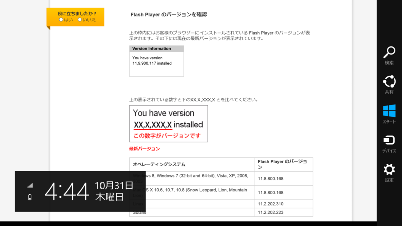
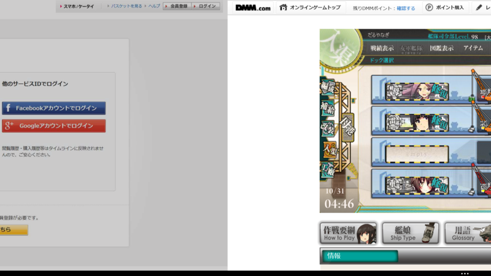

 

<blockquote cite="http://www.forest.impress.co.jp/docs/news/20131009_618742.html">

米Adobe Systems Incorporatedは8日（現地時間）、「Adobe Flash Player」および「Adobe AIR」の月例アップデートを公開した。現在、最新版が同社のWebサイトから無償でダウンロード可能。すでにインストールされている場合は、自動更新機能を利用してアップデートすることもできる。

<cite><a href="http://www.forest.impress.co.jp/docs/news/20131009_618742.html">Adobe&#x3001;&#x300C;Adobe Flash Player&#x300D;&#x300C;Adobe AIR&#x300D;&#x3092;&#x30A2;&#x30C3;&#x30D7;&#x30C7;&#x30FC;&#x30C8;&#x3002;&#x8106;&#x5F31;&#x6027;&#x306E;&#x4FEE;&#x6B63;&#x306F;&#x306A;&#x3057; - &#x7A93;&#x306E;&#x675C;</a></cite>
</blockquote>

この記事はボジョレー的に言えばここ数年で最悪のデキで、どうでもいいことは書いてあるくせに肝心なことを何も書いていない。

まず、このアップデートは「Adobe Flash Player」は 11.8 → 11.9、「Adobe AIR」は 3.8 → 3.9 へのメジャーバージョンアップだ。そして、

<blockquote cite="http://www.forest.impress.co.jp/docs/news/20130904_614026.html">

Windows 8.1や「Internet Explorer 11」、OS X 10.9（Mavericks）、iOS 7のサポートが計画されている。

<cite><a href="http://www.forest.impress.co.jp/docs/news/20130904_614026.html">&#x300C;Adobe Flash Player 11.9&#x300D;&#x300C;Adobe AIR 3.9&#x300D;&#x30D9;&#x30FC;&#x30BF;&#x7248;&#x304C;&ldquo;Adobe Labs&rdquo;&#x3067;&#x516C;&#x958B; - &#x7A93;&#x306E;&#x675C;</a></cite>
</blockquote>

を果たしたバージョンでもある。それを書かないとは、実にたるんでる。――そして、そのことにどこからもツッコミがないというのも寂しい話だ。動かなくなったときはスゴく叩かれるのにな。

というわけで、今日は反省がてら<b>「Flash Player 11.9 For Windows 8.1」</b>の新機能をおさらいしておく。なお、<a href="http://helpx.adobe.com/flash-player/release-note/fp117win81.html">&#x30EA;&#x30EA;&#x30FC;&#x30B9;&#x30CE;&#x30FC;&#x30C8;</a>では「Flash Player <b>11.7 Release Preview</b> for Windows 8.1」となっているが、細かいことは気にしないことにしておく。もしかしたらすでに実装済みである機能が含まれているかもしれないけど、最近体調が悪くてそこまで調べる気力が起こらない。

<h3>Instaback</h3>

 

<blockquote>

The InstaBack feature essentially enables the “back navigation” without having to reload the previous page

</blockquote>

Windows 8.1 の Internet Explorer 11 では（Windows 8でもそうだったかもしれんが）ページの左右フリックで［戻る］［進む］といったオペレーションが行える。まぁ、それだけならちょっとしたタッチジェスチャーなのだけど、こいつがちょっと賢いのは（操作を誤って）戻ったあとに再び進んだ場合にリロードが発生しないところ。

Flash の場合、前のページに戻ると元ページのコンテンツがサスペンドされ、再び開いた際に再開される。試しに“艦これ”で試してみると、戻る・進むでゲームがスタート画面へ巻き戻らないことがわかる。これは使ってみると割と便利だと思う。

<h3>Tab Suspend</h3>

<blockquote>

Independent Tab Suspension is a new feature in IE Windows 8.1 wherein tabs that are not in the immediate foreground of the Modern Browser will be suspended, unless the content in the background  is playing an audio/video stream or is engaged in communication with other instances of Flash using the ActionScript LocalConnection

</blockquote>

この機能は Windows 8.1 の Internet Explorer 11 の新しい機能であると明記されている。Internet Explorer 11 ではタブを100個以上開くと使わないタブがサスペンドされる省エネ仕様となっているが、それに対応しているということのようだ。

<blockquote cite="http://blogs.msdn.com/b/ie_ja/archive/2013/07/24/the-new-ie11-experience.aspx">

IE11 では 1 ウィンドウあたり最大 100 個のタブを利用でき、管理も効率的に行われるため、いつでも非常に高速なブラウジングが可能です。最近使用していないタブはシステム リソースを使用せず、バッテリを浪費することもありません。

<cite><a href="http://blogs.msdn.com/b/ie_ja/archive/2013/07/24/the-new-ie11-experience.aspx">IE11 &#x306E;&#x65B0;&#x3057;&#x3044;&#x30A8;&#x30AF;&#x30B9;&#x30DA;&#x30EA;&#x30A8;&#x30F3;&#x30B9;: Web &#x306E;&#x30DD;&#x30C6;&#x30F3;&#x30B7;&#x30E3;&#x30EB;&#x3092;&#x5F15;&#x304D;&#x51FA;&#x3059;&#x30A2;&#x30D7;&#x30EA;&#x3068;&#x30B5;&#x30A4;&#x30C8;&#x306E;&#x878D;&#x5408; - IEBlog &#x65E5;&#x672C;&#x8A9E; - Site Home - MSDN Blogs</a></cite>
</blockquote>

ただし、バックグラウンドでオーディオ/ビデオストリームが再生されている場合や、ActionScript LocalConnection を利用してほかの Flash インスタンスと通信中である場合はこれが適用されないとのこと――だと思う。

<h3>Play To</h3>

 

<blockquote>

Video streams to PlayTo certified devices. Once the NetStream object is properly initialized and starts playing some video, the user can swipe the charm, select play then a device, at this point the video stream should be re-routed to the selected device. Once the video stream is finished, the connection with the device will be closed.

</blockquote>

うちの環境では残念ながら試せないのだけど、［デバイス］チャームの［再生］コマンドから“Play To”認定されたデバイスでのビデオ再生がサポートされるようだ。

