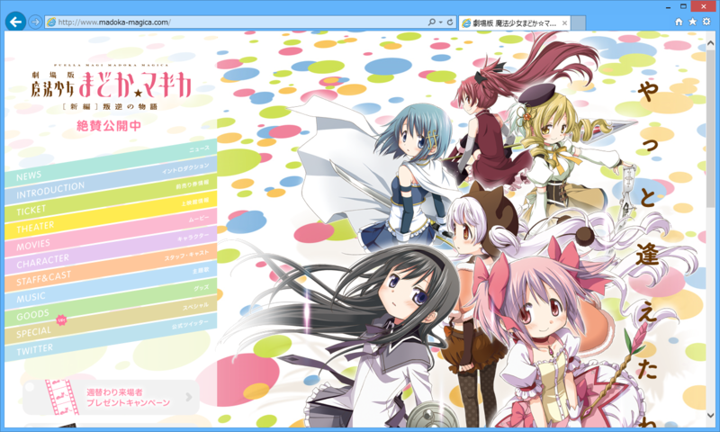

@subsfn が観たいというので観に行った。

<ul>
<li><a href="http://www.madoka-magica.com/">&#x300C;&#x5287;&#x5834;&#x7248; &#x9B54;&#x6CD5;&#x5C11;&#x5973;&#x307E;&#x3069;&#x304B;&#x2606;&#x30DE;&#x30AE;&#x30AB;[&#x65B0;&#x7DE8;]&#x53DB;&#x9006;&#x306E;&#x7269;&#x8A9E;&#x300D;&#x516C;&#x5F0F;&#x30B5;&#x30A4;&#x30C8;</a></li>
</ul>
テレビ版はまどかが神さまになる話だったので、劇場版はきっとその対になる話になるだろうなという予想はしてた。まぁ、だいたいそんな感じだったので、筋書的にはあまり意外性がなかったけれど、割りと面白かった。

以下はどうでもいい感想。

<ul>
<li>さやかちゃんカワイイ！　なんかテレビ版よりちょっと活躍してるしうれしい。</li>
<li>マミさんがいくらボッチだからといって、微妙な新キャラを追加するのはどうかと思う。</li>
<li>ヤンデレ怖い。</li>
<li>キューベエが最後、こぼした牛乳を拭いた後の雑巾みたいになっててかわいそうだった。</li>
</ul>
神へのエロスこそが悪魔の正体、というのはありふれているようで新しい感じ。概念としてのまどか、肉をもった実体としてのまどか、メッセンジャーとしてのさやかたちが三位一体的なのも、なんかキリスト教をモチーフにしているのかなぁ、と感じた。

なにがいいたいかというと、さやかちゃんはまさしく天使であったということなのですよ。

<ul>
<li><a href="https://blog.daruyanagi.jp/entry/2012/10/12/193154">&#x3055;&#x3084;&#x304B;&#x3061;&#x3083;&#x3093;&#x30D5;&#x30A3;&#x30AE;&#x30E5;&#x30A2;&#x3092;&#x958B;&#x5C01;&#x3057;&#x305F;&#x3063;&#x305F; (^q^ - &#x3060;&#x308B;&#x308D;&#x3050;</a></li>
<li><a href="https://blog.daruyanagi.jp/entry/2012/03/25/042130">&#x4E00;&#x30F6;&#x6708;&#x65E9;&#x3044;&#x8A95;&#x751F;&#x65E5;&#x30D7;&#x30EC;&#x30BC;&#x30F3;&#x30C8;&#x3082;&#x3089;&#x3063;&#x305F;&#x3002; - &#x3060;&#x308B;&#x308D;&#x3050;</a></li>
</ul>