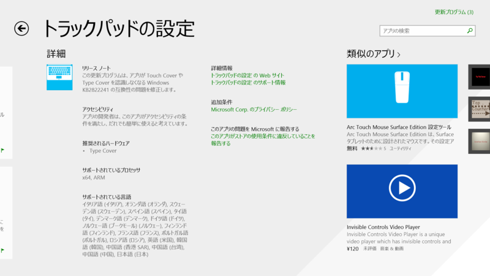

Surface 2 と Surface Pro 2 にアップデートがきているが……

<h3>Surface 2</h3>

<blockquote cite="http://www.microsoft.com/surface/en-us/support/install-update-activate/2-update-history">

<h4>November 2013 updates</h4>

<ul>
<li>Performance improvements for all Type Cover and Touch Cover versions.</li>
<li>Wi-Fi and Bluetooth driver updates to improve wireless display performance.</li>
<li>Camera improvements.</li>
<li>Audio improvements including switching to speaker playback after disconnecting a headset.</li>
<li>System performance and stability improvements.</li>
<li>Battery life improvements.</li>
</ul>

<cite><a href="http://www.microsoft.com/surface/en-us/support/install-update-activate/2-update-history">Microsoft Surface 2 update history | Surface firmware updates</a></cite>
</blockquote>

<h3>Surface Pro 2</h3>

<blockquote cite="http://www.microsoft.com/surface/en-us/support/install-update-activate/pro-update-history">

<h4>November 2013 updates</h4>

<h5>Windows 8.0</h5>

<ul>
<li>Update to allow the use of Japanese Touch Cover 2 and Type Cover 2.</li>
</ul>

<h5>Windows 8.1</h5>

<ul>
<li>Update to the LifeCam driver to increase TrueColor fidelity.</li>
<li>Update to the Wi-Fi and Bluetooth drivers to enable improved wireless display performance and to further enhance Wi-Fi - network performance and stability.</li>
</ul>

<cite><a href="http://www.microsoft.com/surface/en-us/support/install-update-activate/pro-update-history">Microsoft Surface Pro update history | Windows Update | Surface Pro updates</a></cite>
</blockquote>

その一方で、

<a href="http://apps.microsoft.com/windows/ja-jp/app/indstillinger-for-pegefelt/5a4e4cdf-4d60-4084-8d9f-61d2e8f4830b">Windows &#x30B9;&#x30C8;&#x30A2; &#x306E; Windows &#x7528; &#x30C8;&#x30E9;&#x30C3;&#x30AF;&#x30D1;&#x30C3;&#x30C9;&#x306E;&#x8A2D;&#x5B9A; &#x30A2;&#x30D7;&#x30EA;</a> にもアップデートがきている。

<blockquote>

この更新プログラムは、アプリが Touch Cover や Type Cover を認識しなくなる Windows KB2822241 の互換性の問題を修正します。

</blockquote>

そういえば Surface Pro 1 で Touch Cover/Type Cover が反応しなくなったり、最悪 OS がリブートしてしまう現象を経験していたけれど、これが治るのだろうか。だったらうれしい。

      Surface Pro が勝手に落ちて、電源再投入したら、TypeCover が認識されなかった。外してつけた

<a href="http://twitter.com/daruyanagi/status/392161111799107585" class="twitter-detail-info-permalink">2013-10-21 14:31:09</a> via <a href="http://www.metrotwit.com/" rel="nofollow">MetroTwit</a>

      んー また Surface Pro のキーボード（TouchCover）反応しなくなった。あした TypeCover もってきてちゃんと動いたら、キーボードは修理たのんでみるかな？

<a href="http://twitter.com/daruyanagi/status/392225859743911936" class="twitter-detail-info-permalink">2013-10-21 18:48:26</a> via <a href="http://www.metrotwit.com/" rel="nofollow">MetroTwit</a>

「アプリが……認識しなくなる」っていってるから、別件の可能性もあるけれど。ちなみに Surface 2 ではこの問題には遭遇していない。

