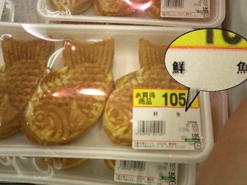

 

<blockquote cite="http://www.j-cast.com/2013/11/14188990.html">

   連日報じられる食品表示問題を受け、ファミリーレストラン最大手のすかいらーくは、一部メニューの表記を見直す。同社の主力店舗・ガストで扱う8品目について、料理名や説明書きなどを2013年11月下旬から順次変更する見通しだ。 
すかいらーくの経営する飲食店で、産地の偽装や誤表示が問題になったわけではない。現在のメニューは「景品表示法違反の優良誤認に当たらないと考えている」（同社の広報担当者）。ただ、「表現について拡大解釈される可能性があり、最大限の注意が必要である」として、「お客様目線」で見直しの議論を進めているという。 
そのメニューのひとつが、「豚肉の生姜焼き和膳」（733円）だ。「生姜焼き」という表現だが、店舗設置のレンジのみで加熱調理しているため、「豚肉の生姜だれ和膳」に変更する。顧客から同メニューの名称に対してクレームがあったわけでもなく、あくまで自主的な取り組み。 
「判断するのは消費者や消費者庁であるから、従来の表記で絶対大丈夫と言い切れない。最大限の緊張感を持ってがんばっている」そうだ。

<cite><a href="http://www.j-cast.com/2013/11/14188990.html">&#x30AC;&#x30B9;&#x30C8;&#x3001;&#x30EC;&#x30F3;&#x30B8;&#x3067;&#x8ABF;&#x7406;&#x3060;&#x304B;&#x3089;&#x3068;&#x300C;&#x751F;&#x59DC;&#x713C;&#x304D;&#x300D;&#x8868;&#x8A18;&#x7D42;&#x4E86; &#x300C;&#x305D;&#x3053;&#x307E;&#x3067;&#x3057;&#x306A;&#x304F;&#x3066;&#x3082;&#x300D;&#x3068;&#x6CE2;&#x7D0B;&#x5E83;&#x304C;&#x308B; (1/2) : J-CAST&#x30CB;&#x30E5;&#x30FC;&#x30B9;</a></cite>
</blockquote>

「豚肉の生姜だれ和膳」！　「豚肉の生姜だれ和膳」！　「豚肉の生姜だれ和膳」！　そんなにおいしくなさそうだな。

しかし、こんな風潮が行き過ぎたら、ちょっと困る。たとえばおかんが「ビーフストロガノフ作ったよ！」と皿を出してきたが、食ってみるとどう考えてもハヤシライスのでき損ないにしか思えない場合。どうするんだよ。なんて答えればいいんだよ。適当に「美味しいね」って答えて、「やっぱり？　お店開いちゃおうかな！」とか言っちゃった場合、俺はどうすればいいんだよ。<i>「メニューは“ビーフストロガノフのつもりで作ったハヤシライスのでき損ない”にしておいたほうがいいよ」</i>って言えばいいのか？　まぁ、客は騙されなくて済みそうだが……。

ともあれ、こういうことは徹底的にやってもだれも幸せにならないので<a href="#f1" name="fn1" title="代替魚だらけの回転寿司になんか行けなくなる！！">*1</a>、どこかで線引きはしなきゃいけない。

<blockquote cite="http://www.caa.go.jp/representation/keihyo/yuryo.html">

景品表示法第4条第1項第1号は，事業者が，自己の供給する商品・サービスの取引において，その品質，規格その他の内容について，一般消費者に対し，  
(1)　実際のものよりも著しく優良であると示すもの  
(2)　事実に相違して競争関係にある事業者に係るものよりも著しく優良であると示すもの  
であって，不当に顧客を誘引し，一般消費者による自主的かつ合理的な選択を阻害するおそれがあると認められる表示を禁止しています（優良誤認表示の禁止）。 

<cite><a href="http://www.caa.go.jp/representation/keihyo/yuryo.html">&#x8868;&#x793A;&#x5BFE;&#x7B56;&#x8AB2; | &#x6D88;&#x8CBB;&#x8005;&#x5E81;</a></cite>
</blockquote>

一応法律でもこのような線引きはあるそうだけど、“<b>優良誤認</b>”という観点以外にも線引きがほしいよね。たとえば個人的に思うのは、

<ul>
<li>消費者の自己防衛権</li>
<li>他者が築いたブランドの侵害やフリーライドの禁止</li>
</ul>
という観点もあっていいと思う。

<b>消費者の自己防衛権</b>というのは、自分にとって害になるものを口にしない権利。たとえば、食物アレルギーは死に直結するから、消費者がそれを避けるための手段が用意されるべきだ。また、アレルギーまでいかなくても、何となく苦手だというものもある。たとえばウチの弟はウニとカキが苦手なので、代わりに僕が仕方なく食べてあげているのだけど、彼のようにイヤなものはイヤという権利は大事だと思う（僕にとっても切実だ）。

優良誤認の禁止と消費者の自己防衛権の保護は提供者＝消費者間におけるルールと言えるだろう。一方、<b>ブランドの保護</b>は提供者＝提供者間のルールと言える。

消費者が無数の選択肢に対して完全情報をもっていて、自分に適したものを理性的にチョイスできると仮定することには無理があるだろう。だからこそ、ブランドには意味がある。無数の選択肢を“ブランド”としてグルーピングし、その内部で品質の安定・均質化を目指し、また“ブランド”同士が互いに品質の向上を競い合えば、消費者にとっては選択にかかわるコストが削減できて大変助かる。その意味で、ブランドの保護は消費者の自己防衛権にも関わっている。消費者にはブランドを選ぶ権利があるだろう。

しかし、ブランドは一朝一夕に築けるものではない。また、築き上げるのは難しいが、失うのはいともたやすい。なので、それを傷つけたり、フリーライドする行為に対してはもっと厳しくあっていいと思う。まぁ、すでに防止策はあると思うけれど、ブランド保護の観点でも食品偽装が許されないという点については指摘しておきたかった。まぁ、有名ホテルみたいなブランドが今回のように集団自殺するのは放置しても構わないが、ほかのブランドに迷惑をかけるのはダメだろうということだ。

ほかにも設けるべき基準があるだろうか。自分はあまり思いつかなかったけれど、いい意見があれば参考にさせていただきたいと思う。

この手の問題はケースバイケースでもあるので、緩い基準だけ設けて、あとは事後的な罰則を設ければいいと思う<a href="#f2" name="fn2" title="悪質な偽装をしていた店舗は営業停止などの処分が下されるべきだと思う。なんかなし崩し的に偽装を明らかにしている店も多いように感じるが">*2</a>。悪用が強く予期できることに対しては事前の規制が有効だろうけれども、この場合はそうではないと思った。

<a href="#fn1" name="f1" class="footnote-number">*1</a>:代替魚だらけの回転寿司になんか行けなくなる！！

<a href="#fn2" name="f2" class="footnote-number">*2</a>:悪質な偽装をしていた店舗は営業停止などの処分が下されるべきだと思う。なんかなし崩し的に偽装を明らかにしている店も多いように感じるが

