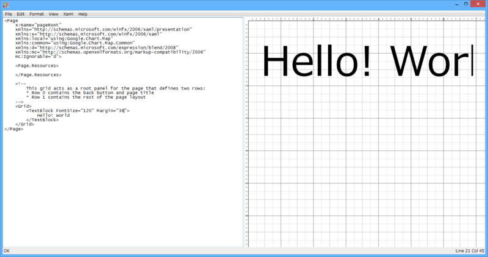

<a href="http://www.amazon.co.jp/exec/obidos/ASIN/482229496X/bestylesnet-22/">プログラミングWindows 第6版 上 ~C#とXAMLによるWindowsストアアプリ開発 (プログラミングシリーズ)</a>
<ul><li>作者: Charles Petzold,(株)クイープ</li><li>出版社/メーカー: 日経BP社</li><li>発売日: 2013/09/20</li><li>メディア: 単行本（ソフトカバー）</li><li><a href="http://d.hatena.ne.jp/asin/482229496X/bestylesnet-22" target="_blank">この商品を含むブログを見る</a></li></ul>

<a href="http://www.atmarkit.co.jp/ait/subtop/features/kwd/wintabcontest.html">2013&#x6D41;&#x884C;&#x8A9E;&#x30A2;&#x30D7;&#x30EA;&#x9078;&#x624B;&#x6A29;&#xFF06;&#x7DCF;&#x9078;&#x6319; by &#xFF20;IT Windows&#x30BF;&#x30D6;&#x30EC;&#x30C3;&#x30C8;&#x5411;&#x3051;&#x30A2;&#x30D7;&#x30EA;&#x958B;&#x767A; - &#xFF20;IT</a> の参加表明をしたらもらえた。下巻は自分で買おう……。

午前中、布団の上でゴロゴロしながら目を通したのだけど、割と懇切丁寧でいいなぁ、と思った。基礎の基礎に関してはすでに知っていたこともあり、第二章まではペロッと読めたのだけど、それでもところどころ「あ、そういうことなんだ」と腑に落ちたところもあった。「こう書いてもいいんだよ」「これがダメなのはこういう意味だから」というのが書かれていると、単に覚えるのじゃなくて、「理解」できる気がする。

そのあとはパラパラと目を通しただけだけど、第8章の「XAML Cruncher」なんかのサンプルは勉強になりそう。

WPF 版は <a href="http://www.charlespetzold.com/blog/2007/07/100411.html">Petzold Book Blog - Introducing XAML Cruncher 2.0</a> からダウンロード可能。左のコード画面に書いた XAML が解析され、右側のデザイン画面に描画される。

最後の方に Windows 8.1 の内容が盛り込まれていて助かる。CommandBar なんかはすでに知ってたけど（これ、割と便利だった）、全部これに移行させたいと思う。ただ、Windows 8.0 ベースの記述のところに Snap なんかの説明もあるのかな？　そこあたりはすでに古くなっているかもしれないので、適宜最新情報を参照しながら読んでいきたいですね。索引は日本版独自なのかな？　グッジョブ。

あと、本の内容にも関係ないけど、ゴロゴロと本を読んでいて気付いた。MSDN ライブラリの内容は充実しているけれど、歴史書で言えばあれ、“紀伝体”なんだな。で、こういう本は“編年体”。流れをつかめている人だったら MSDN ライブラリだけでいいんだろうけれど、わしみたいに困ったときになって初めて MSDN ライブラリを引くような人間にとっては、誰かがまとめてくれた“流れ”がすんごい役に立つ。知識というものは、体系になって初めて知識なのでござるな。

まぁ、何をいまさらお前は言ってんだって話だけど。それよりアプリ作れ、自分。

一応二つぐらい作ってて、完成したほうを提出しようと思っているが、なかなかうまくいかない感じで。

