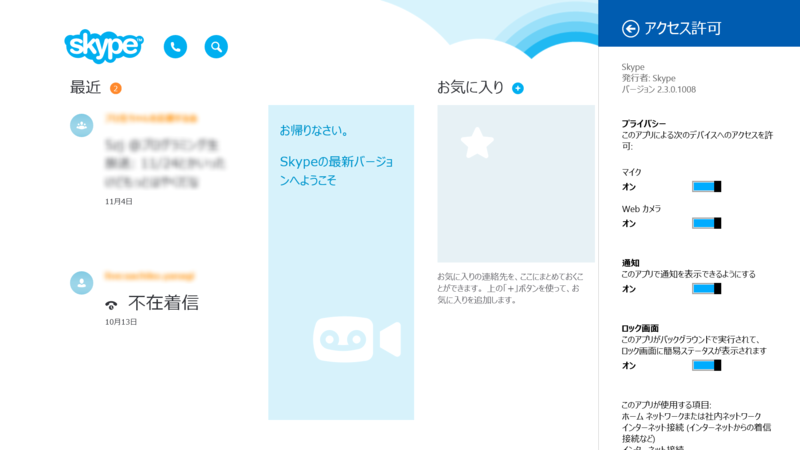

単なるマイナーバージョンアップみたい。

<ul>
<li>全体的な修正</li>
<li>パフォーマンスの向上</li>
</ul>
<a href="http://www.forest.impress.co.jp/docs/news/20131023_620660.html">&#x300C;Windows 8.1&#x300D;&#x306B;&#x3074;&#x3063;&#x305F;&#x308A;&#x306E;&#x300C;Skype&#x300D;&#x3001;&#x300C;Skype for Windows 8.1&#x300D;&#x304C;&#x6B63;&#x5F0F;&#x306B;&#x30EA;&#x30EA;&#x30FC;&#x30B9; - &#x7A93;&#x306E;&#x675C;</a> から初めてのアップデートだったみたい。その間には Skype が起動しないのを修正するアップデートプログラムなんかも出てる。

<ul>
<li><a href="http://support.microsoft.com/kb/2902892">Skype Windows Store app crashes in Windows 8.1 and in Windows Server 2012 R2</a></li>
</ul>