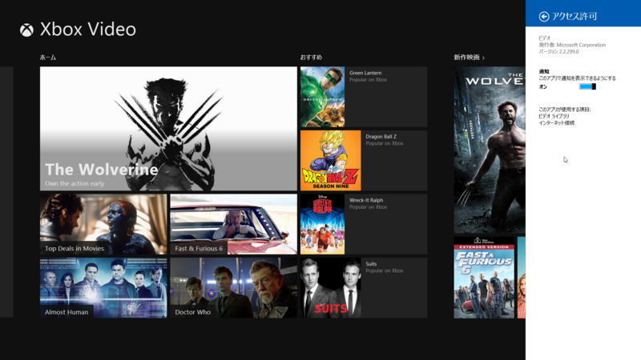

<h3>ニュース 3.0.1.285</h3>

 

<ul>
<li>変更点不明</li>
</ul>

<h3>ビデオ 2.2.299.0</h3>

 

<ul>
<li>その他修正</li>
</ul>
そういえば <a href="https://blog.daruyanagi.jp/entry/2013/11/16/072212">&#x300C;&#x79C1;&#x3082;&#x3088;&#x304F;&#x3088;&#x304F;&#x904B;&#x306E;&#x306A;&#x3044;&#x7537;&#x3060;&#x306A;&#x300D; - &#x3060;&#x308B;&#x308D;&#x3050;</a> では触れなかったが、当初 ビデオ の割引価格がちゃんと反映されていないという案内があった気がする（今探してみたけど見当たらなかった）ので、もしかしたらそういうのを修正したのかもしれない。知らんけど。

<ul>
<li><a href="http://www.forest.impress.co.jp/docs/news/20130416_596088.html">Microsoft&#x3001;Windows 8/RT&#x306B;&#x6A19;&#x6E96;&#x642D;&#x8F09;&#x3055;&#x308C;&#x3066;&#x3044;&#x308B;&ldquo;Bing&rdquo;&#x30A2;&#x30D7;&#x30EA;&#x3092;&#x4E00;&#x6589;&#x30A2;&#x30C3;&#x30D7;&#x30C7;&#x30FC;&#x30C8; - &#x7A93;&#x306E;&#x675C;</a></li>
</ul>

