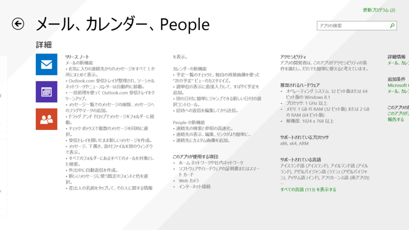
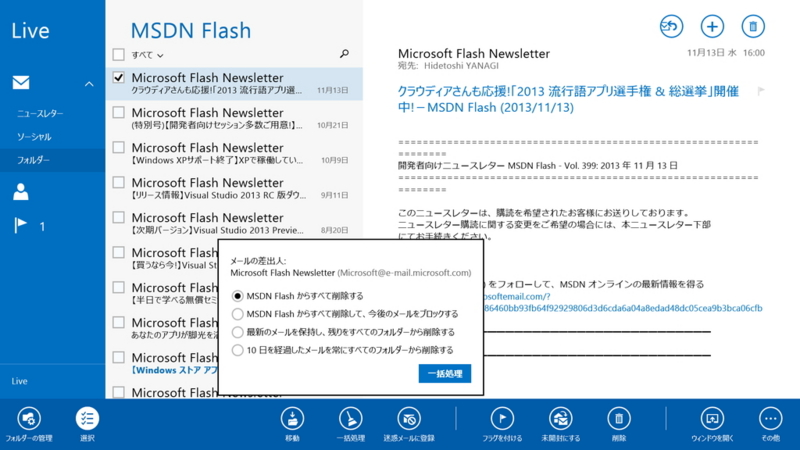
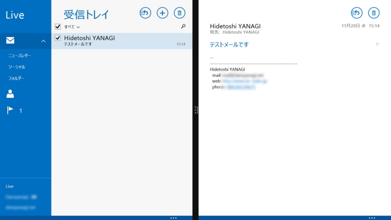
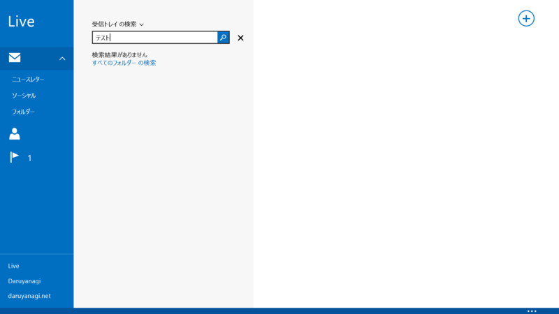
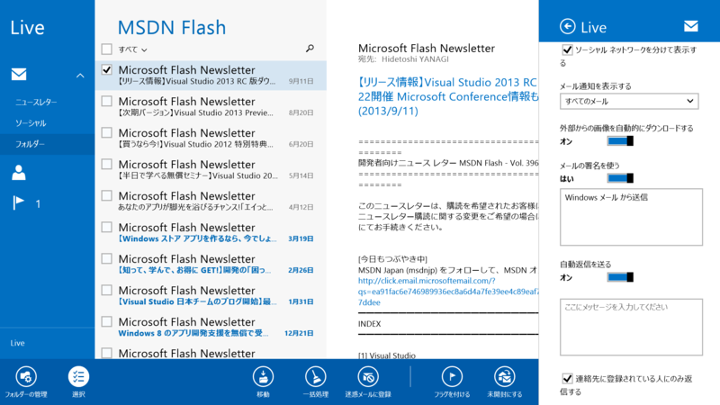
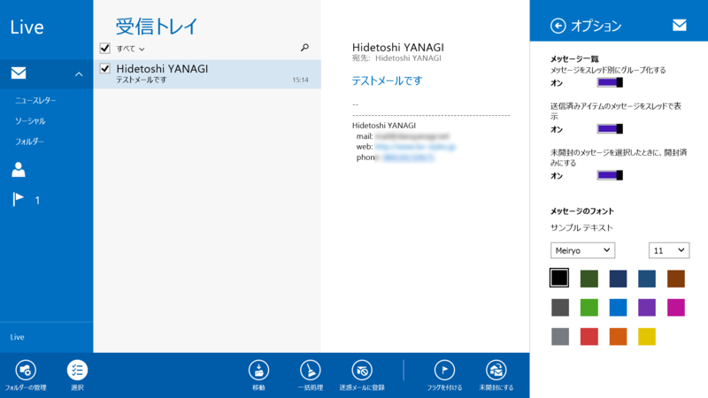
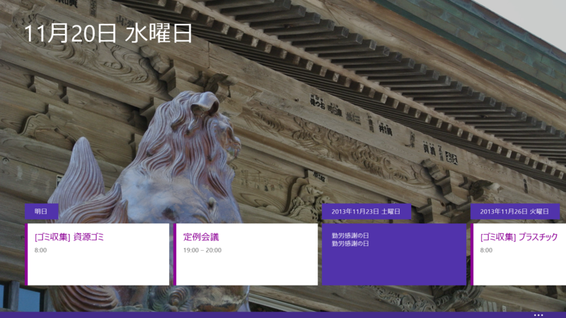
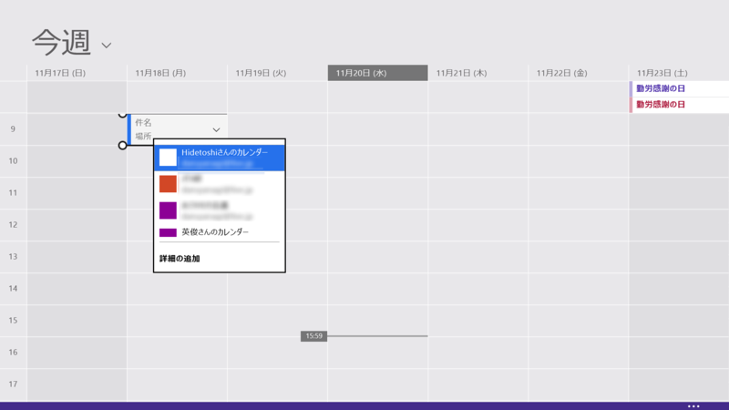
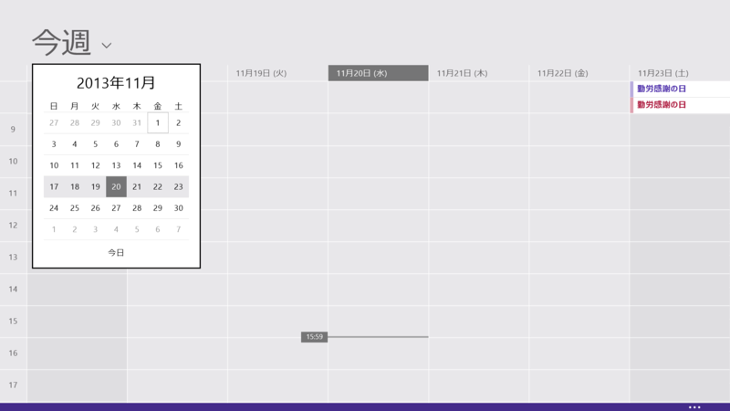
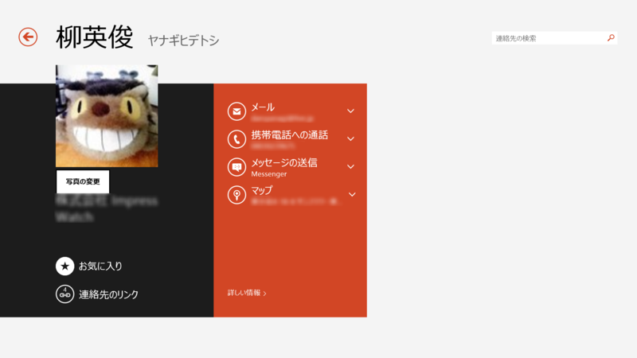

17.5.9600.20279 → 17.5.9600.20315　のマイナーアップデートだった。某所で「すげえアップデートしたぞ！」って書いてあったけど、それは Windows 8 → Windows 8.1 の変更点が更新されないままだったのをそのまま参照してしまったみたい（知らんけど）で、自分で確認した感じ、そんなに大きな変更点はなかった。公式アプリなんだから、みんなのお手本という意味でも、リリースノートはちゃんと書いてあげたほうがいいと思う。

以下はその Windows 8 → Windows 8.1 の変更点。あと、「メッセンジャー」は「Skype」に統合された形で発展的に解消。まぁ、相手がオフラインだ Facebook メッセージも送れないし、あんまり使えない子だったから……。

<h3>メールの新機能</h3>

<ul>
<li>お気に入りの連絡先からのメッセージをすべて 1 か所にまとめて表示。</li>
<li>Outlook.com 受信トレイが整理され、ソーシャル ネットワークやニュースレターは自動的に移動。</li>
<li>一括処理を使って Outlook.com 受信トレイをクリーンアップ。</li>
</ul>
 

<ul>
<li>メッセージ一覧でのメッセージの削除、メッセージへのフラグやマークの追加。</li>
<li>ドラッグ アンド ドロップでメッセージをフォルダーに移動。</li>
<li>チェック ボックスで複数のメッセージを同時に選択。</li>
<li>受信トレイを開いたまま新しいメッセージを作成。</li>
<li>メッセージ、下書き、添付ファイルを別のウィンドウで表示。</li>
</ul>
 

<ul>
<li>すべてのフォルダーにあるすべてのメールを対象とした検索。</li>
</ul>
 

<ul>
<li>外出中に自動返信を作成。</li>
</ul>
 

<ul>
<li>新しいメッセージに使う既定のフォントと色を選択。</li>
</ul>
 

<ul>
<li>差出人の名前をタップして、その人に関する情報を表示。</li>
</ul>

<h3>カレンダーの新機能</h3>

<ul>
<li>予定一覧のチェックと、独自の背景画像を使った "次の予定" ビューのカスタマイズ。</li>
</ul>
 

<ul>
<li>週単位の表示に直接入力して、すばやく予定を追加。</li>
</ul>
 

<ul>
<li>別の日付に簡単にジャンプできる新しい日付の選択コントロール。</li>
</ul>
 

<ul>
<li>招待への返信を編集してから送信。 </li>
</ul>

<h3>People の新機能</h3>

<ul>
<li>連絡先の検索と参照の高速化。</li>
<li>連絡先の表示、編集、リンクがより簡単に。</li>
</ul>
 

<ul>
<li>連絡先にカスタム画像を追加。</li>
</ul>

