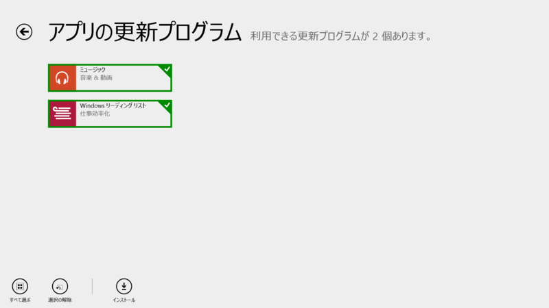
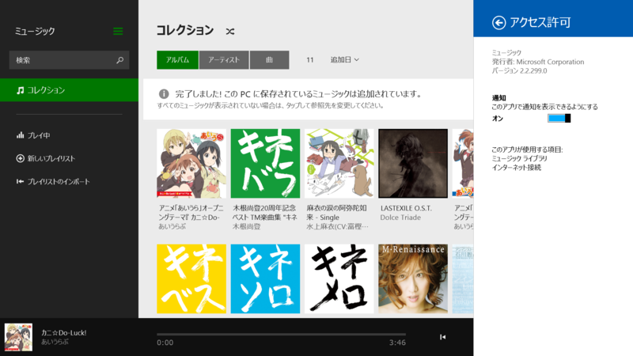
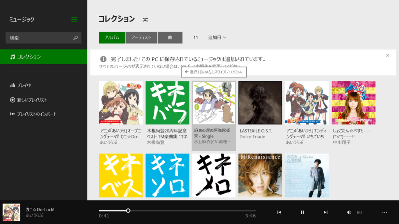
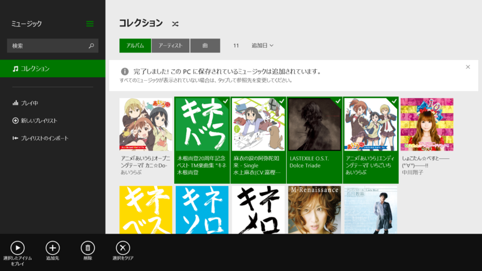
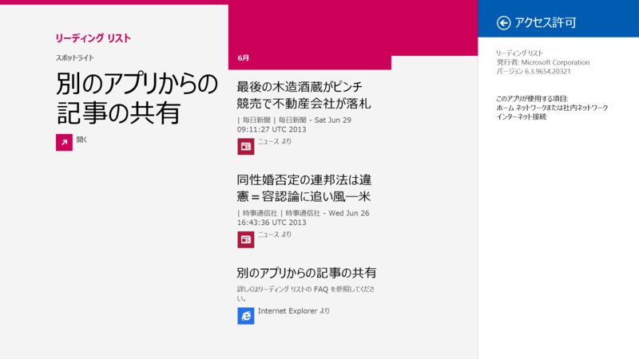
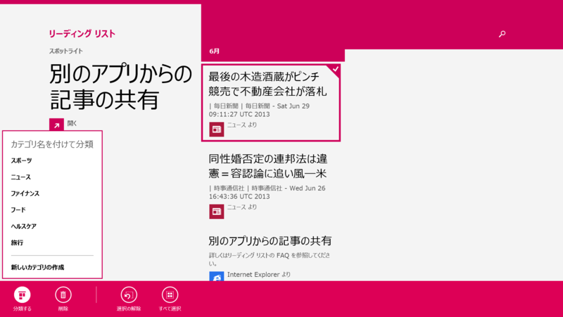

 

<h3>ミュージック 2.2.214.0 → 2.2.299.0</h3>

 

<ul>
<li>1 回タップするだけで、コレクション内のすべての曲をシャッフル再生</li>
<li>コレクションやストアでお好きな曲をダブルクリックしてプレイ</li>
<li>アーティストの詳細ページから人気の曲を再生可能 ヒット曲を見つけよう - [見つけよう] からお好きなジャンルのトップソングを見つけることができます</li>
<li>アルバムや曲の購入がより簡単に。</li>
<li>Microsoft ギフト カードも利用可能</li>
<li>お住まいの国や地域で利用できる機能は、Xbox Music の機能リストをご確認ください。 <a href="http://support.xbox.com/apps/windows-8/xbox-on-windows-features">http://support.xbox.com/apps/windows-8/xbox-on-windows-features</a></li>
</ul>
マイナーアップデート。このアップデート内容はメジャーバージョンアップのものかもしれない。実は左スワイプでアルバムを複数選択できるのは知らなかった。

 

<ul>
<li><a href="http://apps.microsoft.com/windows/ja-jp/app/music/16db93bf-8748-449a-96ba-e9ed3a5f872d">Windows &#x30B9;&#x30C8;&#x30A2; &#x306E; Windows &#x7528; &#x30DF;&#x30E5;&#x30FC;&#x30B8;&#x30C3;&#x30AF; &#x30A2;&#x30D7;&#x30EA;</a></li>
</ul>

<h3>Windows リーディングリスト 6.3.9600.20311 → 6.3.9654.2031</h3>

 

<ul>
<li>このリリースでは、リストにアイテムを追加したときまたはアプリ内で、アイテムを分類する機能が追加されました。アプリからコンテンツを他のユーザーと共有する機能も提供されています。</li>
</ul>
マイナーアップデート。

この機能も今回ついたわけではなさそう。カテゴリー機能とかあったんだね。

<ul>
<li><a href="http://apps.microsoft.com/windows/ja-jp/app/windows-reading-list/98bc0b52-5e5c-4097-b58e-e8e859e1829f">Windows &#x30B9;&#x30C8;&#x30A2; &#x306E; Windows &#x7528; Windows &#x30EA;&#x30FC;&#x30C7;&#x30A3;&#x30F3;&#x30B0; &#x30EA;&#x30B9;&#x30C8; &#x30A2;&#x30D7;&#x30EA;</a></li>
</ul>

