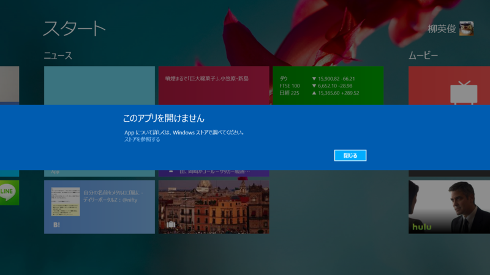
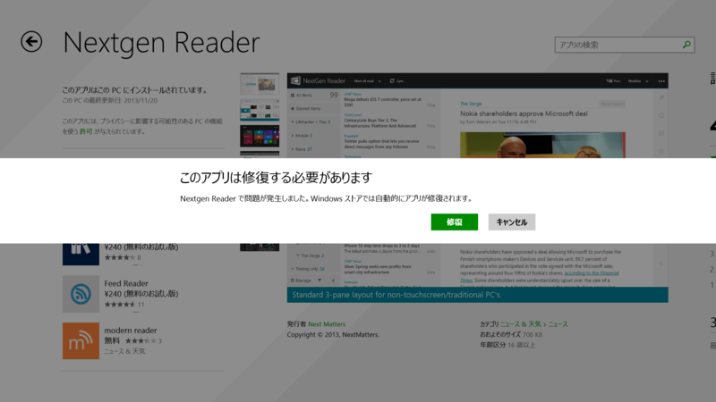

<a href="http://www.forest.impress.co.jp/docs/news/20131120_624451.html">&#x30D5;&#x30A3;&#x30FC;&#x30C9;&#x30EA;&#x30FC;&#x30C0;&#x30FC;&#x30A2;&#x30D7;&#x30EA;&#x300C;Nextgen Reader&#x300D;&#x304C;v2.0.0.0&#x306B;&#x3001;Windows 8.1&#x5BFE;&#x5FDC;&#x3092;&#x5F37;&#x5316; - &#x7A93;&#x306E;&#x675C;</a> をいろいろ触ってたら遭遇。ライブタイルが更新されなくなったばかりか、タイルにアプリ名も表示されないようになり、タップすると「このアプリは開けません」というメッセージが表示された。

ストアを開くと。自動修復が案内される。Microsoft アカウントのパスワードを入力して、アプリを再インストールすると治った。

