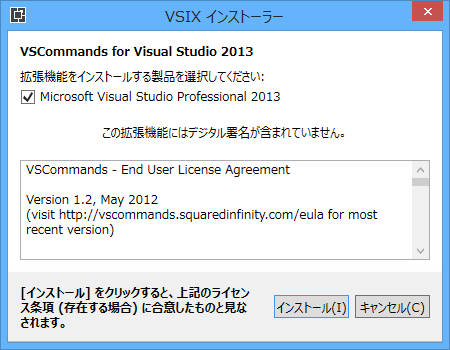
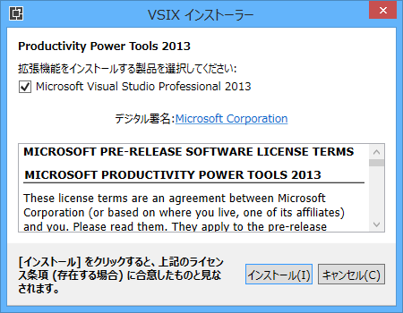
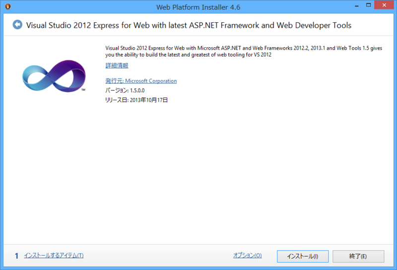

<h3>VSCommands for Visual Studio 2013</h3>

12.3.0.2（2013/11/20）

大人気拡張機能の Visual Studio 2013 版。

<blockquote>

<ul>
<li>CODE BLOCK END TAGGER</li>
<li>FILE STRUCTURE</li>
<li>SOLUTION BADGES</li>
<li>SOLUTION BADGES - TOOLBAR</li>
<li>SOLUTION BADTES - START PAGE</li>
<li>ATTACH TO IIS</li>
<li>MAIN MENU - HIDE</li>
<li>MAIN MENU - CHANGE CASE </li>
<li>OUTPUT WINDOWS COLORING</li>
<li>SYNCHRONIZE SETTING BETWEEN MACHINES</li>
<li>ZIP SOLUTION</li>
<li>TOUCH SUPPORT</li>
</ul>
</blockquote>

そういえば Visual Studio 2013 のメインメニューって、英語版は大文字なんだよね（2012 もだったかな？）。あれは割りと気に入らないっていう人いそう。

<ul>
<li><a href="http://visualstudiogallery.msdn.microsoft.com/c6d1c265-7007-405c-a68b-5606af238ece">VSCommands for Visual Studio 2013 extension</a></li>
</ul>

<h3>Productivity Power Tools 2013</h3>

12.0.21109.0（2013/11/16）

Visual Studio Platform Team 謹製の Visual Studio 拡張機能。いずれ次世代 Visual Studio に搭載されるであろう機能を一足早く試せる（といった立ち位置の拡張機能だったと思う）。

<blockquote>

New additions to Productivity Power Tools 2013:

<ol>
<li>Peek Help </li>
<li>Solution Explorer Errors </li>
<li>Structure Visualizer </li>
<li>Double click to maximize windows </li>
<li>Timestamp margin </li>
<li>Quick tasks – Edit Present On </li>
<li>Ctrl + Click to Peek Definition </li>
<li>HTML Copy improvements </li>
<li>Recently Closed Documents </li>
<li>Match Margin </li>
<li>Power Commands context menu cleanup </li>
</ol>
</blockquote>

<ul>
<li><a href="http://visualstudiogallery.msdn.microsoft.com/dbcb8670-889e-4a54-a226-a48a15e4cace">Productivity Power Tools 2013 extension</a></li>
</ul>

<h3>ASP.NET and Web Tools 2013.1 for Visual Studio 2012</h3>

 

<blockquote cite="http://opcdiary.net/?p=27252">

Visual Studio 2012において、Visual Studio 2013で追加された以下の機能について有効にするもののようです。上リンクはリリースノート。

<ul>
<li>Bootstrapテンプレート</li>
<li>ASP.NET MVC 5</li>
<li>ASP.NET　Web API 2</li>
<li>Entity Framework 6</li>
<li>ASP.NET Scaffolding</li>
<li>Razor Editor / Razor 3</li>
<li>NuGet 2.7</li>
</ul>
インストールは今のところWeb Platform Installerに項目が出てこないので、出てくるまでもう少し待つか、以下のBlogの記事中のDownloadをクリックしてみて下さい。

<cite><a href="http://opcdiary.net/?p=27252">ASP.NET and Web Tools 2013.1 for Visual Studio 2012 | OPC Diary - No Code, No Life.</a></cite>
</blockquote>

<ul>
<li><a href="http://blogs.msdn.com/b/webdev/archive/2013/11/18/announcing-release-of-asp-net-and-web-tools-2013-1-for-visual-studio-2012.aspx">Announcing release of ASP.NET and Web Tools 2013.1 for Visual Studio 2012 - .NET Web Development and Tools Blog - Site Home - MSDN Blogs</a></li>
</ul>

