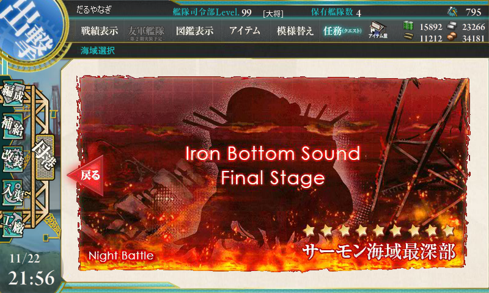
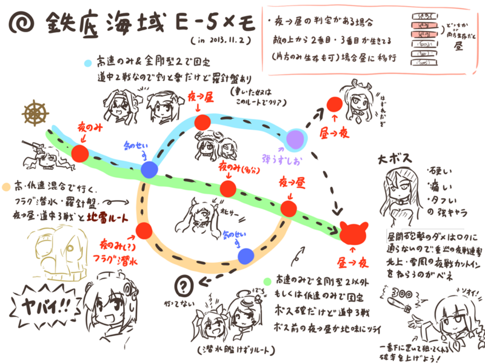
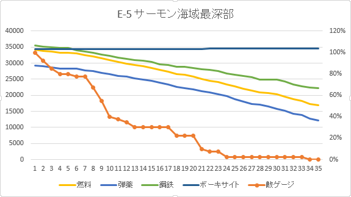
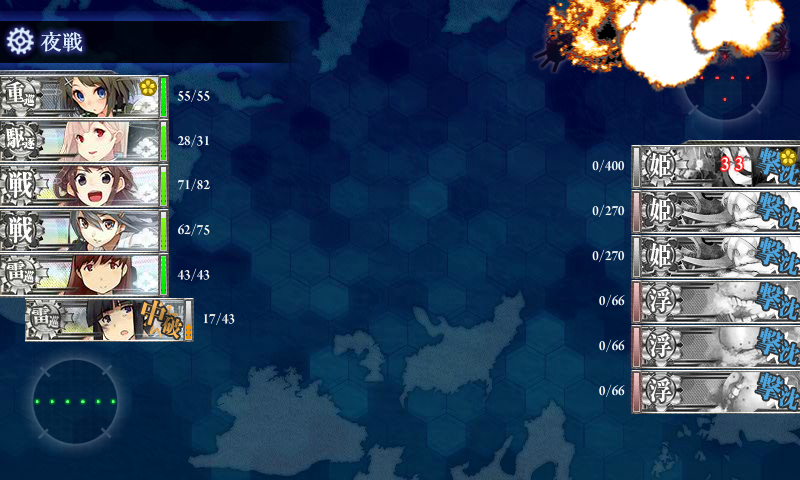
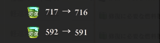
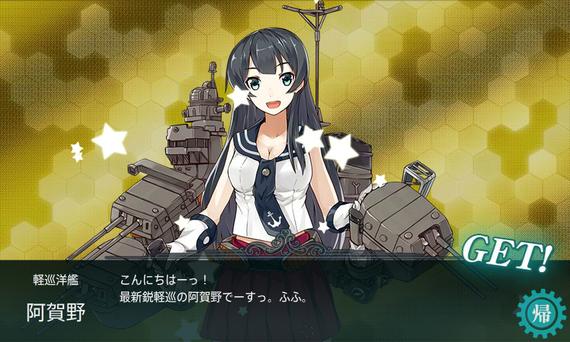
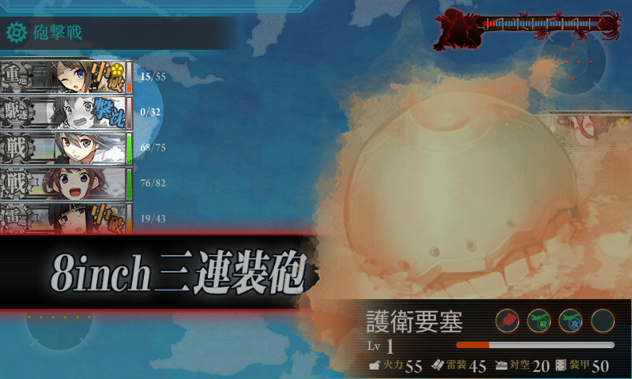

木曜日の晩、どうしても寝付けなかったので、深夜12時に突撃を開始。4時間ぐらいで終わるのだろうと予想していたが……慢心でした。すみません。

<h3>マップ概略と戦略</h3>

      イベント海域メモの反応見てたら需要有りそうだったので、E-5に関して自分が攻略の際に得た情報をある程度詳細に纏めてみました <a class="twitter-tweet-url" href="http://t.co/TCuT2XyENc" target="_top">URL</a>

<a href="http://twitter.com/urusi_bandai/status/396684671464910848" class="twitter-detail-info-permalink">2013-11-03 02:06:10</a> via web

よくわからんが、金剛型2隻＋高速艦で固めれば、1戦少ない上のルートで固定らしい。ウチの場合、初期メンバーは

<ul>
<li>雷巡・北上改二（84）</li>
<li>駆逐・夕立改二（60）</li>
<li>駆逐・雪風改（60）</li>
<li>戦艦・金剛改二（77）</li>
<li>戦艦・榛名改（76）</li>
<li>雷巡・大井改二（83）</li>
</ul>
で臨んだ。途中、昼戦の火力不足を感じて駆逐艦1隻を重巡洋艦（摩耶 Lv 58）にスイッチ。雪風以外は連撃装備にするとかなり生存率と BOSS 到達率が上がる。

道中はすべて複縦陣、BOSS のみ単縦陣。支援艦隊は 軽空母2＋駆逐2 で行っていたが、途中打撃力に不満を感じ 駆逐2＋戦艦4 にスイッチ。弾薬消費量が半端なかったのと、ボーキサイトが余ってたことから、駆逐2＋正規空母4 に切り替えたところこれが大当たりだった（後述）。本隊のキラつけはしなかったが、支援艦隊は演習でちょっとキラキラをつけさせてもらったのを派遣。キラキラがついていないと、たまに支援に失敗する……。

<h3>経過</h3>

35回出撃、13回途中撤退。22回中、お仕置き部屋6回。BOSS 戦（16戦、到達率45％）は S 勝利 3回、A 勝利 8回、B 勝利 2回、C 敗北 3回（大破多数のため夜戦回避で戦術的敗北）。

前半は運がよかったのだけど、艦隊編成で試行錯誤していたのと、支援艦隊の派遣ミスなども重なって A 勝利に甘んずるケースが多かった。中盤からはかなり運が悪くなってきて、編成は変わらないのに途中撤退が続いたり、お仕置き部屋送りが重なったり。最後の方は敵ゲージをあと一つに削りながら、2時間半ほど BOSS にすら到達できなくなったので、精神的にはかなりきつかった。

最後はハイパー北上さんが決めてくれました！　15分～20分間隔の出撃で、所要時間は9時間30分。

消費資源。戦艦仕様の支援艦隊でかなり弾薬を無駄遣いしたけれど、上手くやればもっと抑えられると思う。

<table>
<tr>
<td>燃料</td>
<td>弾薬</td>
<td>鋼鉄</td>
<td>ボーキサイト</td>
</tr>
<tr>
<td>-17,192</td>
<td>-17,184</td>
<td>-13,194</td>
<td>270</td>
</tr>
</table>
バケツの使用数（遠征による増加分込み）

 

<h3>収穫</h3>

      ふぁああああああああああああああああ！ <a class="twitter-tweet-url" href="http://t.co/KsR6lLKBaU" target="_top">URL</a>

<a href="http://twitter.com/daruyanagi/status/403573825574408192" class="twitter-detail-info-permalink">2013-11-22 02:21:12</a> via <a href="http://nozomi.arege.jp/KanHQ/" rel="nofollow">艦これ 司令部室</a>

あと、武蔵。矢矧ほしかったけど、多分無理だろうなぁ……。

<h3>教訓とか感想とか</h3>

 

<ul>
<li><b>雪風でも沈む。</b></li>
<li>なのでダメコンの積み忘れ、ダメ。ゼッタイ。</li>
<li>支援艦隊を間違って普通の遠征（おつかい）にだしてはいけない。</li>
<li>キラキラつけたら回避が上がるだなんて、信じられない。</li>
<li>4時間で済むと思って平日の版に挑戦したら次の日が辛い。</li>
</ul>
まぁ、幸い雪風は丹陽になる予定のとそのまま育てる予定の2隻を育てていたので、それほど心理的ダメージはないけど……申し訳ないことには変わりない。

