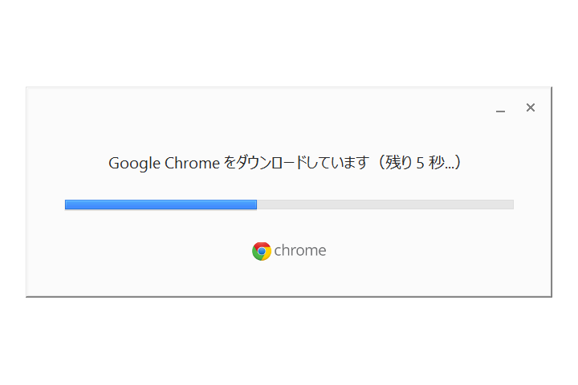
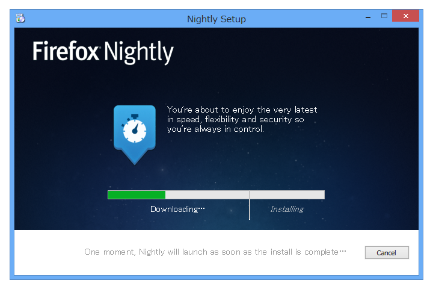
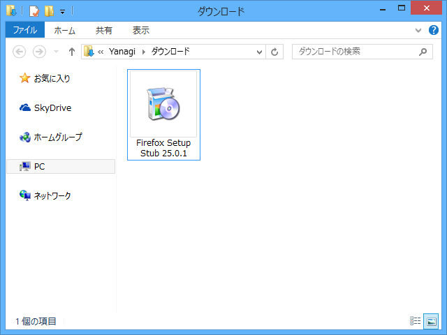

割りと最近、Google Chrome のインストーラーが新しくなった。そういえば、Mozilla Firefox のインストーラーもスタブインストーラーがメインになるらしい（海の向こうではもうそうなってる）。

セットアップに必要なファイルをアーカイブし、インストール時に展開するタイプを<b>フルインストーラー（Full Installer）</b>といい、このようにインストール時にセットアップに必要なファイルをダウンロードしてインストールするタイプを<b>スタブインストーラー（Stub Installer）</b>（Online Installer とも）というのだそうな。

 

<blockquote cite="http://e-words.jp/w/E382B9E382BFE38396.html">

あるプログラムが他のプログラムを呼び出す際に仲介となるプログラム。スタブの仲介を受けることで、プロセス間通信やクライアント・サーバ間でのオブジェクト呼び出しなどを、通常の手続き呼び出しと同様に扱うことができるようになる。

<cite><a href="http://e-words.jp/w/E382B9E382BFE38396.html">&#x30B9;&#x30BF;&#x30D6;&#x3068;&#x306F; &#x3010; stub &#x3011; - &#x610F;&#x5473;/&#x89E3;&#x8AAC;/&#x8AAC;&#x660E;/&#x5B9A;&#x7FA9; &#xFF1A; IT&#x7528;&#x8A9E;&#x8F9E;&#x5178;</a></cite>
</blockquote>

Mozilla Firefox はだいぶ前からフルインストーラーとスタブインストーラーの両方を用意していたらしいので、別に新しいって言うものではないけれど。

<blockquote cite="http://level.s69.xrea.com/mozilla/index.cgi?id=20060222_Installer">

スタブインストーラはすべての言語に対してひとつのインストーラが配布され、実行時に正しいロケールファイルをダウンロードできるという利点がある。もちろんフルインストーラも利用でき、特にシステム管理者とローカル環境でインストールしたい人には有用だろう。

<cite><a href="http://level.s69.xrea.com/mozilla/index.cgi?id=20060222_Installer">Firefox 2.0 &#x306E;&#x30A4;&#x30F3;&#x30B9;&#x30C8;&#x30FC;&#x30E9; - &#x3048;&#x3080;&#x3082;&#x3058;&#x3089;</a></cite>
</blockquote>

<ul>
<li><a href="https://quality.mozilla.org/2012/10/stub-installer-in-firefox-nightly-try-it-out-give-feedback-and-test-it/">Stub Installer in Firefox Nightly &ndash; Try it out, Give feedback, and Test it! | QMO &ndash; quality.mozilla.org</a></li>
</ul>