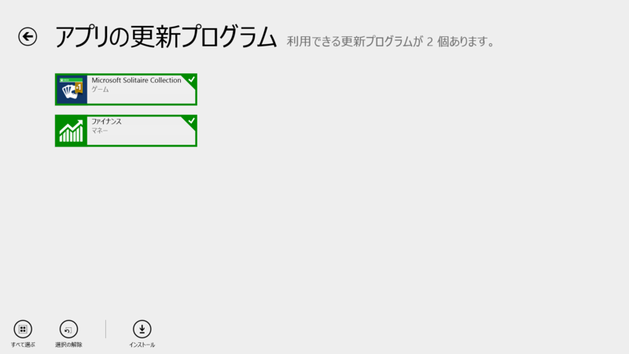
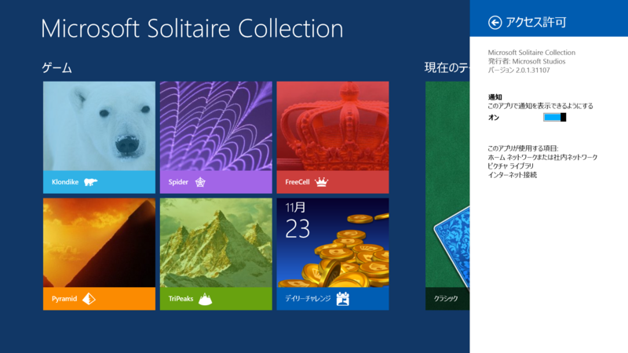

 

<h3>Microsoft Solitaire Collection 2.0.0.31018 → 2.0.1.31107</h3>

 

<blockquote>

<ul>
<li>Windows 8.1 に対応!</li>
<li>バグの修正および最適化</li>
<li>ご意見、ご感想をお聞かせください。Xbox フォーラムにて募集しております。 <a href="http://aka.ms/SolitaireSupport">http://aka.ms/SolitaireSupport</a></li>
</ul>
</blockquote>

ただのマイナーアップデートだと思う。

<ul>
<li><a href="http://apps.microsoft.com/windows/ja-jp/app/microsoft-solitaire-collection/1a36fd17-5161-4651-ae2d-13384e427ea8">Windows &#x30B9;&#x30C8;&#x30A2; &#x306E; Windows &#x7528; Microsoft Solitaire Collection &#x30A2;&#x30D7;&#x30EA;</a></li>
</ul>

<h3>ファイナンス 3.0.1.203 → 3.0.1.299</h3>

リリースノートなし。ただのマイナーアップデート。

<ul>
<li><a href="http://apps.microsoft.com/windows/ja-jp/app/finance/ffc158e5-74d6-4878-8ace-8f0df45083c1">Windows &#x30B9;&#x30C8;&#x30A2; &#x306E; Windows &#x7528; &#x30D5;&#x30A1;&#x30A4;&#x30CA;&#x30F3;&#x30B9; &#x30A2;&#x30D7;&#x30EA;</a></li>
</ul>

