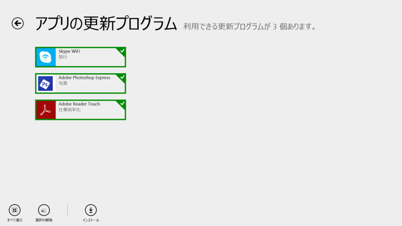
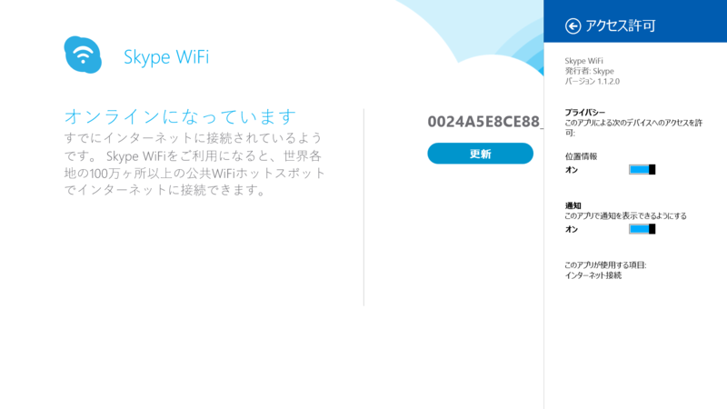
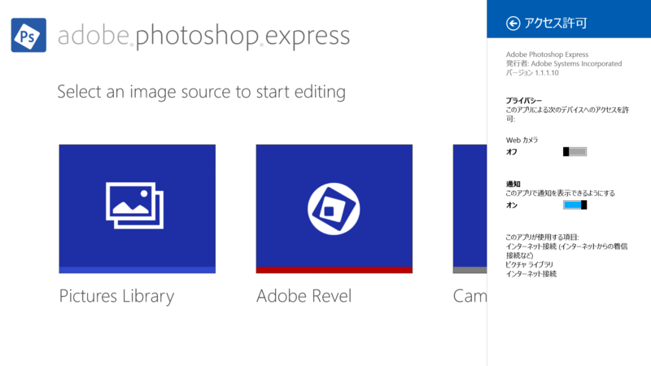
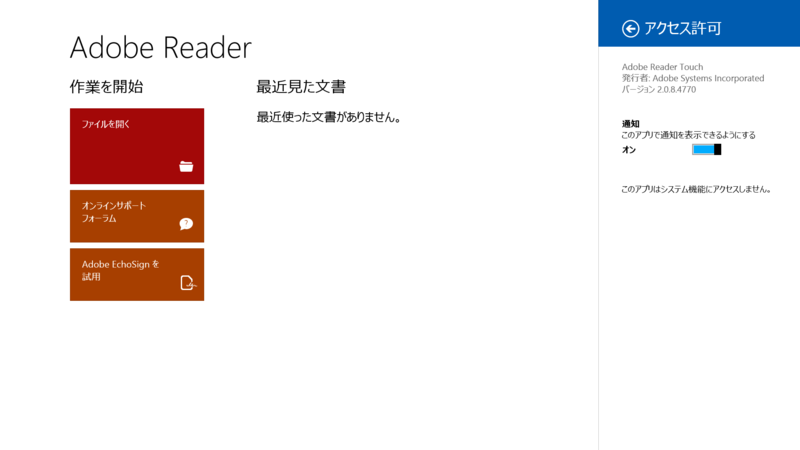
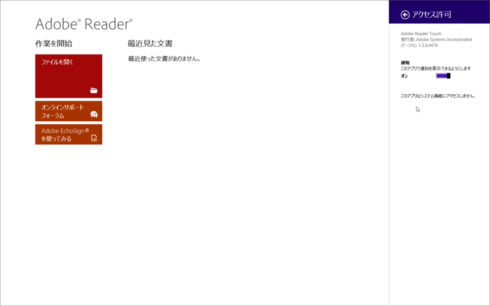

 

<h3>Skype WiFi 1.1.1.1 → 1.1.2.0</h3>

 

<blockquote>

新機能

<ul>
<li>パフォーマンス向上と修正</li>
</ul>
</blockquote>

<ul>
<li><a href="http://apps.microsoft.com/windows/ja-jp/app/skype-wifi/47588cf4-d990-42f5-8d47-1c9061d56b3e">Windows &#x30B9;&#x30C8;&#x30A2; &#x306E; Windows &#x7528; Skype WiFi &#x30A2;&#x30D7;&#x30EA;</a></li>
</ul>

<h3>Adobe Photoshop Express 1.1.0.79 → 1.1.1.10</h3>

 

<blockquote>

<ul>
<li>BugFixes</li>
</ul>
</blockquote>

<ul>
<li><a href="http://apps.microsoft.com/windows/ja-jp/app/adobe-photoshop-express/c08a0d72-28a1-465a-9e70-6a5b80b44d60">Windows &#x30B9;&#x30C8;&#x30A2; &#x306E; Windows &#x7528; Adobe Photoshop Express &#x30A2;&#x30D7;&#x30EA;</a></li>
</ul>

<h3>Adobe Reader Touch 2.0.8.2893 → 2.0.8.4770</h3>

 

<blockquote>

<ul>
<li>バグ修正</li>
</ul>
</blockquote>

いつのまに v2.0.x になってたのだろう。Windows 8.1 向け？　手元に Windows 8 環境がないのであとで確認してみよう。

<ul>
<li><a href="http://apps.microsoft.com/windows/ja-jp/app/adobe-reader-touch/162a2931-8ee6-4a56-9570-53282525d7a3">Windows &#x30B9;&#x30C8;&#x30A2; &#x306E; Windows &#x7528; Adobe Reader Touch &#x30A2;&#x30D7;&#x30EA;</a></li>
</ul>

<h4>追記</h4>

Windows 8 環境では 1.3.8.4476 でした。

