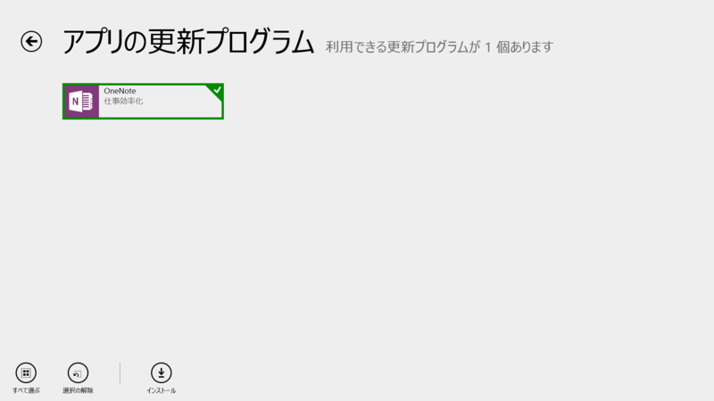
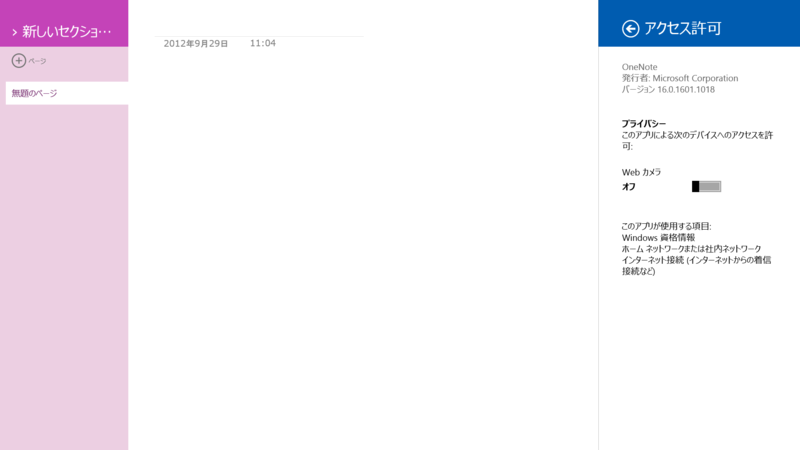
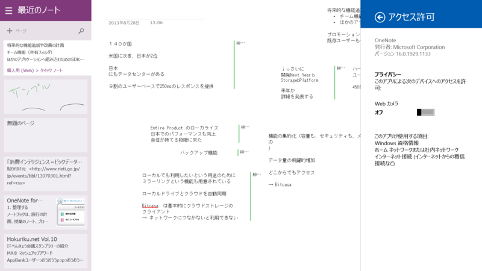
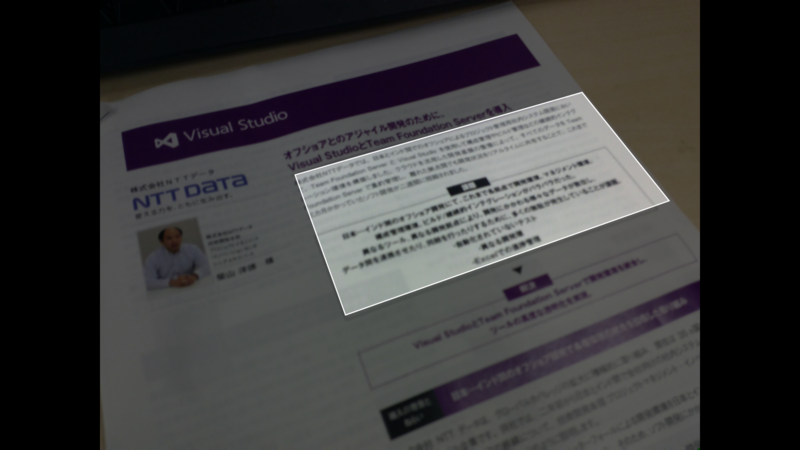
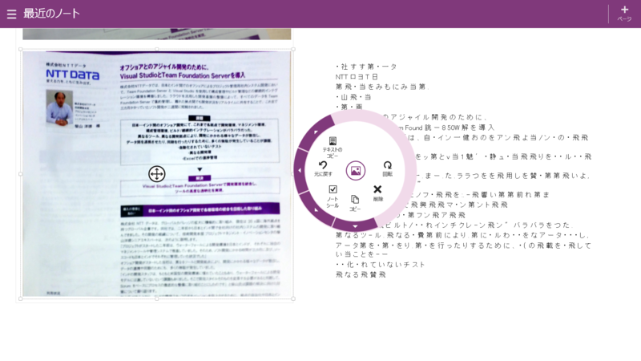
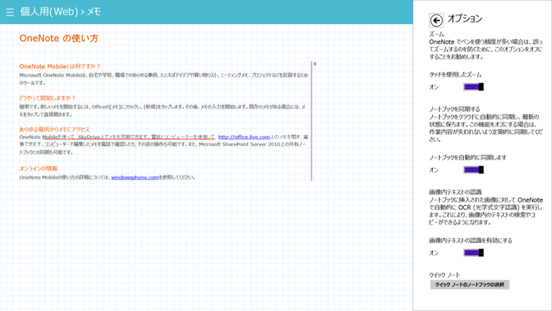
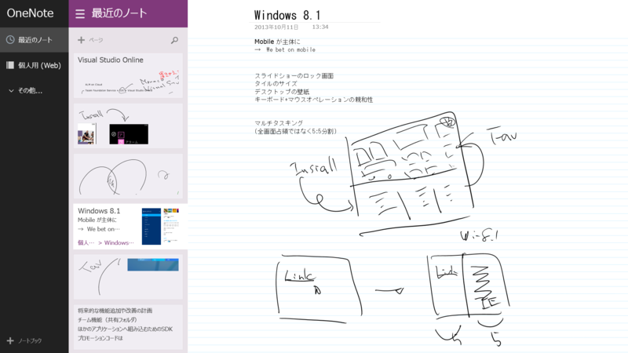

 

<h3>OneNote 16.0.1601.1018 → 16.0.1929.1133</h3>

更新前。

更新後。

ただのマイナーアップデートかと思ったらかなり変わってた。

<blockquote>

<ul>
<li>ペン メニューで、お気に入りのペンの設定や、ペンの色と太さの変更が可能</li>
<li>最近使ったノートブックの一覧のローミングをサポート</li>
<li>タッチ操作での書き込みをサポート</li>
</ul>
</blockquote>

リリースノートは据え置きくさい（参考: <a href="http://www.forest.impress.co.jp/docs/news/20130717_607813.html">Windows &#x30B9;&#x30C8;&#x30A2;&#x30A2;&#x30D7;&#x30EA;&#x300C;OneNote&#x300D;&#x304C;&#x300C;Office 365&#x300D;&#x30A2;&#x30AB;&#x30A6;&#x30F3;&#x30C8;&#x306B;&#x5BFE;&#x5FDC; - &#x7A93;&#x306E;&#x675C;</a>）。<a href="http://blogs.office.com/b/microsoft-onenote/">OneNote Blog</a> の更新は今のところない。

ちょろっと使って気がついたのは、カメラでの取り込みでテキスト認識と方向補正に対応したところぐらいか。

Surface 2 のカメラってどうやってフォーカスを合わせればいいのかわからず、適当に撮ったところ、テキスト認識の精度は散々だった。ただ、メモの方向補正はバッチリ効いたかも。

オプションにも［画像内テキストの認識］という項目が追加されている。そのほかの変更はデザインの改善ぐらいか。

全体的にソリッドかつフラットになった印象。

<ul>
<li><a href="http://apps.microsoft.com/windows/ja-jp/app/onenote/f022389f-f3a6-417e-ad23-704fbdf57117">Windows &#x30B9;&#x30C8;&#x30A2; &#x306E; Windows &#x7528; OneNote &#x30A2;&#x30D7;&#x30EA;</a></li>
</ul>

<h4>追記</h4>

<ul>
<li><a href="http://blogs.office.com/b/microsoft-onenote/archive/2013/11/25/a-big-onenote-update-for-windows-note-taking-devices.aspx">http://blogs.office.com/b/microsoft-onenote/archive/2013/11/25/a-big-onenote-update-for-windows-note-taking-devices.aspx</a></li>
</ul>
公式ブログも更新。［共有］チャームからのインポートなんかも強化点みたい。

