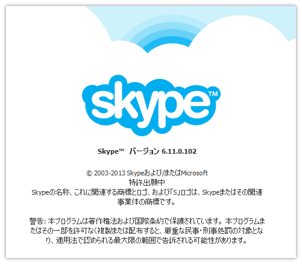

 

<h3>Skype for Windows Desktop 6.10.0.104 → 6.11.0.102</h3>

自動アップデート機能ではまだ更新できなかった。<a href="http://www.skype.com/ja/download-skype/skype-for-windows/">&#x30A4;&#x30F3;&#x30B9;&#x30C8;&#x30FC;&#x30E9;&#x30FC;</a>でアップデート。

<ul>
<li><a href="http://community.skype.com/t5/Windows-desktop-client/bd-p/Windows">Windows (desktop client) - Skype Community</a></li>
<li><a href="https://support.skype.com/en/category/SKYPE_FOR_WINDOWS/">Help for Skype &ndash; user guides, FAQs, customer support</a></li>
</ul>
更新履歴はよ。

