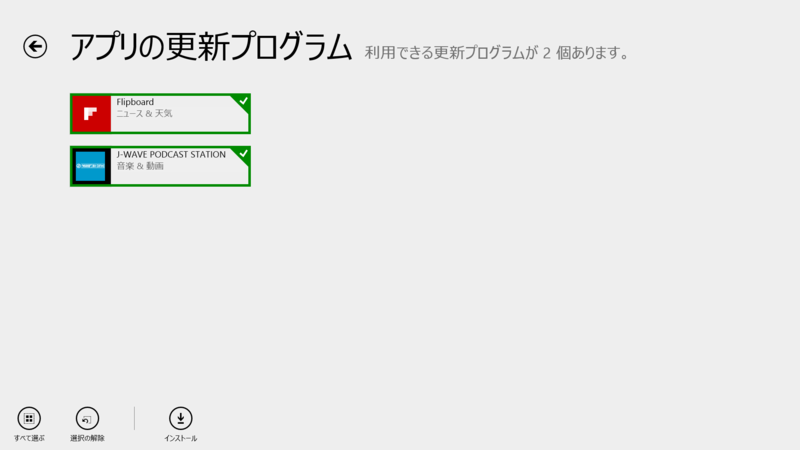
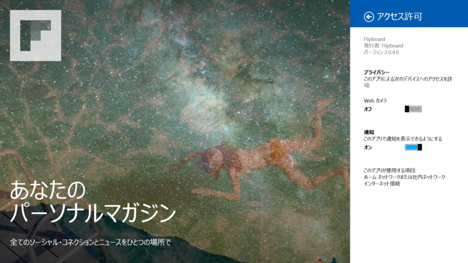

 

<h3>Flipboard 2.0.3.0 → 2.0.4.0</h3>

<a href="http://www.forest.impress.co.jp/docs/news/20131115_623841.html">&#x30CB;&#x30E5;&#x30FC;&#x30B9;&#x306A;&#x3069;&#x3092;&#x96D1;&#x8A8C;&#x98A8;&#x306B;&#x95B2;&#x89A7;&#x3067;&#x304D;&#x308B;&#x300C;Flipboard&#x300D;&#x306E;Windows &#x30B9;&#x30C8;&#x30A2;&#x30A2;&#x30D7;&#x30EA;&#x7248;&#x304C;&#x516C;&#x958B; - &#x7A93;&#x306E;&#x675C;</a> からあまり間をおかず。たぶん些細な修正なんだと思う。<a href="http://inside.flipboard.com/">Inside Flipboard | The Official Flipboard Blog</a> にもとくに記述はないみたい。

<ul>
<li><a href="http://apps.microsoft.com/windows/ja-jp/app/flipboard/e62e393a-acc9-40d9-a34a-13a41f2eeef0">Windows &#x30B9;&#x30C8;&#x30A2; &#x306E; Windows &#x7528; Flipboard &#x30A2;&#x30D7;&#x30EA;</a></li>
</ul>

