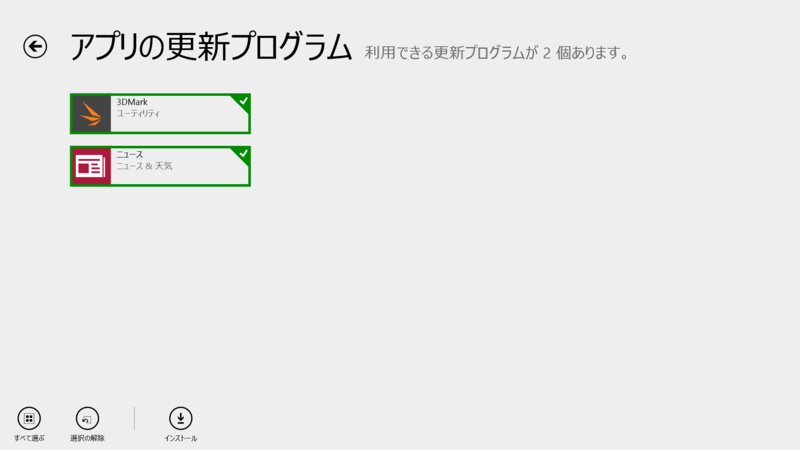
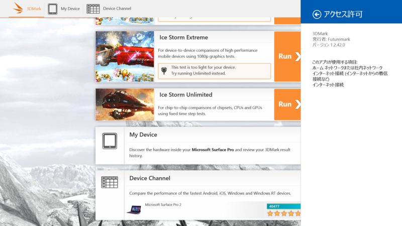
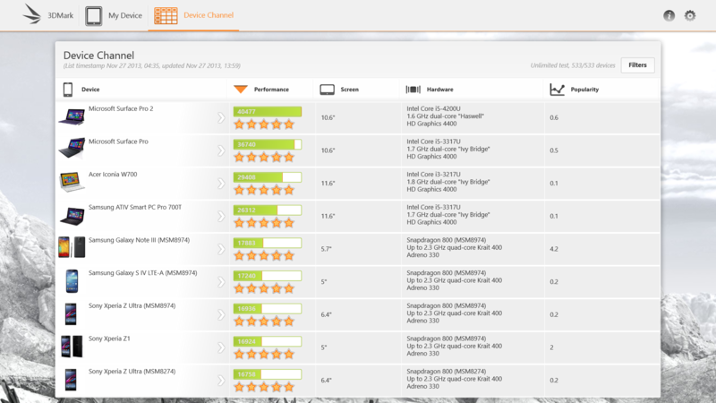
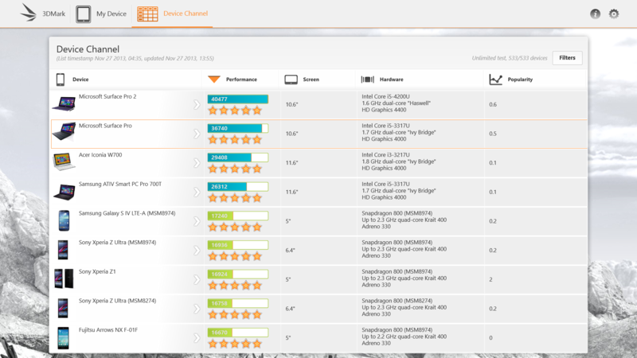
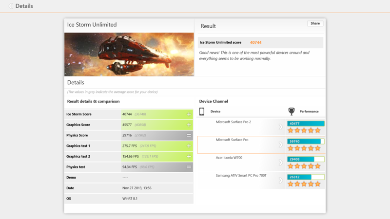
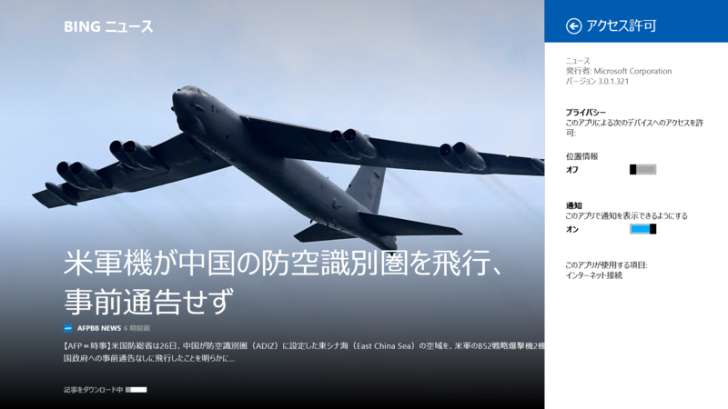

 

<h3>3DMark 1.1.11.4749 → 1.2.42.0</h3>

 

<blockquote>

In the latest release, you can compare your score with Windows 8 tablets in the Device Channel.

People rely on Futuremark benchmarks to produce accurate and unbiased results. Devices with suspicious benchmarks scores have been delisted from the Device Channel. You should not use scores from delisted devices to compare devices.

</blockquote>

変更点はよくわからなかったが――

旧バージョン。

新バージョン。まさか Windows 8.x タブレット（非 ARM）が色分けされただけなのだろうか。<a href="http://japanese.engadget.com/2013/11/26/3dmark-htc/">&#x30D9;&#x30F3;&#x30C1;&#x30DE;&#x30FC;&#x30AF;&#x306E;3DMark&#x3001;&#x30B5;&#x30E0;&#x30B9;&#x30F3;&#x3084;HTC&#x306E;&#x4E00;&#x90E8;&#x7AEF;&#x672B;&#x3092;&#x5BFE;&#x8C61;&#x304B;&#x3089;&#x9664;&#x5916;&#x3002;&#x4E0D;&#x6B63;&#x306A;&#x7D50;&#x679C;&#x64CD;&#x4F5C;&#x306E;&#x7591;&#x3044; - Engadget Japanese</a> が関係するのかどうかは知らない。

あと気になったのだけど、Surface Pro 1 なのに OS が Windows RT 8.1 って判定された。

<ul>
<li><a href="http://apps.microsoft.com/windows/ja-jp/app/3dmark/f71eedf2-76ac-4be9-a073-13142d4a87fe">Windows &#x30B9;&#x30C8;&#x30A2; &#x306E; Windows &#x7528; 3DMark &#x30A2;&#x30D7;&#x30EA;</a></li>
</ul>

<h3>ニュース 3.0.1.285 → 3.0.1.321</h3>

リリースノートなし。たぶんマイナーアップデート。

<ul>
<li><a href="http://apps.microsoft.com/windows/ja-jp/app/news/eaaf2ce3-d5a3-4a59-ae31-276fbc44a7cd">Windows &#x30B9;&#x30C8;&#x30A2; &#x306E; Windows &#x7528; &#x30CB;&#x30E5;&#x30FC;&#x30B9; &#x30A2;&#x30D7;&#x30EA;</a></li>
</ul>

