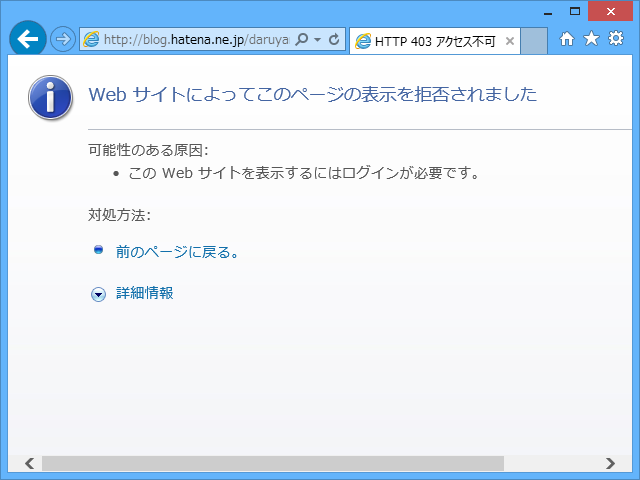

詳細は <a href="http://shiba-yan.hatenablog.jp/entry/20131203/1386001153">&#x3060;&#x308B;&#x3084;&#x306A;&#x304E;&#x6C0F;&#x3060;&#x3051;&#x306F;&#x3066;&#x306A;&#x30D6;&#x30ED;&#x30B0;&#x306B;&#x30ED;&#x30B0;&#x30A4;&#x30F3;&#x51FA;&#x6765;&#x306A;&#x3044;&#x3089;&#x3057;&#x3044; - &#x3057;&#x3070;&#x3084;&#x3093;&#x96D1;&#x8A18;</a> に詳しいが（なんでやねん！）、ここ数日間、はてなブログにログインできず、ブログが更新できなかった。

<h3>経緯</h3>

<ol>
<li>とあるところに、はてなダイアリーがありました。</li>
<li>そのはてなダイアリーには、Twitter のログが毎日自動収集のうえ保管されていました。</li>
<li>はてなダイアリーの過去ログに、ア○ィダス社の女性社員が某スポーツ選手を侮辱したという記事に関するかなり古いツイートが含まれていました。</li>
<li>そのツイート部分に個人名が含まれているので消せという要求が、はてなの法務からありました。対応しない場合、はてなダイアリーをプライベートにするとの由。</li>
<li>はてなダイアリーなぞプライベートにされようがまるごと消されようが構わないと思っていたので、放置・忘却。</li>
<li>はてなブログへのログインがブロックされました。</li>
</ol>

<h3>対応</h3>

<ul>
<li>はてなダイアリーの記事を全部削除した。</li>
</ul>

<h3>感想</h3>

<ul>
<li>何の事件かさっぱり忘れていたのだけど、かなり鮮明に思い出したうえに記憶が強固になった。「忘れられる権利」は逆効果になることもある。</li>
<li>ムカついたと同時に、こんな辺境ブログに埋もれた一行まで弁護士使っていちいち削除しているだなんて大変だなと思ってしまった。</li>
<li>使わないサービスを「いつか役に立つかも」と放置しておくと面倒なことになる。</li>
<li>法務と名前の付いたところには面倒くさくてもちゃんと対応しておけ、俺様。</li>
<li>はてなのサポートはそんなに対応早くない。法務の対応はやたら早い（はてなダイアリーの削除からはてなブログの復活まで、一般の業務時間外にもかかわらず割りと一瞬だった）。</li>
<li>なんで「はてなダイアリー」の巻き添えで「はてなブログ」をブロックするのか、正直納得がいかない（ほかのサービスが問題なく使えたので気が付く・思い出すのが遅れた。ちょうど iOS アプリをアップデートした直後に気が付いたので、そっちが問題かと思ってしまった）。最初のメールにそう書いてくれれば、ちゃんと対応したのに（←ぉぃ）。</li>
<li>Windows Azure Websites ＋ WebMatrix ＋ WordPress で<a href="http://darulog.azurewebsites.net/">&#x907F;&#x96E3;&#x6240;</a>を作ったけど、楽ちんすぎてわろた。</li>
<li>WordPress よりはてなブログのほうが使いやすい。はてなブログより WordPress のほうが自由。</li>
<li>ってか、Windows Azure Websites に課金して使いたい。サイコー</li>
<li>WordPress はデカすぎて自分にとってはブラックボックス。自分でブログエンジン作りたい気持ちが高まった。</li>
</ul>
あと、いい加減<i>ブログデータのエクスポートはつけてほしい。</i>技術的にできないはずはないだろうので、経営戦略的な理由でやっているのだろうけれど、そういうのはよろしくない。

<ul>
<li><a href="http://ja.wikipedia.org/wiki/%E3%83%9B%E3%83%BC%E3%83%AB%E3%83%89%E3%82%A2%E3%83%83%E3%83%97%E5%95%8F%E9%A1%8C">&#x30DB;&#x30FC;&#x30EB;&#x30C9;&#x30A2;&#x30C3;&#x30D7;&#x554F;&#x984C; - Wikipedia</a></li>
</ul>

<h3>謝辞</h3>

自分の怠慢から、しばやんにはなんかいろいろ手間かけさせて申し訳なかった。ありがとう。

だけど、エラい人に直接 Twitter で頼むの、個人的には好きじゃないんだよな。エラい人はエラさに応じて大変忙しいわけで、こんなクダらないことで振り回すぐらいならもっとクリエイティブなことやってほしいし。Twitter で <a href="https://twitter.com/masason">@masason</a> に直接文句いう人とかもそんなに好きじゃないしなぁ。あと、上のひとに Twitter で頼んでしまっては、サポートのひとの立場がなかろうと心配してしまう。まぁ、それは杞憂か。

