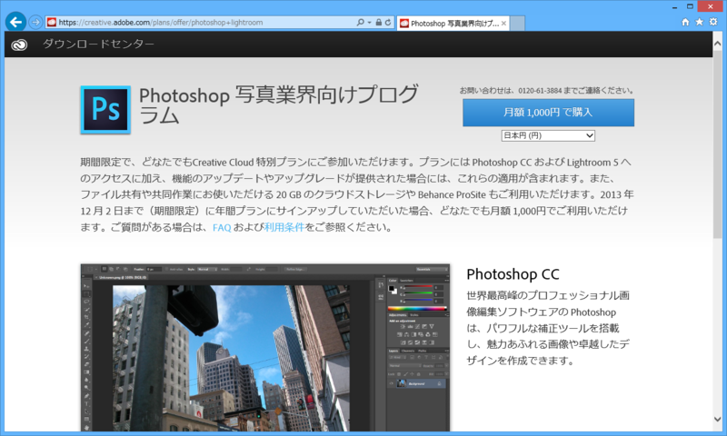

 

<blockquote cite="http://www.itmedia.co.jp/news/articles/1312/03/news082.html">

最新のフル版Photoshop「Photoshop CC」と写真家向けソフト「Lightroom 5」、20Gバイトのクラウドストレージ、ポートフォリオを公開できる「Behance ProSite」を利用できるプラン。同社によると「メンバーシップを更新し続けて頂ける限り、月額1000円にて継続してご利用いただけます」。最新版へのアップデート／アップグレードも適用される。

<cite><a href="http://www.itmedia.co.jp/news/articles/1312/03/news082.html">Photoshop&#xFF06;Lightroom&#x6708;&#x984D;1000&#x5186;&#x30D7;&#x30E9;&#x30F3;&#x3001;12&#x6708;9&#x65E5;&#x307E;&#x3067;&#x53D7;&#x3051;&#x4ED8;&#x3051;&#x5EF6;&#x9577; - ITmedia &#x30CB;&#x30E5;&#x30FC;&#x30B9;</a></cite>
</blockquote>

最初は12月2日までってことだったが、例のクレジットカード情報流出問題なんかが気になって決断を遅らせているうちに契約し損ねてしまった……ところ、募集期間が延長されたっぽいので契約。案外集まってないのかしら？

別に「写真業界」のひとでもなんでもないけど、「Photoshop CC」「Lightroom 5」がこの値段ならギリギリありかなって思う。できたら500円ぐらいだったらうれしいけど。ほかのアプリも、どんどんサブスクリプション制になればいいと思う。アップデートのインセンティブも向上するしね（同じお金を払うなら、最新版のほうがお得でしょう？）。

インストールはめんどくさくてまだしていない。

