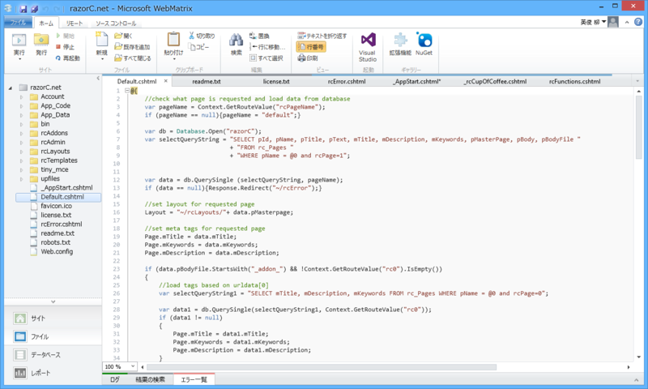
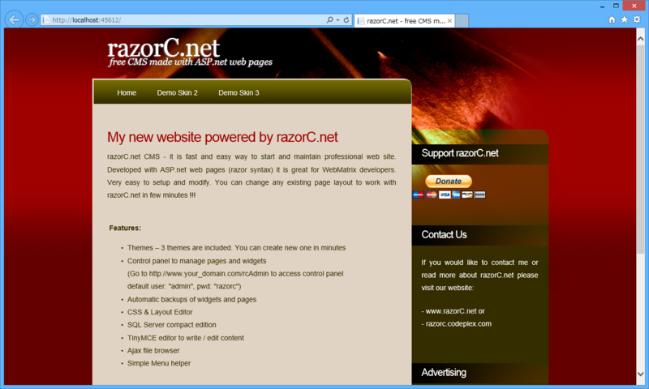

ASP.NET Web Pages（razor syntax）で開発された CMS で、WebMatrix で開いていろいろ改造できるみたい。

<ul>
<li><a href="http://www.razorc.net/">Open Source ASP.net CMS for WebMatrix - razorC.net</a></li>
</ul>
実際に WebMatrix で動かすとこんな感じ。

機能的には割と普通というか、自動バックアップ機能とテーマ機能、レイアウトエディターが気になる程度。

ちょっと面白いなと思ったのはコレ。

<pre class="code lang-cs" data-lang="cs" data-unlink>// _AppStart.cshtml

@using System.Web.Routing

@{
RouteTable.Routes.MapWebPageRoute(
&quot;{rcPageName}/{rc0}/{rc1}&quot;,
&quot;~/Default.cshtml&quot;,
new {
rcPageName = &quot;default&quot;,
rc0=-1,
rc1=-1
}
);
}
</pre>
別に<a href="https://blog.daruyanagi.jp/entry/2012/07/06/174414">&#x898F;&#x7D04;&#x30D9;&#x30FC;&#x30B9;&#x306E;&#x30EB;&#x30FC;&#x30C6;&#x30A3;&#x30F3;&#x30B0;</a>を無理して使う必要はなかったんだな。言われてみればそうなのだろうけれど、割りと目から鱗だった。

<ul>
<li><a href="http://www.mikesdotnetting.com/Article/187/More-Flexible-Routing-For-ASP.NET-Web-Pages">More Flexible Routing For ASP.NET Web Pages</a></li>
</ul>