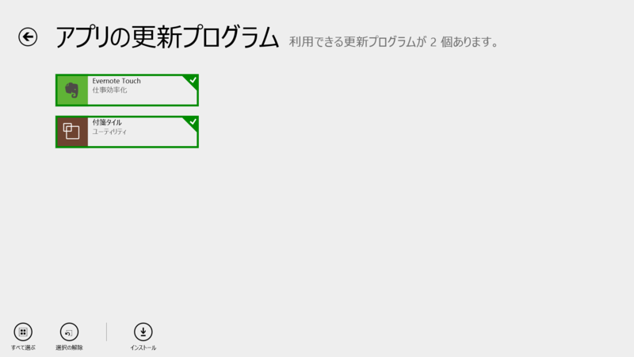
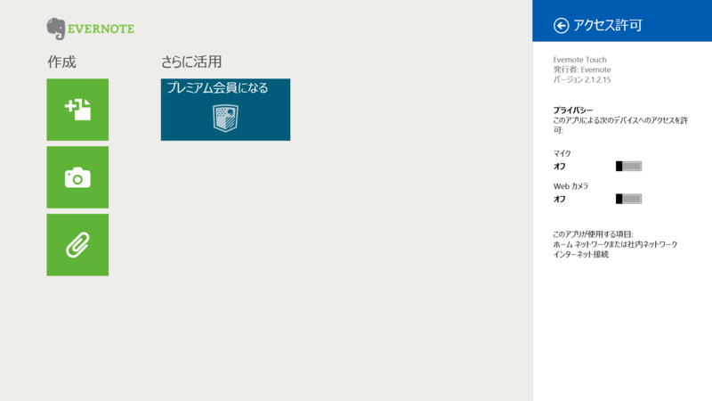
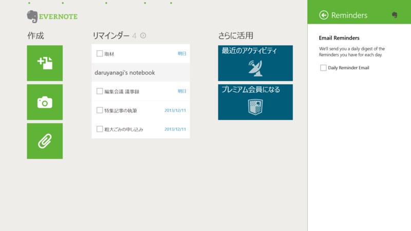
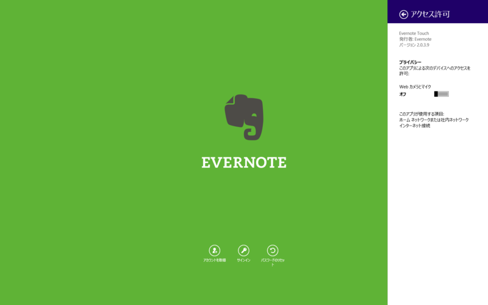
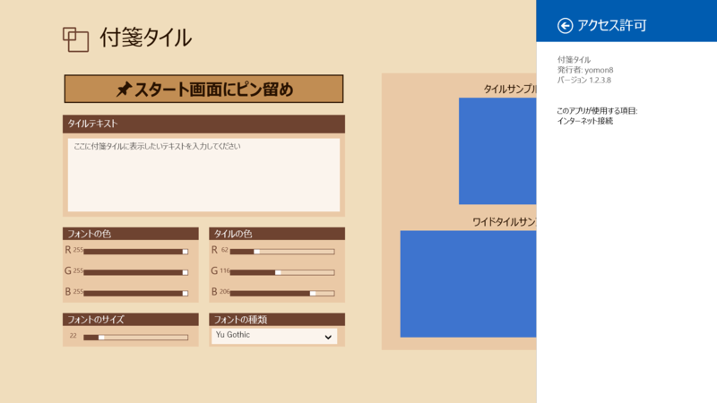

 

<h3>Evernote Touch 2.1.1.28 → 2.1.2.15</h3>

 

<blockquote>

重要なノートや作業中のノートを忘れないためのリマインダー機能

・リマインダーをノートに追加して、ノート一覧の上に固定して表示  
・期日を設定して、アプリ内およびメールでの通知を受信 
・完了したノートを「実行済み」にする 
・共有ノートブックにあるノートのリマインダーを表示・リマインダー通知を受信

</blockquote>

ほかのプラットフォームですでに利用できるリマインダー機能がモダン アプリにも。

<ul>
<li><a href="http://apps.microsoft.com/windows/ja-jp/app/43762868-3915-4c75-b5ca-d4f12b1d1ba4">Windows &#x30B9;&#x30C8;&#x30A2; &#x306E; Windows &#x7528; &#x4ED8;&#x7B8B;&#x30BF;&#x30A4;&#x30EB; &#x30A2;&#x30D7;&#x30EA;</a></li>
</ul>

<h4>追記</h4>

Windows 8 では v2.0.3.9 が最新版のようだ。

<ul>
<li><a href="http://www.forest.impress.co.jp/docs/news/20130708_606807.html">Evernote&#x3001;&#x30B9;&#x30C8;&#x30A2;&#x30A2;&#x30D7;&#x30EA;&#x300C;Evernote Touch&#x300D;&#x3092;v2&#x3078;&#x30E1;&#x30B8;&#x30E3;&#x30FC;&#x30D0;&#x30FC;&#x30B8;&#x30E7;&#x30F3;&#x30A2;&#x30C3;&#x30D7; - &#x7A93;&#x306E;&#x675C;</a></li>
</ul>

<h3>付箋タイル 1.2.2.7 → 1.2.3.8</h3>

 

<blockquote>

<1.2.3.8> 
バグ修正

</blockquote>

割りと気に入っているけれど、2つ目以降のタイルを新規追加するプロセスが少しわかりにくいかなと感じた。慣れればオッケーだけど。

<ul>
<li><a href="http://apps.microsoft.com/windows/ja-jp/app/evernote-touch/5aba7f8c-318f-42aa-9590-b1fc31e5cba6">Windows &#x30B9;&#x30C8;&#x30A2; &#x306E; Windows &#x7528; Evernote Touch &#x30A2;&#x30D7;&#x30EA;</a></li>
<li><a href="http://www.forest.impress.co.jp/docs/review/20131203_625966.html">&#x3010;&#x30EC;&#x30D3;&#x30E5;&#x30FC;&#x3011;&#x30B9;&#x30BF;&#x30FC;&#x30C8;&#x753B;&#x9762;&#x3078;&#x4ED8;&#x7B8B;&#x7D19;&#x4EE3;&#x308F;&#x308A;&#x306E;&#x30BF;&#x30A4;&#x30EB;&#x3092;&#x30D4;&#x30F3;&#x7559;&#x3081;&#x3057;&#x3066;&#x304A;&#x3051;&#x308B;&#x30B9;&#x30C8;&#x30A2;&#x30A2;&#x30D7;&#x30EA;&#x300C;&#x4ED8;&#x7B8B;&#x30BF;&#x30A4;&#x30EB;&#x300D; - &#x7A93;&#x306E;&#x675C;</a></li>
</ul>

