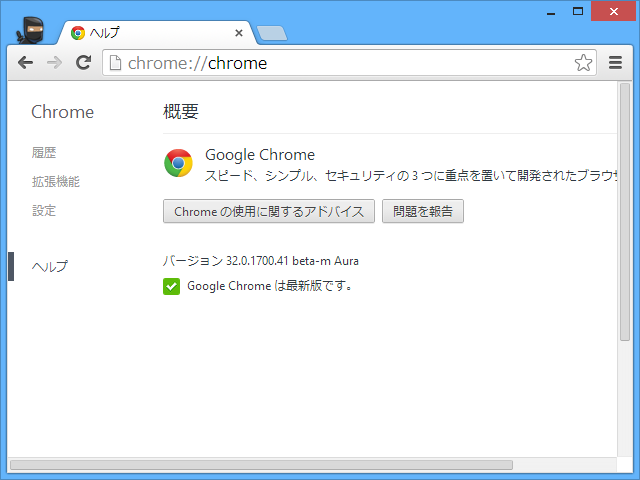
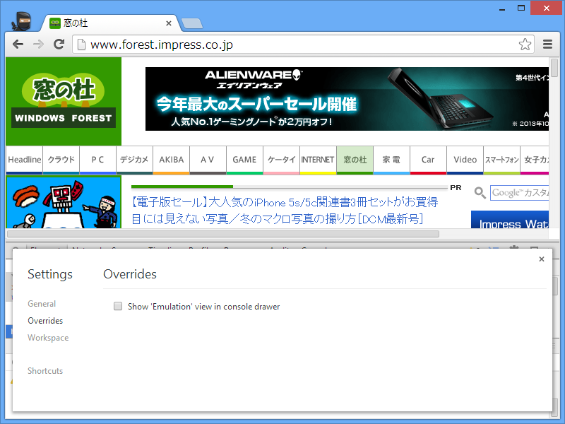
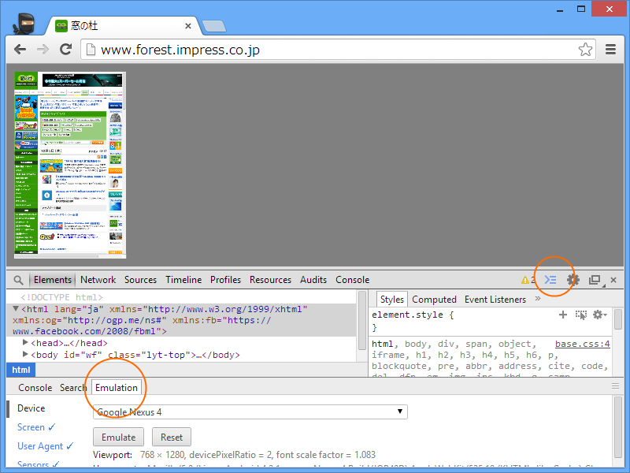
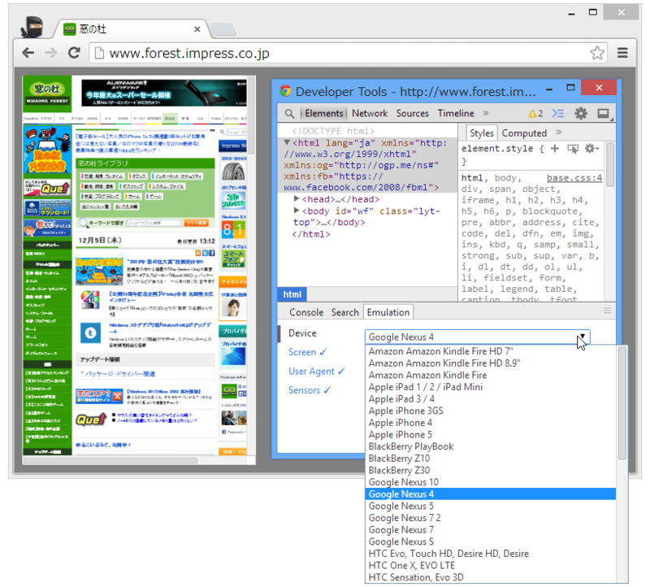
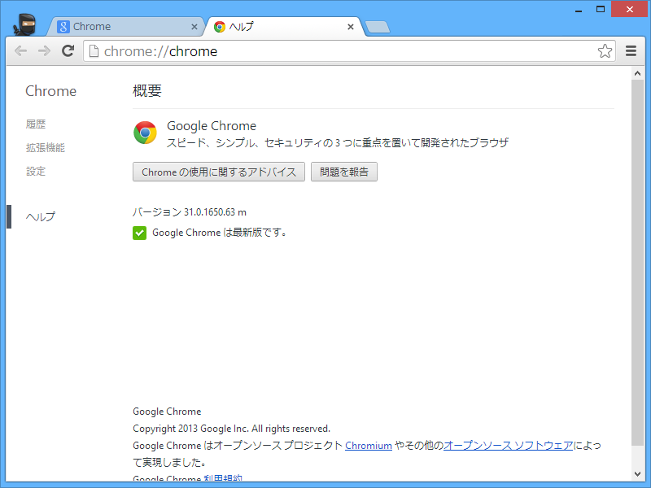

<h3>Google Chrome 32.0.1700.41</h3>

 

<blockquote>

Google Chrome	32.0.1700.41 (Official Build 238477) beta-m Aura 
OS	Windows  
Blink	537.36 (@163020) 
JavaScript	V8 3.22.24.8 
Flash	11.9.900.170

</blockquote>

<ul>
<li><a href="http://googlechromereleases.blogspot.jp/2013/12/beta-channel-update_4.html">Chrome Releases: Beta Channel Update</a></li>
</ul>

［Settings］‐［Overrides］で Console Drawer の Emulation View を有効化し……

Console Drawer を引っ張り出すとモバイルデバイスのエミュレーション機能が利用できる。ほかにもリモートデバッグ機能がついているみたいだけれど、手元に Android デバイスがないのでまた今度試してみることにしよう。

 

<ul>
<li><a href="http://blog.chromium.org/2013/12/chrome-devtools-for-mobile-emulate-and.html">Chromium Blog: Chrome DevTools for Mobile: Emulate and Screencast</a></li>
</ul>

<h3>Google Chrome 31.0.1650.63</h3>

 

<blockquote>

Google Chrome	31.0.1650.63 (Official Build 238485) m 
OS	Windows  
Blink	537.36 (@163124) 
JavaScript	V8 3.21.18.13 
Flash	11.9.900.170

</blockquote>

<ul>
<li><a href="http://googlechromereleases.blogspot.jp/2013/12/stable-channel-update.html">Chrome Releases: Stable Channel Update</a></li>
</ul>

