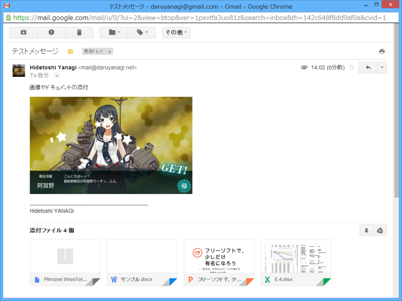
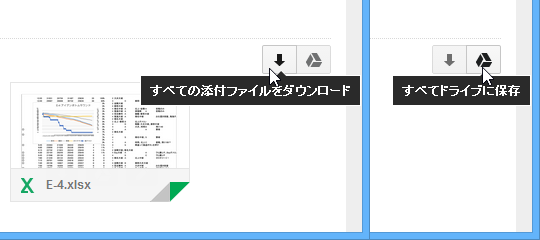

画像ファイルのプレビューは前からあった気がするけど、オフィス文書のプレビューは新しいと思う。これは割りと便利だと思った。

あと、添付ファイルを ZIP でまとめてダウンロードする機能があるのを知らなくて、部署で笑われた。今まで自分で ZIP に固めて添付してたぜ……ぐぬぬ。

<ul>
<li><a href="https://blog.daruyanagi.jp/entry/2013/09/25/113348">Gmail : Amazon &#x304B;&#x3089;&#x306E;&#x5546;&#x54C1;&#x914D;&#x9001;&#x3092;&#x8FFD;&#x8DE1;&#x3067;&#x304D;&#x308B;&#x795E;&#x6A5F;&#x80FD; - &#x3060;&#x308B;&#x308D;&#x3050;</a></li>
</ul>