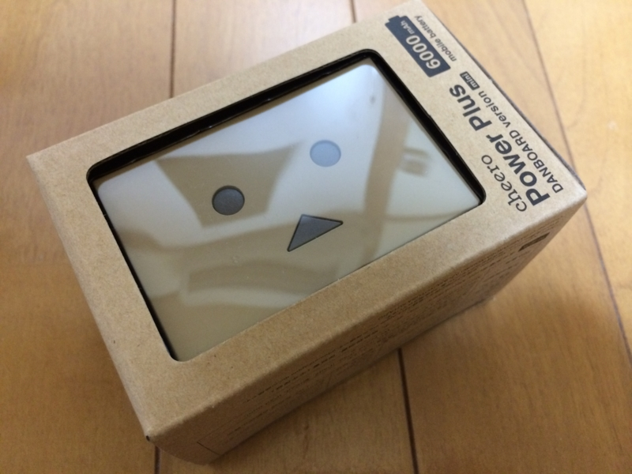
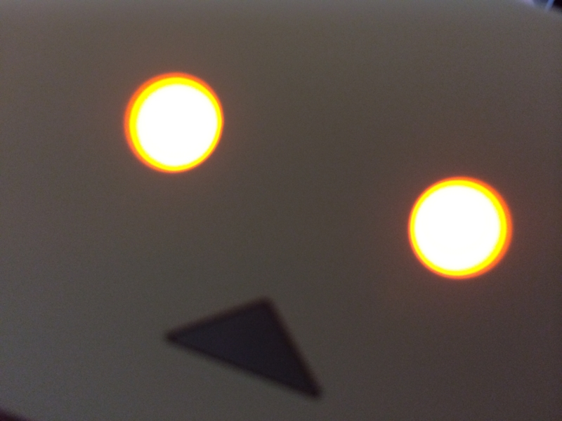
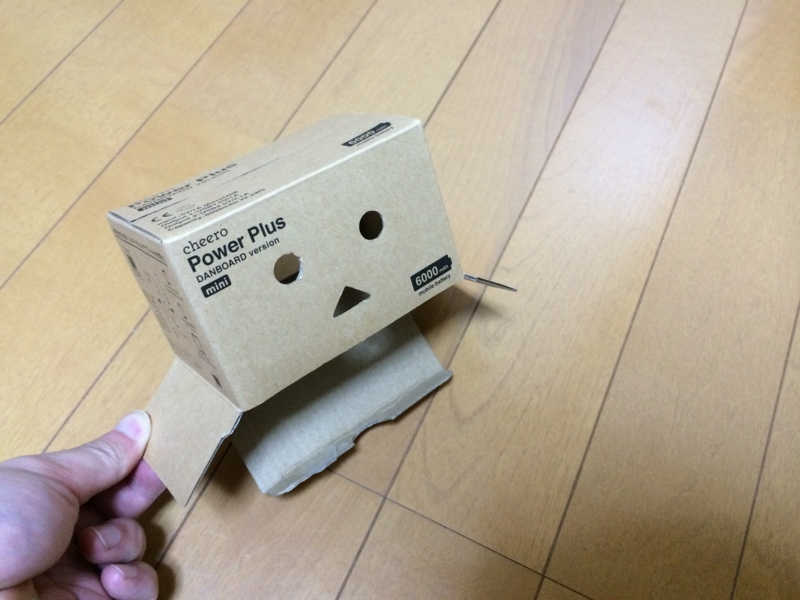

さっそく頼んだら速攻届いた。Amazon はええ。

<a href="https://blog.daruyanagi.jp/entry/2013/07/25/071956">cheero Power Plus 10400mAh DANBOARD Version &#x3092;&#x8CB7;&#x3063;&#x305F;&#x3063;&#x305F; - &#x3060;&#x308B;&#x308D;&#x3050;</a> と比べると……

<table>
<tr>
<td>型番</td>
<td>内蔵バッテリー</td>
<td>商品パッケージの寸法</td>
<td>重量	</td>
</tr>
<tr>
<td>CHE-046</td>
<td>10400mAh（iPhone約5回分）</td>
<td>74mm(W)×23mm(H)×117mm(D)</td>
<td>259 g</td>
</tr>
<tr>
<td>CHE-047</td>
<td>6000mAh（iPhone約2.5回分）</td>
<td>74mm(W)×48mm(H)×34mm(D)</td>
<td>140g</td>
</tr>
</table>
まぁ、いろいろだいたい半分になってる。確かに前のヤツはちょっとデカすぎた気もする。

今回は何と言っても目が光るようになったのがポイント。バッテリー残量のインジケーターが見当たらなくて、もしかして機能削られちゃったのかなぁと思ったのだけど、これも目の色や点滅でわかるようになっているらしい。いいぞ、いいぞ。

<table>
<tr>
<td>赤色点滅</td>
<td>0-33%</td>
</tr>
<tr>
<td>オレンジ色点滅</td>
<td>34-66%</td>
</tr>
<tr>
<td>黄色点滅</td>
<td>67-99%</td>
</tr>
<tr>
<td>黄色点灯</td>
<td>100%（本体充電完了）</td>
</tr>
</table>
説明書によるとこんな感じなのだそうだ。赤が空っぽで、黄色が充電完了ね……よし、覚えた。

もちろん付属の麻袋も健在。これだけほしいっていう人も少なくないという。

<a href="http://www.amazon.co.jp/exec/obidos/ASIN/B009T71BQM/bestylesnet-22/">Apple Lightning to Micro USB Adapter MD820ZM/A[並行輸入品]</a>
<ul><li>出版社/メーカー: Apple Computer</li><li>メディア: エレクトロニクス</li><li><a href="http://d.hatena.ne.jp/asin/B009T71BQM/bestylesnet-22" target="_blank">この商品を含むブログを見る</a></li></ul>

この麻袋に Lightning と Micro USB の変換コネクタを入れておけば、iPhone や iPad の充電もバッチリ。

あと、箱が結構かわいい。これでは捨てられんぞ……

あえてケチをつけるとするならば、もう少し薄型であればポケットやカバンで納まりがよかったと思う。まぁ、でもいいや。

<a href="http://www.amazon.co.jp/exec/obidos/ASIN/B00G8I2BU0/bestylesnet-22/">cheero Power Plus 6000mAh DANBOARD version -mini- 目が光る モバイルバッテリー [ 国産Sanyo/Panasonic高品質電池搭載 ] iPhone 6 6Plus 5s 5c 5 / iPad / Android / Xperia / Galaxy / 各種スマホ / タブレット / ゲーム機 / Wi-Fiルータ 等 急速充電 対応</a>
<ul><li>出版社/メーカー: cheero</li><li>メディア: Wireless Phone Accessory</li><li><a href="http://d.hatena.ne.jp/asin/B00G8I2BU0/bestylesnet-22" target="_blank">この商品を含むブログ (11件) を見る</a></li></ul>

