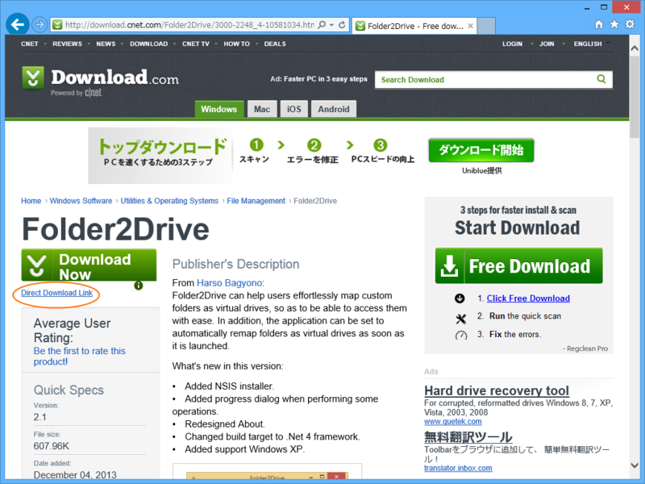
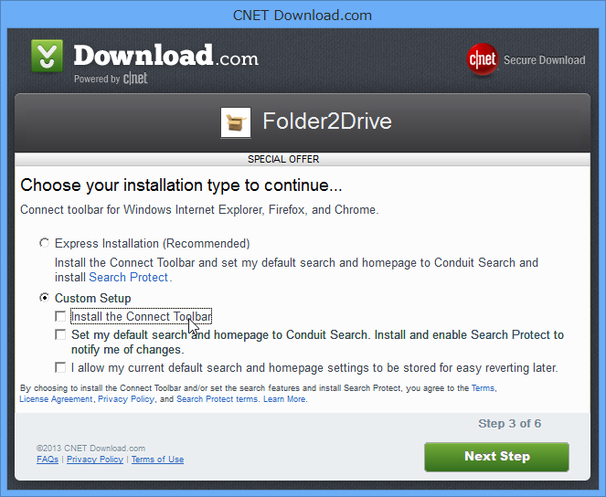

［Direct Download Link］というリンクをクリックしないと――

専用インストーラーでマルウェアまがいの余計なツールがてんこ盛りインストールされる。

当たり前の話だが、ダウンロードの際はよく注意書きを読むべきだ。注意書きが英語で読めないというのなら、そこでダウンロードをあきらめるべきだ。Download.CNET.com を擁護する気はさらさらないが（使わないで済むなら使わないほうがよいだろう）、ユーザー側の自衛も必要だと思う。Download.CNET.com は<b>これでも</b>良心的な部類だ。

