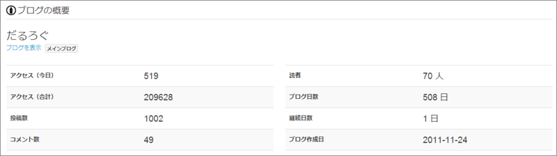

約二年ほどで達成。PV は20万、読者数は70人なんだそうです。ありがとうございます。

旧ブログ<a href="#f-0359fbad" name="fn-0359fbad" title="三代目？　初代と二代目は失われた">*1</a>からのインポート記事なんかもあるんで、純粋にはてなブログだけで達成した数ではないのだけど。ちなみに最初の記事は <a href="https://blog.daruyanagi.jp/entry/2011/11/26/172306">&#x306F;&#x3066;&#x306A;&#x30D6;&#x30ED;&#x30B0;&#x3063;&#x3066;&hellip;&hellip; - &#x3060;&#x308B;&#x308D;&#x3050;</a> でした。はてなブログ、当時に比べたらめっちゃ機能アップしてる。

最近は Windows ストア アプリのアップデートメモブログになりつつあって、そんなのみんな興味ないだろうし、ちょっと申し訳ないけど、これって自分には必要なのよね。まぁ、ほかにも役に立つ人がいれば割りと一石二鳥でいいんじゃないかと。ブログってそんなものでいいのではないかと思います。

<a href="#fn-0359fbad" name="f-0359fbad" class="footnote-number">*1</a>:三代目？　初代と二代目は失われた

