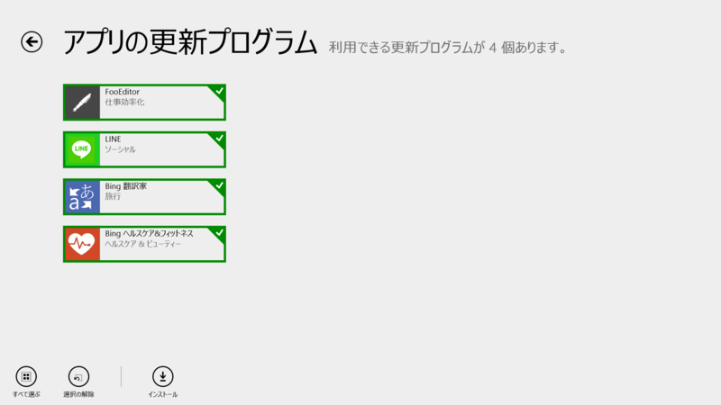
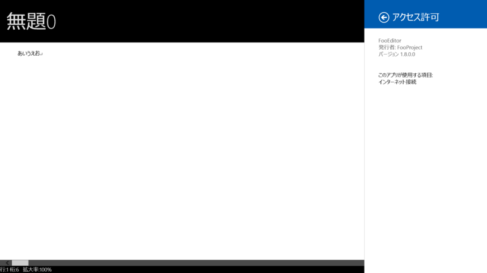
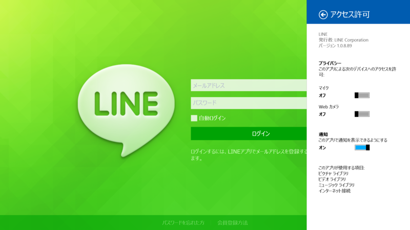
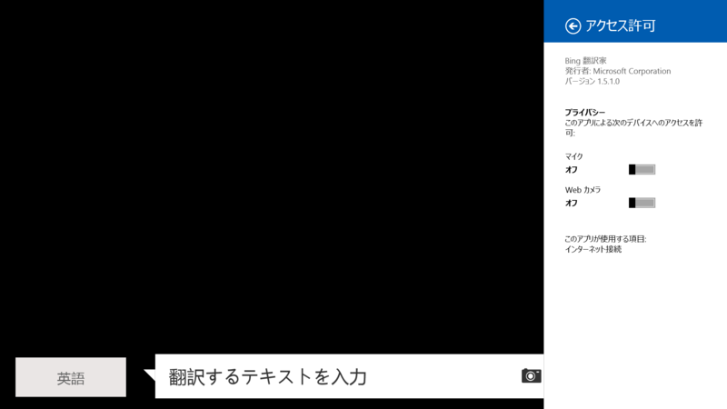
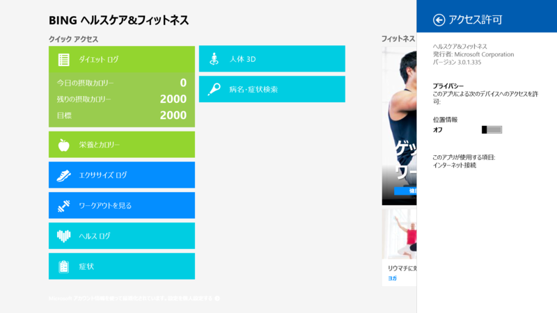

 

<h3>FooEditor 1.6.0.0 → 1.8.0.0</h3>

 

<blockquote cite="http://apps.microsoft.com/windows/ja-jp/app/5cb310b8-3ec8-4ef1-9461-260bc0c98d6d">

1.8.0.0 
[BugFix] 
・特定の操作をするとIMEで入力ができなくなることがある不具合を修正した

<cite><a href="http://apps.microsoft.com/windows/ja-jp/app/5cb310b8-3ec8-4ef1-9461-260bc0c98d6d">Windows &#x30B9;&#x30C8;&#x30A2; &#x306E; Windows &#x7528; FooEditor &#x30A2;&#x30D7;&#x30EA;</a></cite>
</blockquote>

<h3>LINE 1.0.7.83 → 1.0.8.89</h3>

 

<blockquote cite="http://apps.microsoft.com/windows/ja-jp/app/line/b039ba22-c3af-45b3-aea2-83d612c9bce6">

アイコンをアップデート 
不具合修正および性能改善

<cite><a href="http://apps.microsoft.com/windows/ja-jp/app/line/b039ba22-c3af-45b3-aea2-83d612c9bce6">Windows &#x30B9;&#x30C8;&#x30A2; &#x306E; Windows &#x7528; LINE &#x30A2;&#x30D7;&#x30EA;</a></cite>
</blockquote>

<h3>Bing 翻訳家 1.5.0.0 → 1.5.1.0</h3>

更新履歴なし。

それにしてもこのアプリ名はイケてない……翻訳アプリなのに！！

<ul>
<li><a href="http://apps.microsoft.com/windows/ja-jp/app/bing-translator/1489bb69-3e78-4085-96f5-2a9a6f303559">Windows &#x30B9;&#x30C8;&#x30A2; &#x306E; Windows &#x7528; Bing &#x7FFB;&#x8A33;&#x5BB6; &#x30A2;&#x30D7;&#x30EA;</a></li>
</ul>

<h3>Bing ヘルスケア&フィットネス 3.0.1.203 → 3.0.1.335</h3>

更新履歴なし。

プリインストールのいわゆる“Bing アプリ”の一つになるのだろうか。

<ul>
<li><a href="http://apps.microsoft.com/windows/ja-jp/app/bing-health-fitness/54c27690-1f6b-40b0-b561-72dc76e67d02">Windows &#x30B9;&#x30C8;&#x30A2; &#x306E; Windows &#x7528; Bing &#x30D8;&#x30EB;&#x30B9;&#x30B1;&#x30A2;&amp;&#x30D5;&#x30A3;&#x30C3;&#x30C8;&#x30CD;&#x30B9; &#x30A2;&#x30D7;&#x30EA;</a></li>
</ul>

