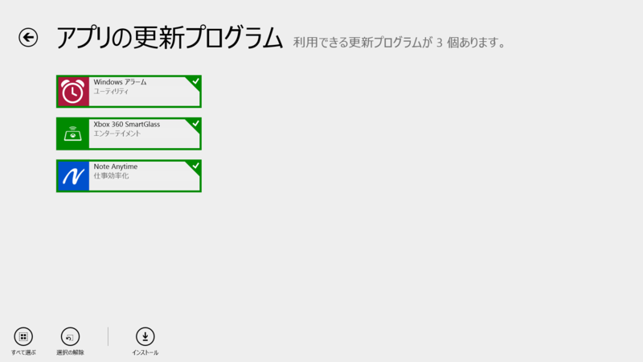
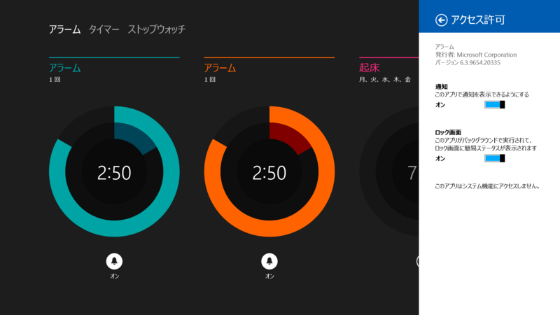
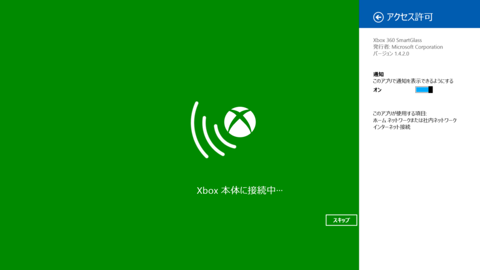
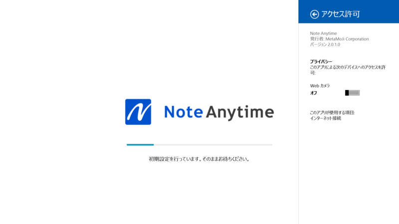
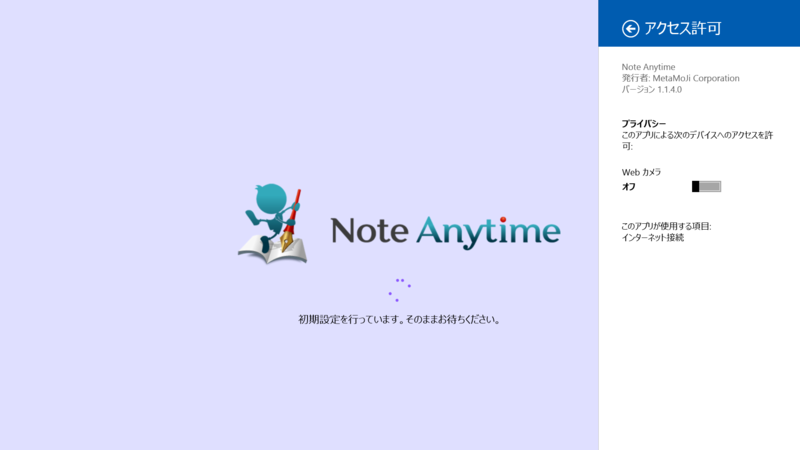
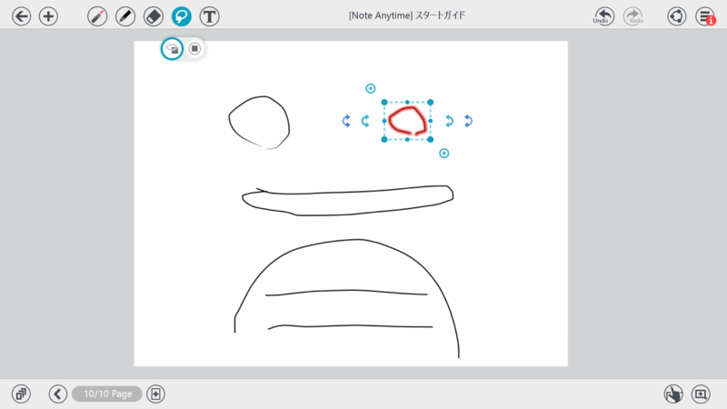

 

<h3>Windows アラーム 6.3.9600.20278 → 6.3.9654.20335</h3>

たぶん単なるマイナーフィックス。

<ul>
<li><a href="http://apps.microsoft.com/windows/ja-jp/app/windows-alarms/579fc437-d398-411c-a6c5-d01fd4523b94">Windows &#x30B9;&#x30C8;&#x30A2; &#x306E; Windows &#x7528; Windows &#x30A2;&#x30E9;&#x30FC;&#x30E0; &#x30A2;&#x30D7;&#x30EA;</a></li>
</ul>

<h3>Xbox 360 SmartGlass 1.3.0.0 → 1.4.2.0</h3>

 

<blockquote>

Internet Explorer on Xbox 360 の対応やテレビで見ている新しいコンテンツに関連した情報の表示を含む､さまざまな機能追加とパフォーマンスの向上をいたしました｡

</blockquote>

XBox はもってないのでよくわからん。次のやつがでたらほしいけどね。

<ul>
<li><a href="http://apps.microsoft.com/windows/ja-jp/app/xbox-360-smartglass/571b1120-f579-47d3-88c8-a722652643b3">Windows &#x30B9;&#x30C8;&#x30A2; &#x306E; Windows &#x7528; Xbox 360 SmartGlass &#x30A2;&#x30D7;&#x30EA;</a></li>
</ul>

<h3>Note Anytime 1.1.4.0 → 2.0.1.0</h3>

メジャーバージョンアップのようだ。

以前のスプラッシュスクリーンはこんな感じだった。

<blockquote>

[2.0.0] 
□描画機能 
・ペンの種類の追加（蛍光ペン、万年筆） 
・カラーホイールによる色指定 
・有償の消耗インクを廃止 
・レーザーポインタモード 
・投げ縄に全入モード

□テキスト操作 
・「後からテキスト」「テキストユニット化」機能（※mazec購入ユーザー様対象） 
・箇条書き機能 
・テキストユニットの結合/分割 
・テキスト検索

□ノート・用紙・アイテム 
・他のノートを複製してページ追加（挿入読込） 
・用紙と表紙の設定メニューを改良 
・ノートへのパスワード設定機能 
・個々のコンテンツ販売（有料/無料）を廃止（コンテンツ使い放題サービスに統合）

□ファイル操作（インポート・送る機能） 
・テキストファイルのインポート 
・画像ファイル（png、jpg、gif）のインポート

□キャビネット 
・複数ノートを選択し、削除や送信が可能に 
・タグ作成の上限を1,000個に拡張 
・テキストによる絞り込み機能の対象に、本文テキストを追加

□mazec 
・字形学習機能（手書き文字自動学習、字形登録） 
・変換機能の強化（交ぜ書き予測、各提示予測、語彙の強化）

□その他 
・ユーザーインターフェースの全面刷新（アイコンデザインを変更、シンプルUIを採用） 
・その他、多数を改善

</blockquote>

個人的にはちょっと機能が多すぎるかなって思う。Adobe Ideas みたいなのがいいけど、ストア アプリにならないかなぁ。

<ul>
<li><a href="http://apps.microsoft.com/windows/ja-jp/app/note-anytime/b143522d-3500-4858-9be5-2dec4dcb693e">Windows &#x30B9;&#x30C8;&#x30A2; &#x306E; Windows &#x7528; Note Anytime &#x30A2;&#x30D7;&#x30EA;</a></li>
<li><a href="http://internet.watch.impress.co.jp/docs/news/20131210_626994.html">&#x30CE;&#x30FC;&#x30C8;&#x30A2;&#x30D7;&#x30EA;&#x300C;Note Anytime&#x300D;&#x6700;&#x65B0;&#x7248;&#x3067;UI&#x5237;&#x65B0;&#x3001;&#x6709;&#x511F;&#x7248;&#x3082; -INTERNET Watch</a></li>
</ul>

