
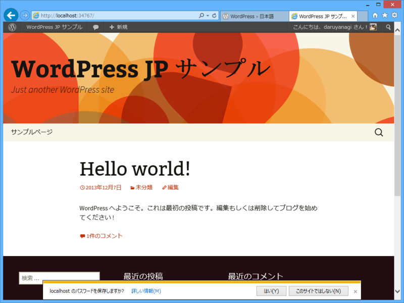

※ <a href="http://www.adventar.org/calendars/132">One ASP.NET Advent Calendar 2013 - Adventar</a> が埋まらなかったら使おうと思っていたちょっとヘチョいネタです。

WebMatrix のアプリケーション ギャラリーからインストールできる WordPress は英語版のようだ。まぁ、英語版に言語パッチをいれれば同等になるものと思われるが、今回は日本語サイトから WordPress の日本語版をダウンロードして WebMatrix で起動させてみることにする。

<h3>WordPress 日本語版のダウンロード</h3>

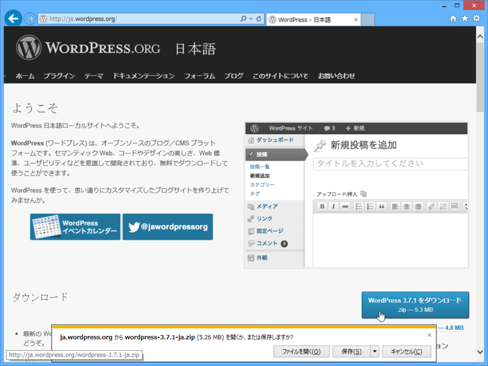

<a href="http://ja.wordpress.org/">WordPress &rsaquo; &#x65E5;&#x672C;&#x8A9E;</a> からダウンロード。

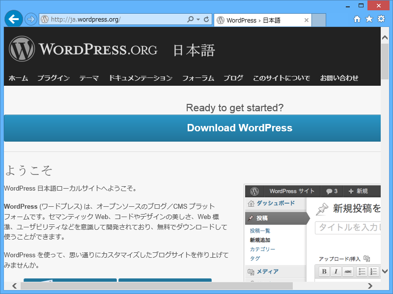

ちょっと笑ってしまったのだけど、ブラウザーの横幅が足りないと英語版の WordPress がダウンロードされてしまうようだ<a href="#f1" name="fn1" title="ダメなモバイル対応の典型のような例ですね！">*1</a>。ファイル名が wordpress-3.7.1-ja.zip であることを確認しよう（3.7.1 はバージョン）。

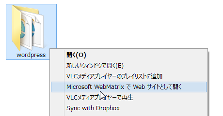

次にアーカイブを展開して、フォルダのコンテキストメニューから［Microsoft WebMatrix で Web サイトとして開く］を選択する。

<h3>WebMatrix の設定</h3>

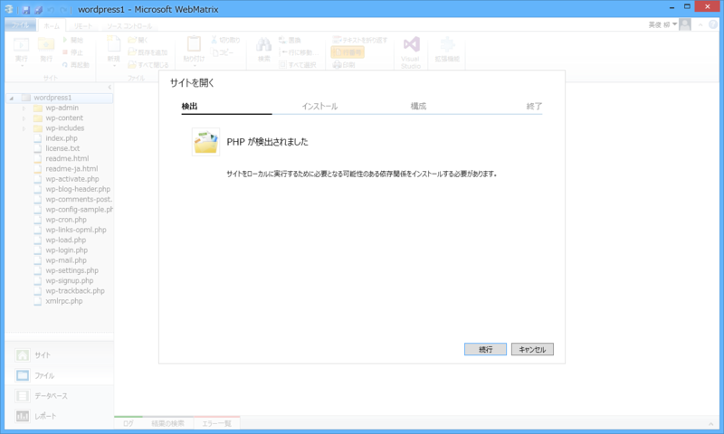

WordPress 日本語版を WebMatrix で開くと、PHP などの欠けている必要モジュールが検出され、ダウンロードが始まる。MySQL も検出されると思われるが、ウチの環境では既にセットアップ済みだったので追加インストールは不要だった。

次いで現れる Windows Azure Websites の作成画面はスキップしてよい。

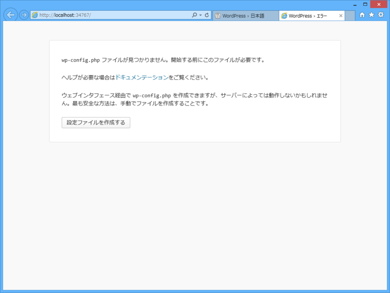

これでセットアップは完了。とりあえず［実行］ボタンを押してみる。

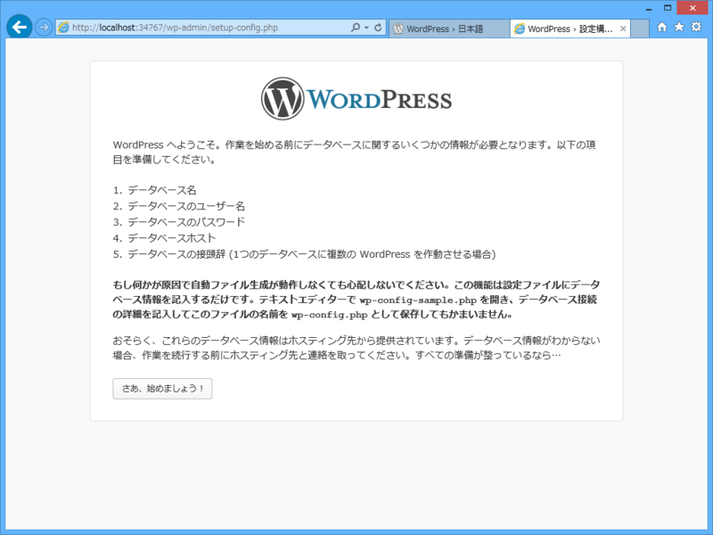

［さぁ、始めましょう！］をクリックして続行。

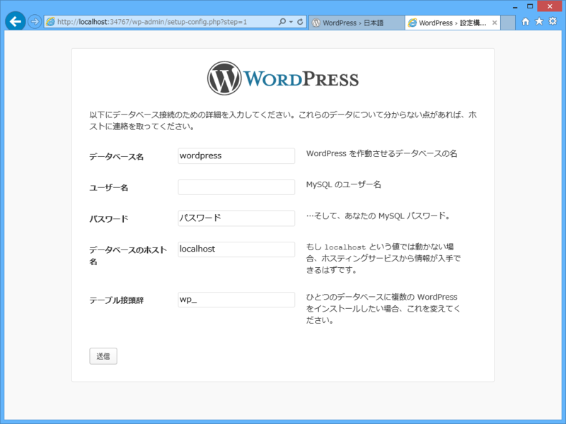

My SQL のユーザー名とパスワードを入力して［送信］。ユーザー名は通常 root で、パスワードは WebMatrix で MySQL をセットアップしたときに指定するアレだ。

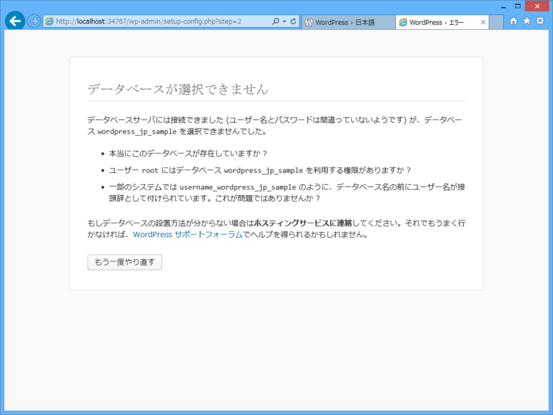

失敗。データベースを作成するのを忘れていた。

<h3>MySQL のデータベースを作成</h3>

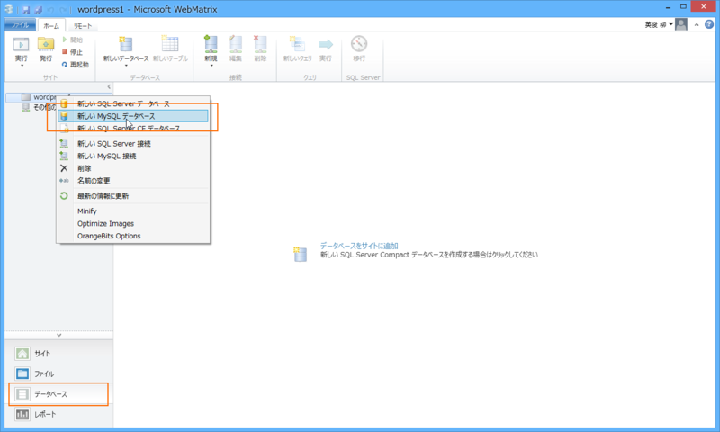

ワークスペースを［データベース］に切り替え、ルートフォルダーのコンテキストメニューから［新しい MySQL データベース］を選択。

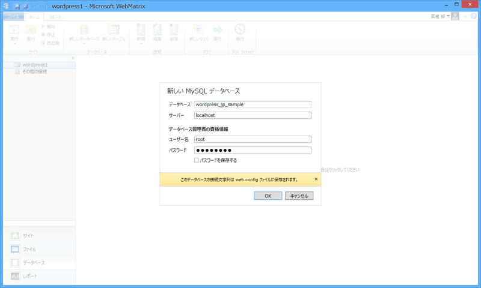

今回、データベース名は wordpress_jp_sample とした。［新しい MySQL 接続］メニューで既存の WordPress データベースと接続させれば、そのデータを利用して WordPress を構築することもできるはず。

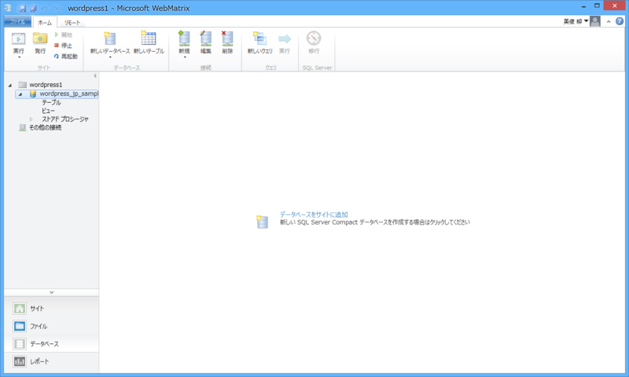

無事、空っぽのデータベースが作成された。

<h3>再度セットアップに挑戦</h3>

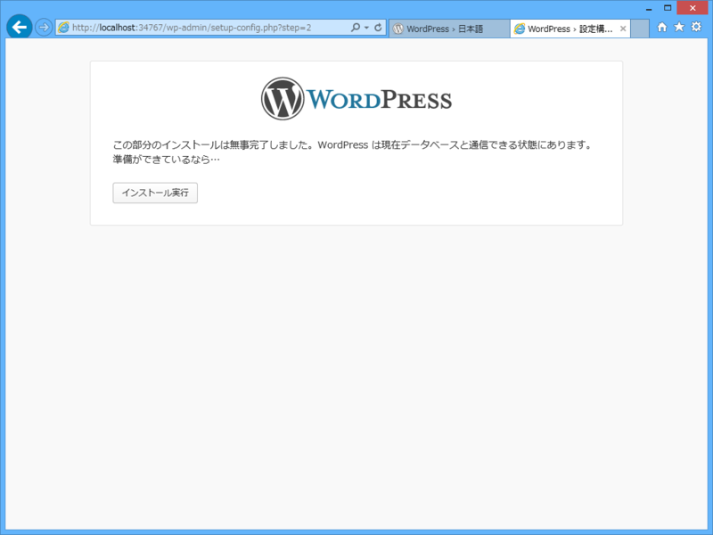

もう一度セットアップ画面に戻ってやり直すと、今度はデータベースに接続できるはず。

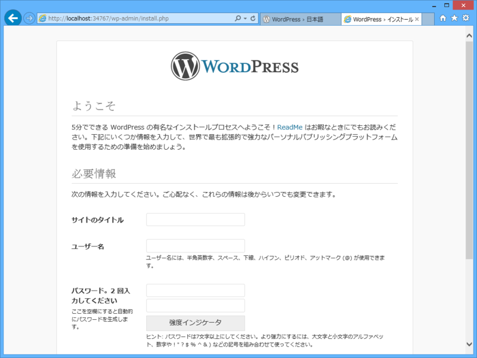

あとは必要な項目を入力して――

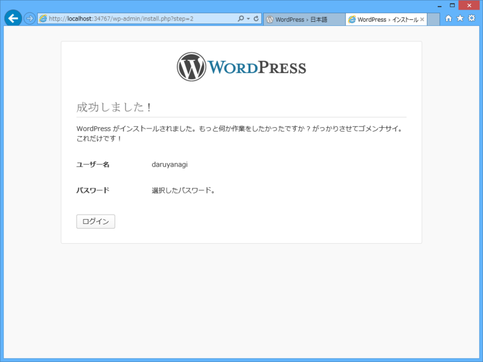

終わり。

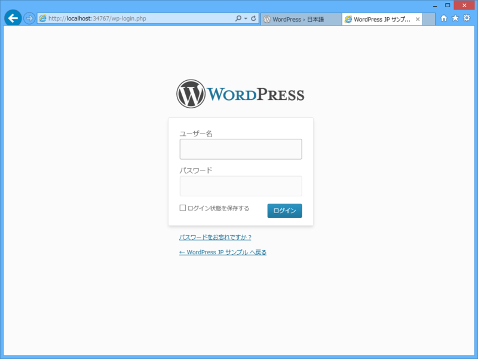

試しにログインしてみると――

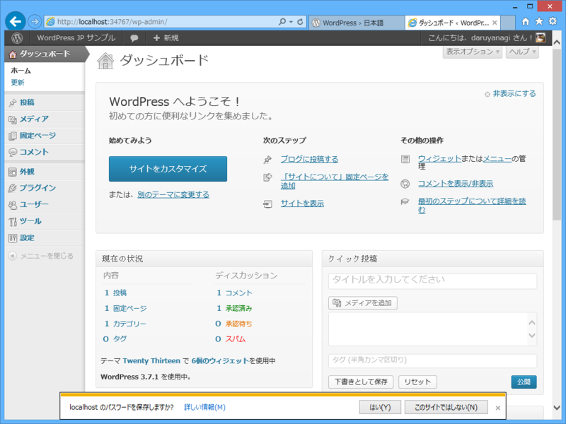

管理画面にアクセスできる。おぉ、ユーザーインターフェイスが日本語化されておるぞ！

<a href="#fn1" name="f1" class="footnote-number">*1</a>:ダメなモバイル対応の典型のような例ですね！

